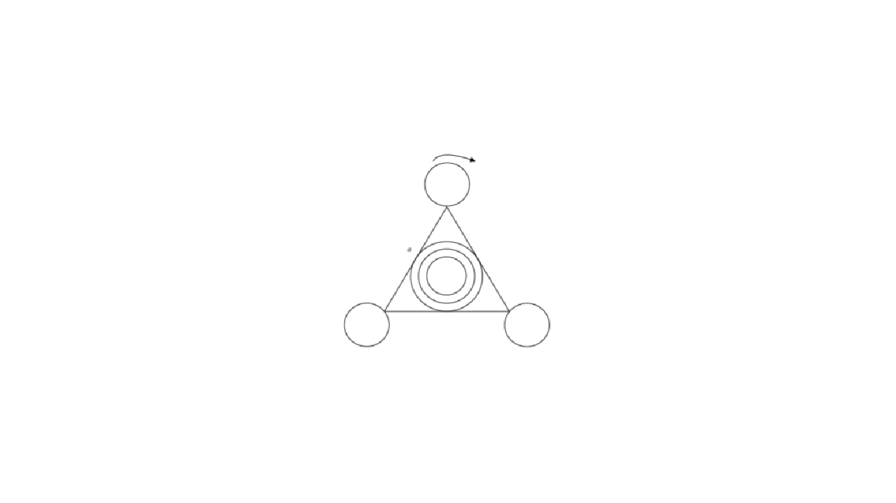

**Задание:** a – сторона треугольника, n – количество сторон многоугольника, вписанных в окружности. n вводится с клавиатуры.
Реализовать вращение всей фигуры по часовой стрелке. Раскрасить все элементы по своему усмотрению.

