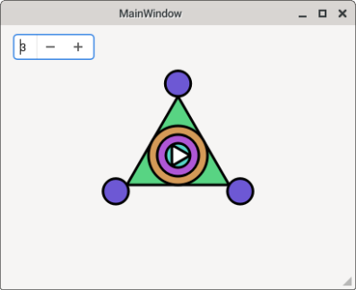

Используемые формулы в построении фигуры.

Расчет шага $\alpha$:
$$360/n$$
Получение n-угольника: 
$$T_n = (r*cos(\alpha)+center_x;r*sin(\alpha)+center_y),$$

Для поворота фигур была использована матрица поворота.
$$ \begin{array}{ccc}
x' = x*cos(\alpha)-y*sin(\alpha),
\\
y' = x*sin(\alpha)+y*cos(\alpha).
\end{array}
$$
Формула зависимости массива brushColors[5] от угла поворота.
$$(((i+1)*250+\alpha/10)\%359;(i*150)\%255;150)_{HSL}$$

Формулы для радиусов вписанных в треугольник a окружностей.
$$
    \begin{array}{ccc}
    r_1 = (height-20|width-20)/20
    \\
    r_2 = r_1+(height-30|width-30)
    \\
    r_3 = r_2+(height-30|width-30)
    \end{array}
$$

Сторона a вычисляется по радиусу наибольшей вписанной в него окружности.
$$a = 2*\sqrt{3}*r_3$$
Радиус описанной окружности треугольника a.
$$R_a = \frac{\sqrt{3}*a}{3}$$

Окружности на ходящиеся на вершинах треугольника находятся на вершинах скрытого треугольника a' с радиусом описанной окружности на a/8 больше чем у треугольника a.
$$R_{a'} = R_a+\frac{a}{8} $$

### Окно программы
