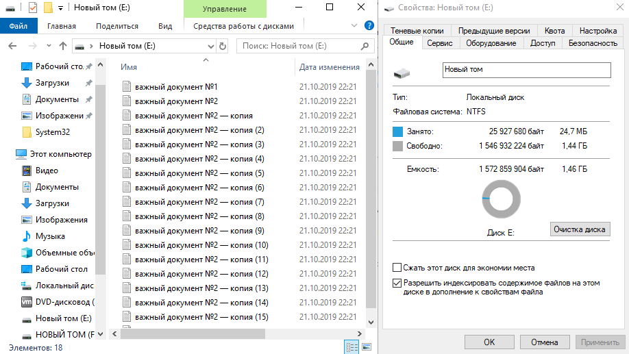
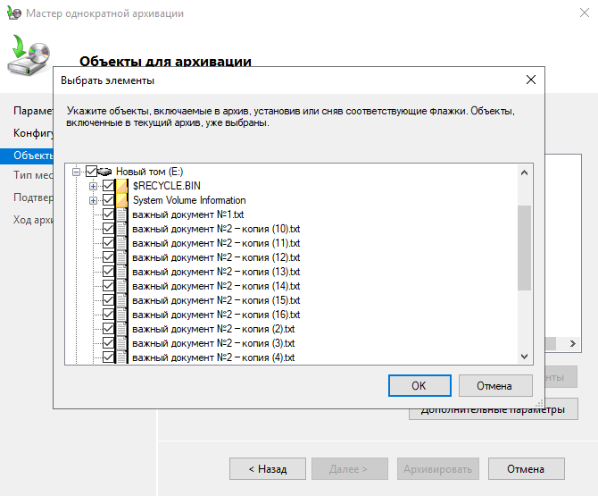
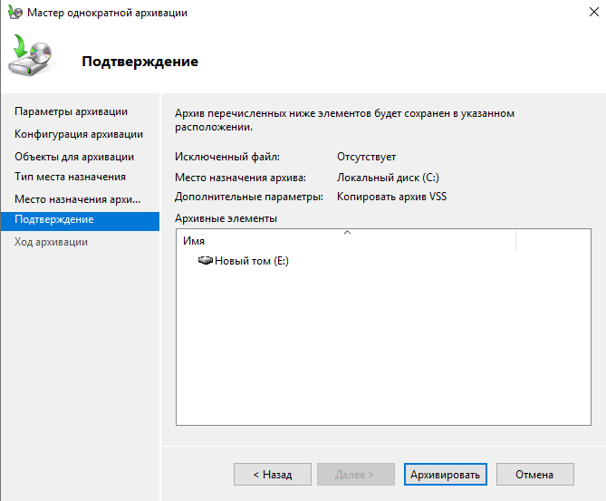
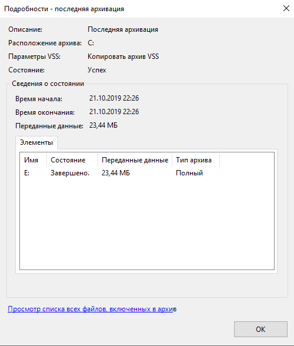

1. Для резервного копирования, был создан новый раздел с файловой системы NTFS и на нем созданы несколько файлов.

   

2. В мастере однократной архивации выбрали раздел для архивации.

   

3. Подтверждаем архивацию.

   

4. Завершенная архивация.

   

