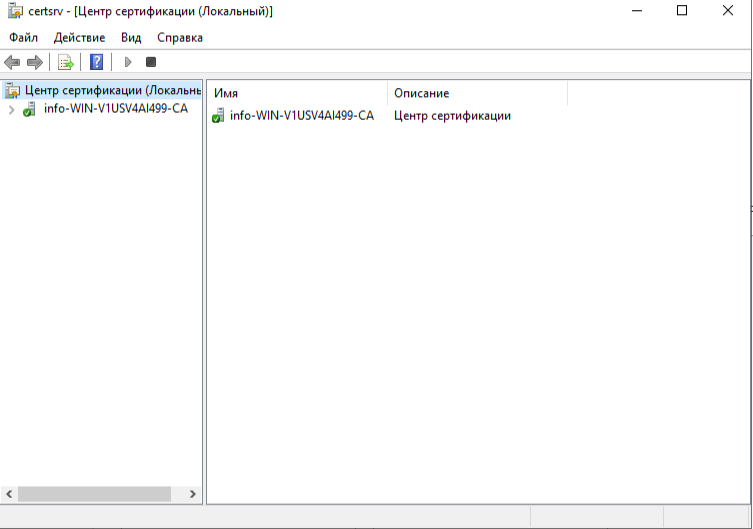
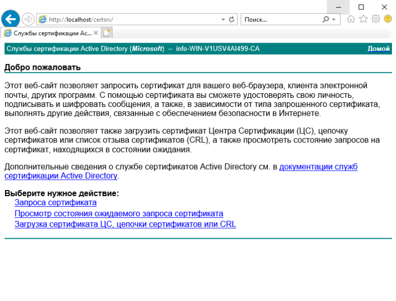
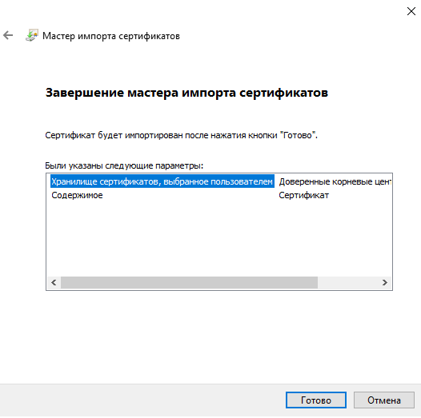
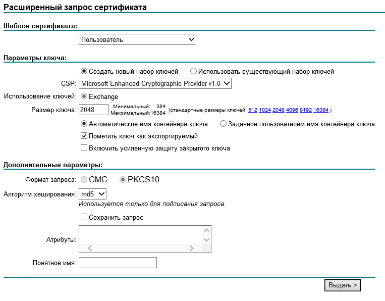

1. Установлена роль WSUS

   

2. HTTP страница службы сертификации AD.

3. Получен и установлен сертификат центра сертификации.

   

4. Окно расширенного запроса пользовательского сертификата.

   