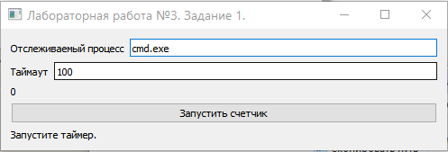
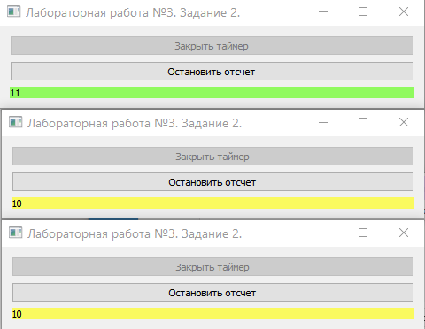

**Краткие теоритеческие сведения**

**Процесс** — это исполнение программы.
Операционная система использует процессы для разделения исполняемых приложений.

**Поток** — это основная единица, которой операционная система выделяет время процессора. Каждый поток имеет приоритет планирования и набор структур, в которых система сохраняет контекст потока, когда выполнение потока приостановлено.

**Синхронизация потоков.**
Синхронизация потоков необходима для того чтобы исключить состояния гонок и дедлоков.
> Гонка потоков - (неопределенность параллелизма) ошибка в проектировании приложения, при которой работа системы или приложения зависит от того, в каком порядке выполняются части кода.

> Дедлок - ситуация , при которой несколько процессов находятся в состоянии ожидания ресурсов, занятых друг другом, и ни один из них не может продолжать свое выполнение.

**Синхронизация в OC Windows**
В операционной системе Windows существуют несколько объектов ядра для осуществления синхронизации потоков в системе.

1. Мьютекс
2. Семафор.
3. Ждущий таймер.
4. Критическая секция
5. Событие
 

Любой объект ядра может находится в двух состояних:
* сигнальное (свободен)
* не сигнально (занят)

Идея синхронизации заключается в том чтобы поток мог останавливать свою работу до освобождения необходимых для его выполнения ресурсов.

Используя API функцию **WaitForSingleObject**(*objectHandle*,*timeout*)  мы можем приостановить работу процесса до освобождения ресурса *objectHandle*.

Ждущие таймеры - объект синхронизации переходящий в сигнальное состояние после определенной задержки (*dueTime*).

**API функции для работы с ждущими таймерами**.

* **CreateWaitableTimer**() - создание ждущего таймера, атрибуты функции принимают имя таймера, атрибуты защиты, и флаг ручного сброса.
* **OpenWaitableTimer**() - открытие дескриптора существующего ждущего таймера по имени или адресу.
* **SetWaitableTimer**() - установка параметров ждущего таймера можно указать задержку (*dueTime*) и период и флаг пробуждения при установке которого таймер будет выводить систему из состояния сна.

Ждущий таймер может работать в 3 режимах.

* *Режим ручного сброса* - после установки параметров таймера и последующего захвата функцией **WaitForSingleObject** таймер остается в сигнальном состоянии до следующей установки параметров.
* *Режим автоматического сброса* - после захвата фукцией **WaitForSingleObject** таймер автоматически переходит в несигнальное состояние.
* *Режим интервального таймера* - после установки параметров таймера, по прошествию задержки таймер переходит в сигнальное состояние, далее после захвата таймера другим потоком таймер сбрасывается после прошествия времени указанном в периода.

**Примеры работы программы**

