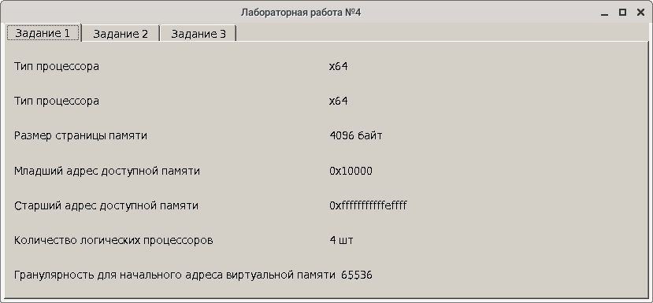
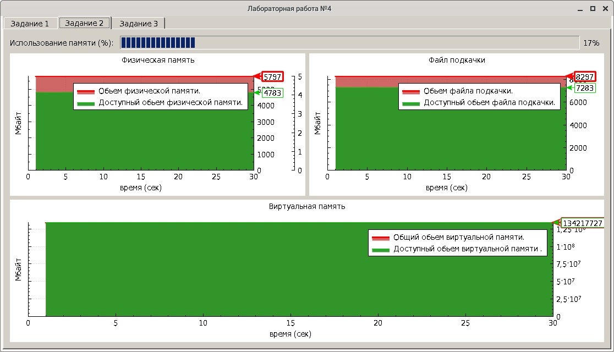
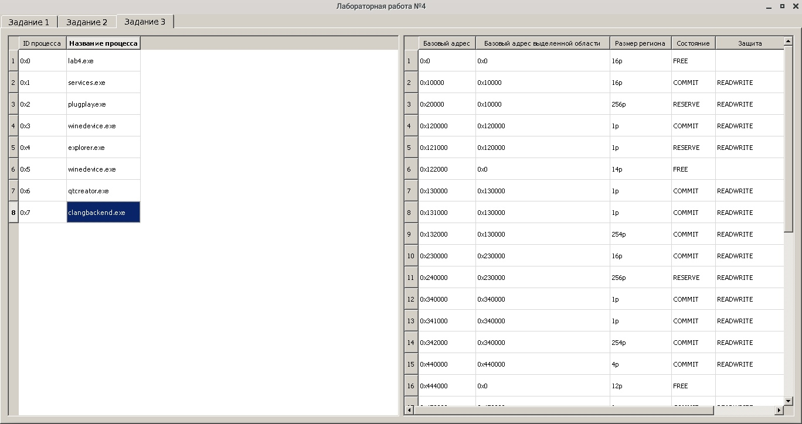

**Краткие теоритические сведения**

**Физическая память** - оперативная память (RAM), установленная в компьютер, каждый байт этой памяти имеет свой адрес (физический адрес) он равен $n-1$, где n - номер байта в массиве памяти.

**Внешняя память** - долговременная память представленная внешними носителями.

**Файл подкачки (swap)** - файл находящийся на внешнем носителе (локальном диске или flash носителе(*ReadyBoost*)), используемый точно так же как и ram память, имеет больший обьем но гораздо меньшую скорость чтения записи по сравнению с ram. 

**Виртуальная память** - набор чисел представленный в виде набора виртуальных адресов, эти адреса нельзя использовать для непосредственного обращения к физической памяти, однако после некоторых преобразований из вирутальных адресов получаются физические адреса с требуемыми данными, за это ответственен диспетчер виртуальной памяти (*VMM*). Минимальным оперируемым блоком памяти в *VMM* является страница(page), размером 4 байта. Виртуальные адреса проецируются как на физическую память, так и на файлы подкачки.

Каждый процесс в Windows получает свое виртуальное адресное пространство, объемом 4 Гб:

* 0-64 Кб : зарезервированно для NULL указателей(неинициализированных).
* 128 Кб - 2 Гб : находятся модули программы,dll и другие файлы отображаемые в память, доступно в пользовательском режиме.
* 0-64 Кб : зарезервированно для некорректных указателей.
* 2 Гб : находятся драйвера устройств и другие системные объекты Windows, не доступно в пользовательском режиме.

Один и тот же участок памяти в физической памяти может быть отображен в разных виртуальных адресных пространствах по разным адресам, это позволяет совместно использовать этот участок памяти несколькими процессами. 

Windows фиксирует coстояние каждой физической страницы памяти в структуре данных называемой Page Frame Database.
Каждая физическая страница может находиться в одном из восьми стояний:
* **активная** (*active*), страница в текущий момент отображается на виртуальную память

* **переходная** (*transition*),  в состоянии переходном к активному состоянию

* **ждущая** (*standby*), страница  вышла из состояния active, но осталась неизменной

* **измененная** (*modified*), страница вышла из состояния active. ее содержимое изменено но еще не записано на диск

* **измененная** незаписанная (*modified no write*), страница находится в состоянии «измененная», но особо помечена как страница, содержимое которой не записано на диск. Используется драйверами файловой системы Windows

* **свободная** (*free*), страница свободна, но содержит произвольные записи, не может использоваться процессом

* **очищенная** (*zeroed*), страница свободна и инициализирована нулями потоком нулевой страницы. Может быть использована процессом

* **страница с ошибками** (*bad*), странице были обнаружены ошибки или другие аппаратные ошибки,в следствии чего не может быть использована

**Примеры работы программы**

