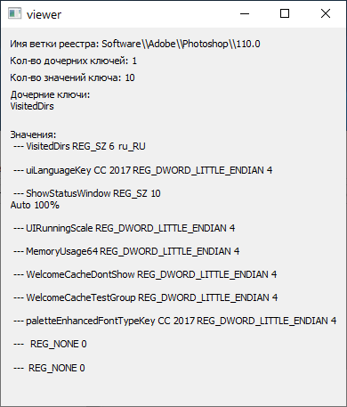

**Краткие теоритические сведения**

**Реестр** представляет собой системную базу данных представляющую собой дерево, в которой приложения и системные компоненты хранят и получают данные конфигурации. Данные, хранящиеся в реестре, различаются в зависимости от версии Microsoft Windows. Приложения используют API реестра для извлечения, изменения или удаления данных реестра.

Реестр состоит из ключей, которые в свою очередь состоят из подключей, и значений ключа. 

В Windows NT есть 5 предопределенных корневых веток реестра:

* HKEY_CLASSES_ROOT
* HKEY_CURRENT_USER
* HKEY_LOCAL_MACHINE
* HKEY_USERS
* HKEY_CURRENT_CONFIG
  
Типы значений реестра:

* REG_BINARY
* REG_DWORD
* REG_DWORD_BIGENDIAN
* REG_DWORD_LITTLE_ENDIAN
* REG_EXPAND_SZ
* REG_LINK
* REG_MULTI_SZ
* REG_NONE
* REG_RESOURCE_LIST
* REG_SZ

Для чтения и записи в файл используются API функции CreateFile,ReadFile,WriteFile.

**Примеры работы программы**

