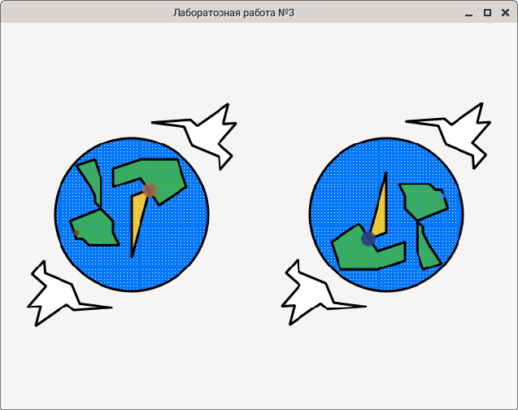

**Содержание отчёта**
1. Название темы.
2. Цель работы.
3. Постановка задачи.
4. Вывод необходимых формул для построения изображения. Указать какие матрицы используются и в какой последовательности они умножаются для реализации анимации.
5. Текст программы.
6. Результат работы программы (снимки экрана).
   
Размеры всех фигур зависимы от наибольшей стороны экрана.

Преобразования используемые для построения изображения.
1. Полигоны материков.
   1. Афинное преобразование машстабирования.
   2. Афинное преобразование отражения. 
   3. Афинное преобразование перемещения. 
2. Полигоны птицы.
   1. Афинное преобразование поворота.
   2. Афинное преобразование отражения. 
   3. Афинное преобразование перемещения.    
   4. Афинное преобразование машстабирования.
 
 

