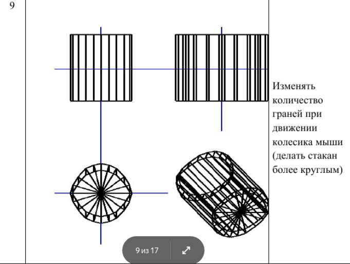

**Требования к программе.**

1.  Окно поделить на 4 части одинаковые части:
   1. На верхней левой части должна отображаться фронтальная проекция (вид спереди);
   2. Правая верхняя часть – профильная проекция (вид сбоку);
   3. Левая нижняя часть должна отображать вид сверху (горизонтальную проекцию);
   4. На правой нижней части должна отображаться проекция, вид которой выбирает пользователь:
      * центральная, косоугольная
      * кабинетная,
      * косоугольная
      * свободная,
      * параллельная,
      * ортографическая.
   
   