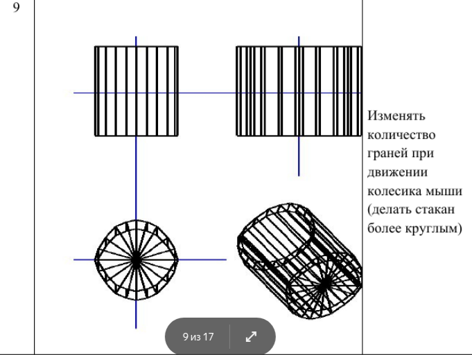

**Порядок выполнения работы**

1. Реализовать алгоритм сортировки выпуклых многоугольников по глубине Z, где Z - центр тяжести многоугольника (при помощи qStableSort).

2. На экран вывести только 1 проекцию модели (центральную или ортографическую). Пользователь должен иметь возможность поворачивать фигуру, с использованием мыши или клавиш, удалять и приближать фигуру.

3. Фигура должна состоять из набора небольших граней. Грани должны быть соизмеримы.

4. При выводе изображения предоставить возможность пользователю видеть грани прозрачными. Разработать алгоритм и написать программу для создания трёхмерной сцены, содержащей графические объекты, в соответствии с выбранной предметной областью.

   

