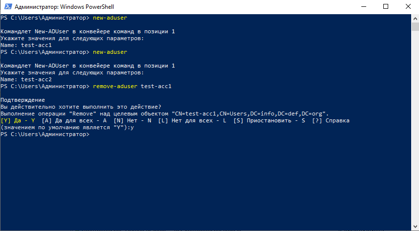
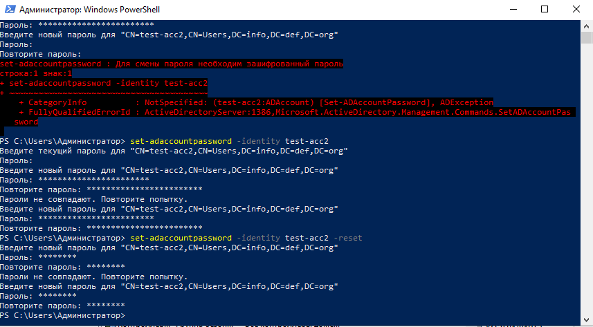
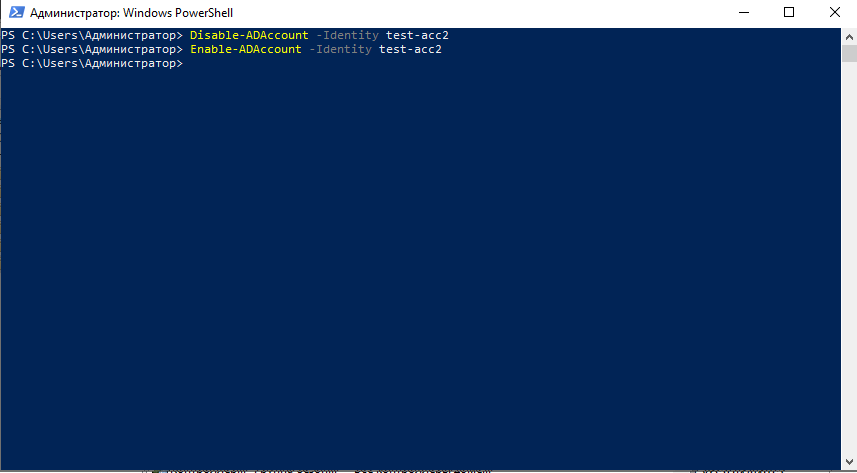
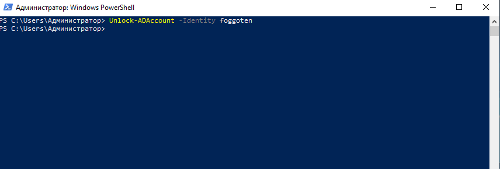
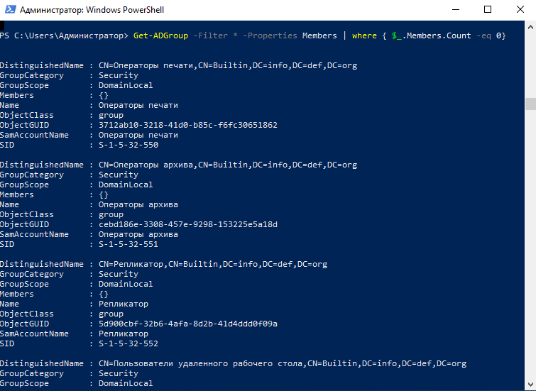
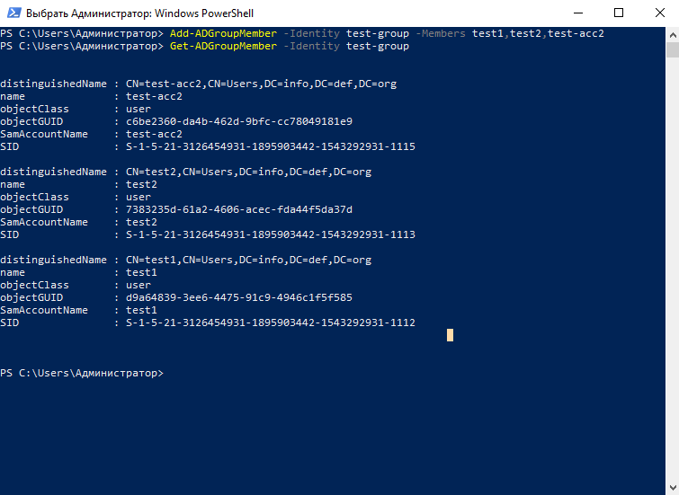
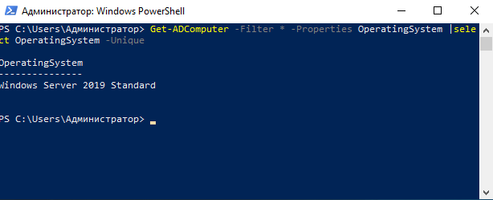

**Список основных задач:**

1. Создать и удалить пользователя.

   

2. Сбросить пароль пользователя.

   

3. Активировать и деактивировать учетные записи.

   

4. Разблокировать учетную запись пользователя.

   

5. Удалить учетную запись.

6. Найти пустые группы.

   

7. Добавить пользователей в группу.

8. Вывести список членов группы.

   

10. Найти устаревшие учетные записи компьютеров.

10. Деактивировать учетную запись компьютера.

11. Найти компьютеры по типу.

    

