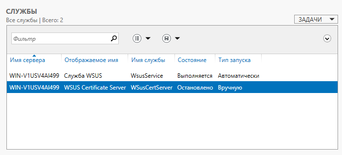
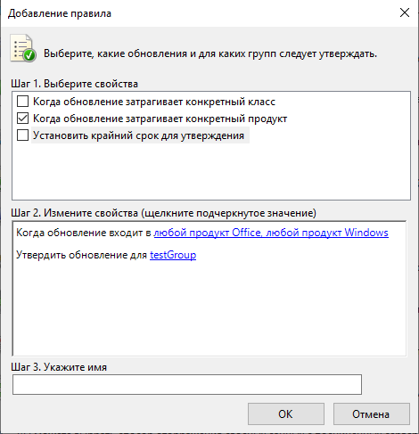
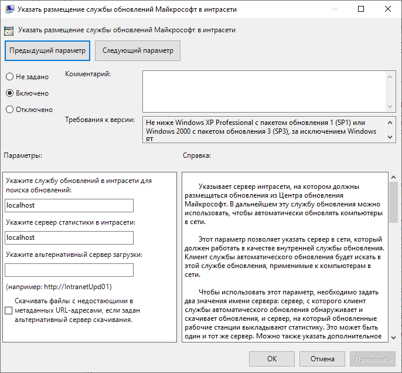

1. Установлена роль WSUS

2. Выполнена синхронизация с сервером обновлений Microsoft.
3. Созданы группы testGroup, workGroup и настроены правила автоматического утвержения обновлений.

4. Настроены групповые политики домена для получения обновлений из установленной WSUS.

