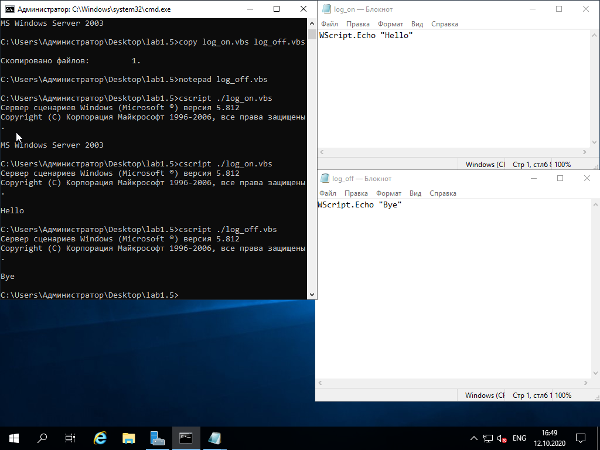
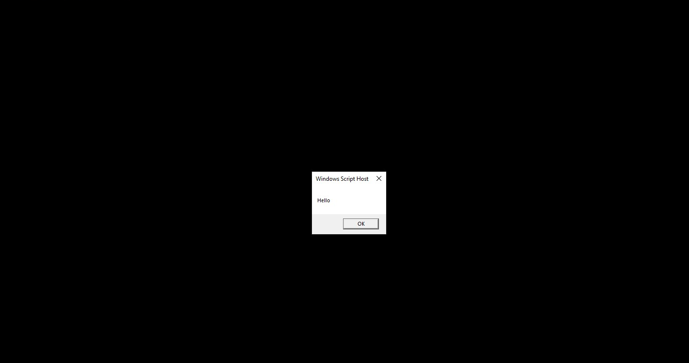

1. Был созданы файлы logon.vbs, logoff.vbs и запущенные различными способами. В зависимости от способа запуска изменялась форма вывода сообщения. Для консольного запуска сообщение выводилось в консоль, для остальных случаев появлялось диалоговое окно.



2. В групповой политике домена AD в пункте Автозагрузка и Завершение работы были добавлены скрипты logon.vbs logoff.vbs соответственно. А так же проверена их работоспособность.


3. В групповой политике домена AD в пункте Сценарии входа пользователя и Сценарии выхода были добавлены скрипты logon.vbs logoff.vbs соответственно. А так же проверена их работоспособность.




4. Был создан файл с указанным содержимым и запущен через консоль. Результат выполнения сценария - информация о корневом объекте Active Directory.


5. Был создан файл с указанным содержимым и запущен через консоль. 


**Вывод**: Я ознакомился с языком сценариев VBS его синтаксисом, ограничениями. Научился создавать сценарии, запускать их различными способами и работать с объектами AD при помощи инструментария VBS.

**Контрольные вопросы**

1. Сколькими способами можно запустить cценарий через командную строку? Перечислите их.

2. Выдаст ли ошибку сценарий при запуске, если там будет введен следующий текст? Почему?

```vb
Const Message = "Hello World!"
WScript.Echo meSSaGe
```

3. Каково по умолчанию время выполнения сценария?

4. Напишите сценарий получения объекта Пользователя Иван Иванов, находящийся в организационном подразделении Работники домена Gazpom.com.

5. Что такое LDAP?

6. Недостатки языка VBScript?

**Ответы**

1. Запуск скрипта в командной строке можно осуществить при помощи 2 программ:

   * cscript - консольный режим
   * wscript - графический режим

2. Ошибка возникает в следствии неправильного обращения к переменной Message, язык VBS -  регистрозависимый.

3. Время исполнения сценария по умолчанию - не ограничено.

4. PowerShell скрипт для получения объекта:
   
```powershell
Get-ADObject -Identity "CN= Иван Иванов,OU= Работники,DC=Gazpom,DC=com"
```

5. LDAP — протокол прикладного уровня для доступа к службе каталогов. Является одной из составных частей AD.

6. Недостаток языка VBScript в том что Microsoft прекратила его поддержку. В качестве замены в современных системах используется язык сценариев Powershell.