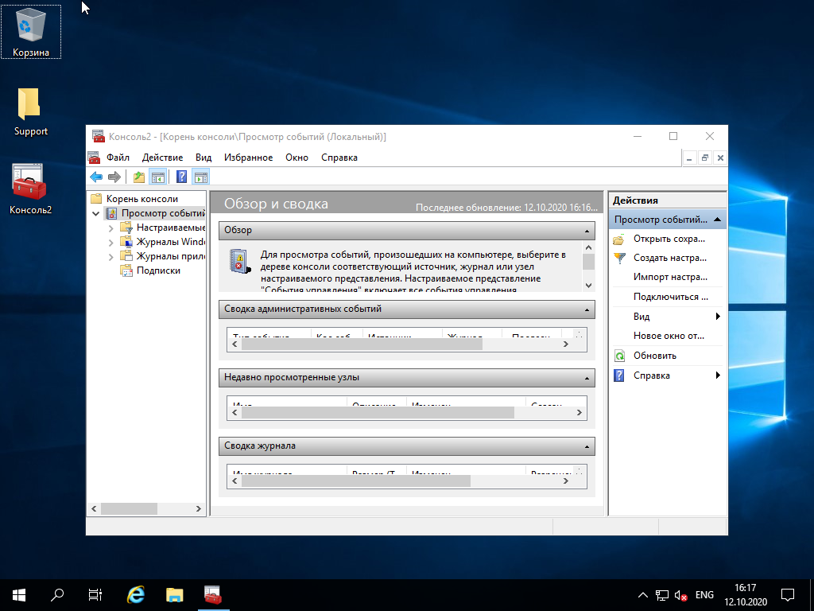

1. В качестве хост-машины используется компьютер под управлением ОС Linux. Через web-интерфейс настраиваем виртуальную машину и устанавливаем систему.

2. В виртуальной машине была установлена ОС Windows 2016. Платформа для виртуализации автоматически настроила виртуальный сетевой адаптер и виртуальная машина получила IP адрес и доступ в локальную сеть.

3. Служба AD была успешно развернута при помощи "Мастера настройки доменных служба Active Directory"

4. NetBIOS имя было получено следующими способами:

5. Был создан терминал MMC и сохранен на рабочем столе под именем Консоль2 в него была добавлена оснастка Просмотр событий.

6. На виртуальной машине было разрешено удаленное управление. С рабочей станции было совершено подключение к удаленному рабочему столу виртуальной машины. Дальнейшая работа производилась через RDP.

7. Была установлена служба терминалов. Так же были изучены параметры программы Удаленное подключение к рабочему столу.
   

8. Выполнение данного пункта лабораторной работы невозможно, так как компания Microsoft прекратила поддержку Windows Messenger в апреле 2013.

**Вывод:** Я ознакомился с понятием виртуальная машина, научился конфигурировать и устанавливать соединение между несколькими виртуальными машинами, а так же устанавливать гостевые ОС. Ознакомился с процедурой установки Windows Server и настроил сервер в качестве контроллера домена службы каталогов AD. 

**Контрольные вопросы.**

1. Каковы преимущества использования виртуальных машин?
2. Каковы недостатки использования виртуальных машин?
3. Перечислите роли, для выполнения которых можно сконфигурировать сервер.
4. Дайте определение домена.
5. Что такое NetBIOS-имя домена? Перечислите способы его определения.
6. Для чего нужны консоли ММС? Определение оснастки.
7. Для чего нужны службы терминалов. Средства удалённого администрирования.
8. Сколько одновременных подключений удаленного рабочего стола может параллельно обрабатывать компьютер.

**Ответы**

1. Преимущества использования виртаульных машин:

* виртуальные машины изолированы друг от друга и при сбое одной из них другие продолжать работать в штатном режиме.
* возможность сохранения снимка системы позволяющая быстро переключать сохраненные состояния системы.
* в рамках одной хост машины может быть развернуто несколько виртуальных машин, объединенных в сеть и взаимодействующих между собой.

2. Недостатки виртуальных машин:

* Издержки при виртуализации.
* Сложности в проброске аппаратных 3d ускорителей в виртуальные машины. 

3. Компьютер под управлением ОС Windows Server можно сконфигурировать на исполнение нескольких различных ролей среди них: 

* Web сервер.
* Гипервизор Hyper-V.
* DHCP и DNS сервер и другие.

4. Домен – это основная административная единица в сетевой инфраструктуре предприятия.

5. NETBIOS-имя – уникальное имя домена, представляющее собой 16-байтовый адрес для идентификации в локальной сети.

6. Консоль MMC (Microsoft Management Console) — место для хранения и отображения средств администрирования. Оснастка — это инструмент, размещенный в MMC.

7. Cлужбы терминалов позволяют пользователям удаленно запускать приложения на компьютере или получать полный доступ к рабочему столу удаленного компьютера.

8. Без лицензии на службу терминалов система может поддерживать не более 2 сессий по RDP.