1. Создать организационное подразделение (ОП) Employees с помощью консоли Active Directory и создать ОП Temp с помощью сценария.

При помощи консоли Active Directory - пользователи и компьютеры было создано ОП Employees. 

При помощи команды Powershell Create-ADOrganizationalUnit было создано ОП Temp.

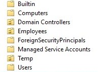

2. Создать пользователей в ОП Employees и изменение их свойств.

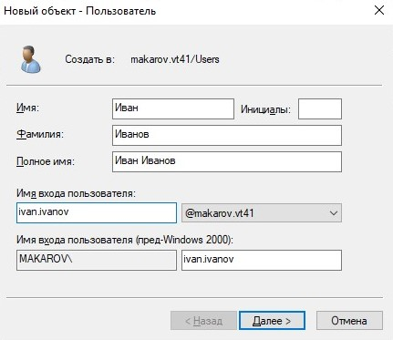

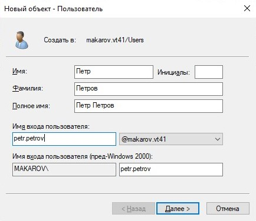

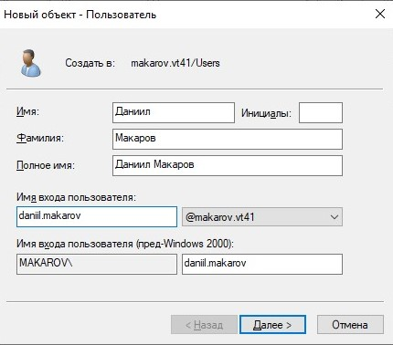

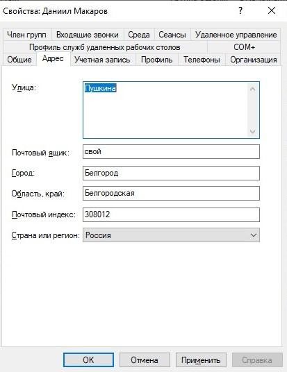

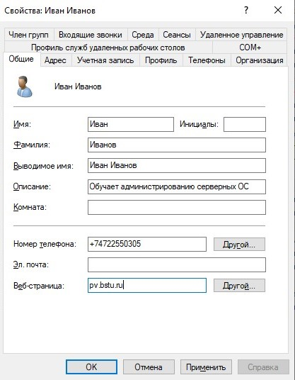

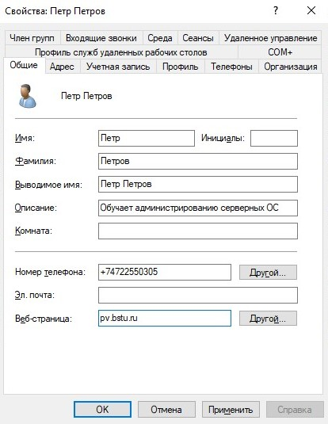

3. При помощи команды Найти осуществите поиск пользователя Иван Иванов в вашем домене. При помощи команды Переместить переместите его в ОП Temp. Переместите объект пользователя обратно в ОП Employees с помощью сценария. С помощью сценария удалите ОП Temp.

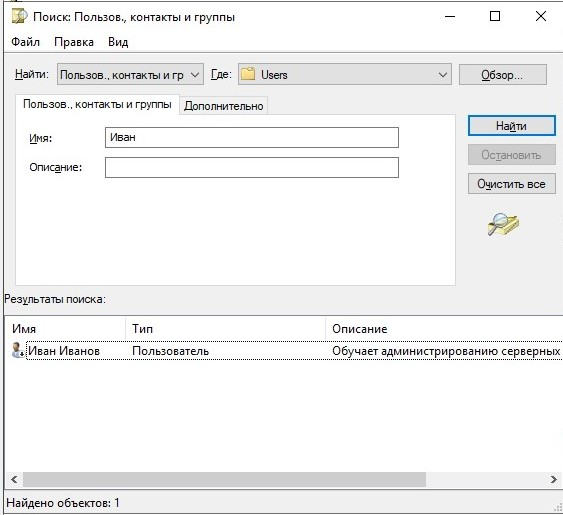

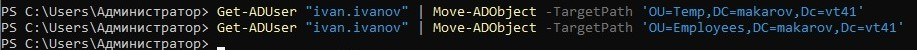

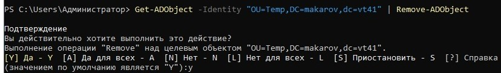

4. Создать учетную запись пользователя для шаблона и установка необходимых свойств.

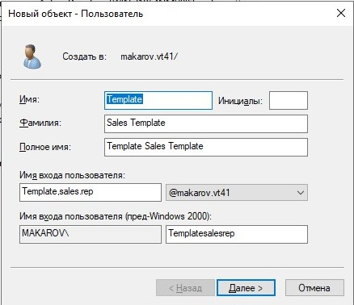

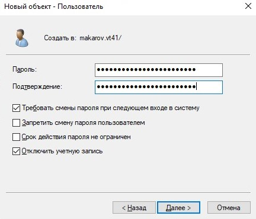

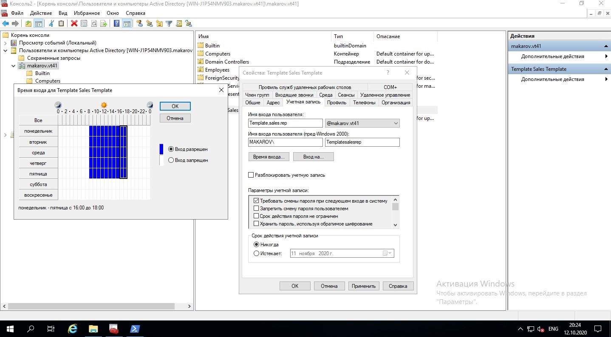

5. Копирование шаблона для создания учетных записей пользователей.

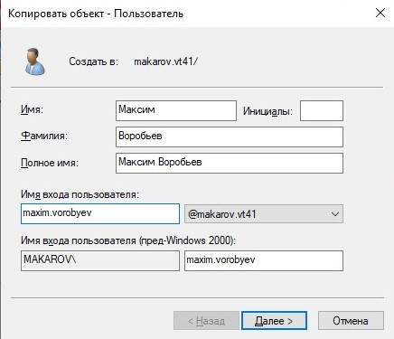

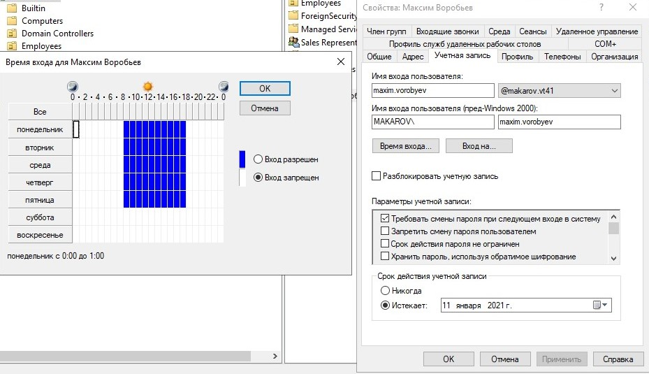

6. Создание .csv файла с следующим содержимым и импортирование его в AD при помощи утилиты csvde.

```csv
DN,objectClass,sAMAccountName,sn,givenName,userPrincipalName
"CN=Андрей Калиберда,OU=Employees,DC=povtas,DC=com",user,andrey.kalib,Калиберда,Андрей
"CN=Юрий Шелаев,OU=Employees,DC=povtas,DC=com",user,juriy.shell,Шелаев,Юрий
```

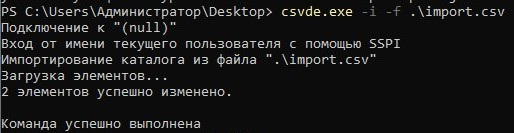

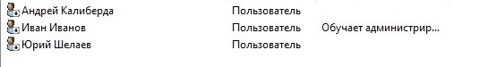

7. Сброс пароля при помощи утилиты dsquery.

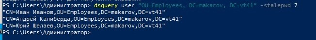

8. В контейнере Builtin консоли *Active Directory — пользователи и компьютеры* раскройте окно свойств группы Операторы печати. На вкладке Члены группы добавьте группу Пользователи домена.

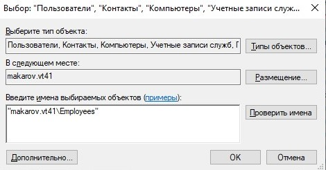

9. Создать директорию Profiles

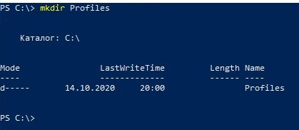

10. Создать учетную записи - шаблон для профилей пользователей.

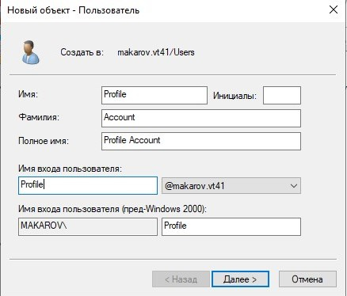

11. Создание профиля и установка его для пользователя Петр Петров как обязательного профиля.

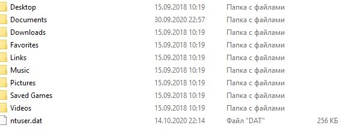

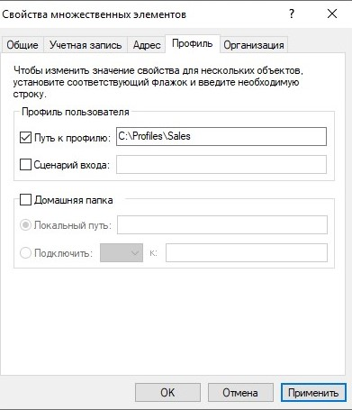

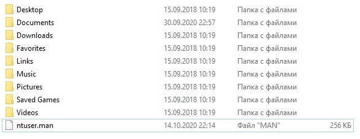

**Вывод**: Я ознакомился с объектами службы AD и научился создавать и управлять этими объектами при помощи различных утилит встроенных в Windows Server. В качестве графического интерфейса для создания объектов AD выступает оснастка *AD - пользователи и компьютеры*, а в качестве консольных инструментов встроенные модули AD в интерпретатор языка powershell.

**Контрольные вопросы**:

1. Что такое учетная запись пользователя?
   
2. Какими способами можно создавать учетные записи?

3. Перечислите свойства объекта пользователя.

4. Какие свойства учетной записи можно одновременно изменить для нескольких объектов пользователей?

5. Перечислите средства командной строки Active Directory.

6. Профили пользователя. Виды профилей.

**Ответы**:
 
1. Учетная запись пользователя — перечень сведений, определяющих персональные настройки пользователя, права доступа.

2. При помощи оснастки *AD - пользователи и компьютеры* или при помощи команды powershell Create-ADUser.\
   
3. * Общие (General) – основные свойства пользователя, которые задаются при создании учетной записи в AD (имя, фамилия, телефон, email и т.д.);
   * Адрес (Address);
   * Учетная запись (Account) – имя учетной записи (samAccountName, userPrincipalName). Здесь можно указать список компьютеров, на которых разрешено работать пользователю (LogonWorkstations), опции: пароль не истекает, пользователь не может сменить пароль, включена ли учетная запись и ее срок действия и т.д.;
   * Профиль (Profile) – можно настроить путь к профилю пользователя (в сценариях с перемещаемыми профилями); скрипт, выполняемый при входе, домашнюю папку, сетевой диск;
   * Телефоны (Telephones);
   * Организация (Organization) – должность, департамент, компания пользователя, имя менеджера.

4. Одновременно можно изменять некоторые свойства связанные с администрирование учетной записи (время входа-выхода), и персональную информацию которая не относится к конкретному человеку (кабинет, организация, адресс, домашняя папка, профиль учетной записи).

5. *  DSADD — добавляет объекты в Active Directory;
   *  DSGET — показывает свойства объектов, зарегистрирован­ных в Active Directory;
   * DSMOD.— изменяет свойства объектов, существующих в Active Directory;
   * DSMOVE — перемещает один объект в новое место в том же домене или переименовывает объект, не перемещая его;
   * DSQUERY — ищет объекты Active Directory по определен­ному критерию;
   * DSRM — удаляет объекты из Active Directory.

6. Профиль пользователя - персональные настройки компьютера закрепленные за пользователем.

Виды профилей:

   * локальный профиль, расположенный на конкретном компьютере и не хранящийся на сервере;
   * перемещаемый профиль, хранящийся на сервере и копируемый на любой компьютер, на котором регистрируется пользователь;
   * обязательный профиль, являющийся разновидностью перемещаемого профиля, настройки пользователя в котором не сохраняются после завершения сеанса.