1. Просмотр набора классов в репозитории WMI.

Через меню "Выполнить" была вызвана команда wbemtest 

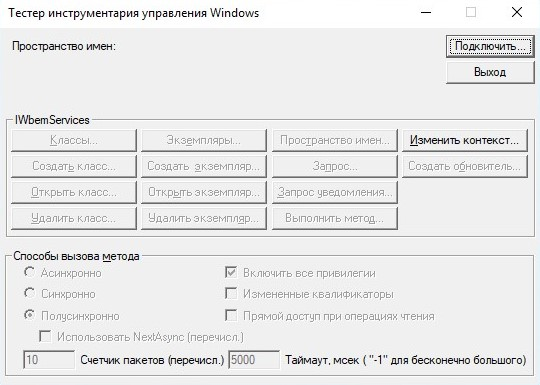

В списке всех классов WMI был найден класс Win32_NTDomain и получен список всех его экземпляров.

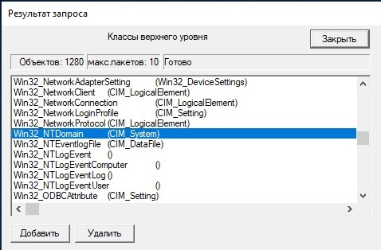

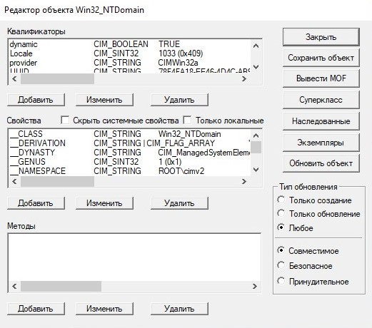

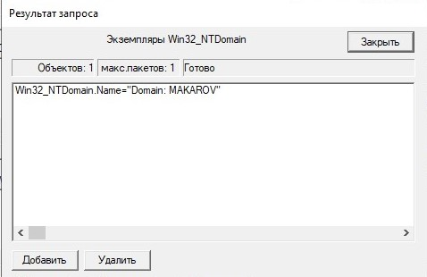

В окне списка соединителей был получен список групп домена и найдена группа "Sales Representative".

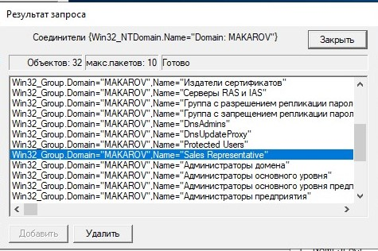

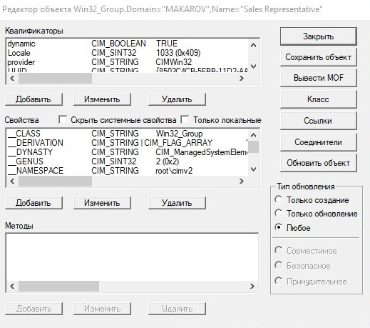

В экземплярах класса учетных записей были найдены указанные пользователи, в атрибут *Disabled* установлены требуемые значения.

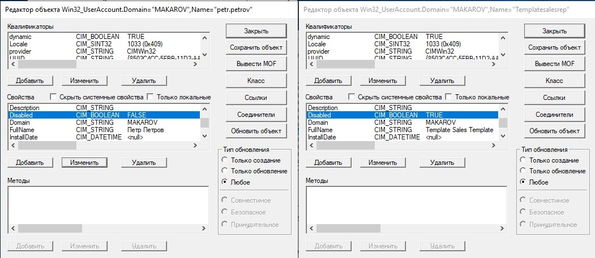

2. Был найден класс Win32_UserAccount.

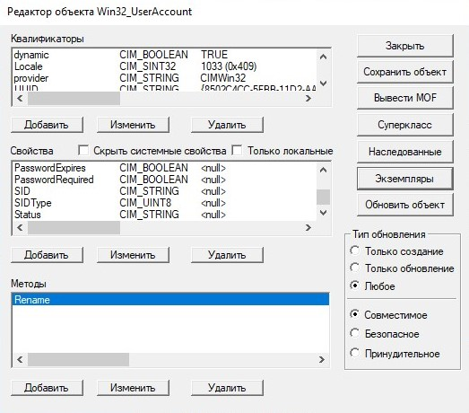

В списке экземпляров класса был найден объект "petr.petrov"

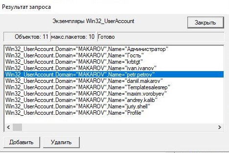

В окне вызова метода был выбран метод Rename объекта "petr.petrov", и установлены требуемые параметры.

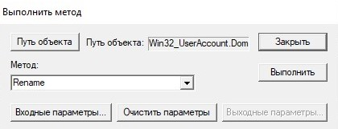

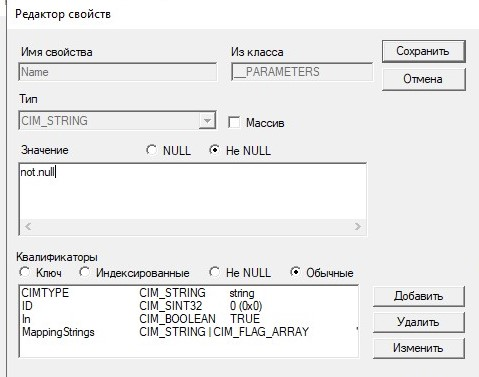

Метод был успешно выполнен но изменения не были внесены в поля объекта. 

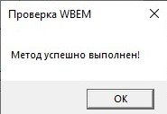

3. Запросы WSL

В окне запросы, был выполнен WQL запрос 

```sql
select * from Win32_UserInDomain
```

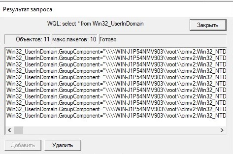

Запрос выводящий пользователей группы "Sales Representative".

```sql
   select * from Win32_GroupUser where
      GroupComponent =  '
                           Win32_Group.Domain   =  "makarov",
                           Name                 =  "Sales Representative"
                        '
```

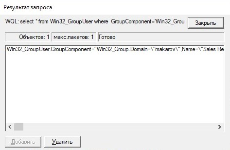

Запрос перечисляющие логические диски:.


```sql
select * from Win32_LogicalDisk
```

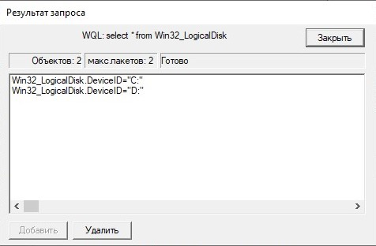

Запрос перечисляющие процессоры:.


```sql
select * from Win32_PerfRawData_PerfOS_Processor
```

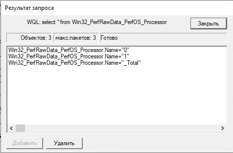

4. Утилита wmic

Был запущена консоль powershell и в ней запущена консоль wmi. При просмотре списка команд, было указано что инструмент WMI является устаревшим и больше не поддерживается.

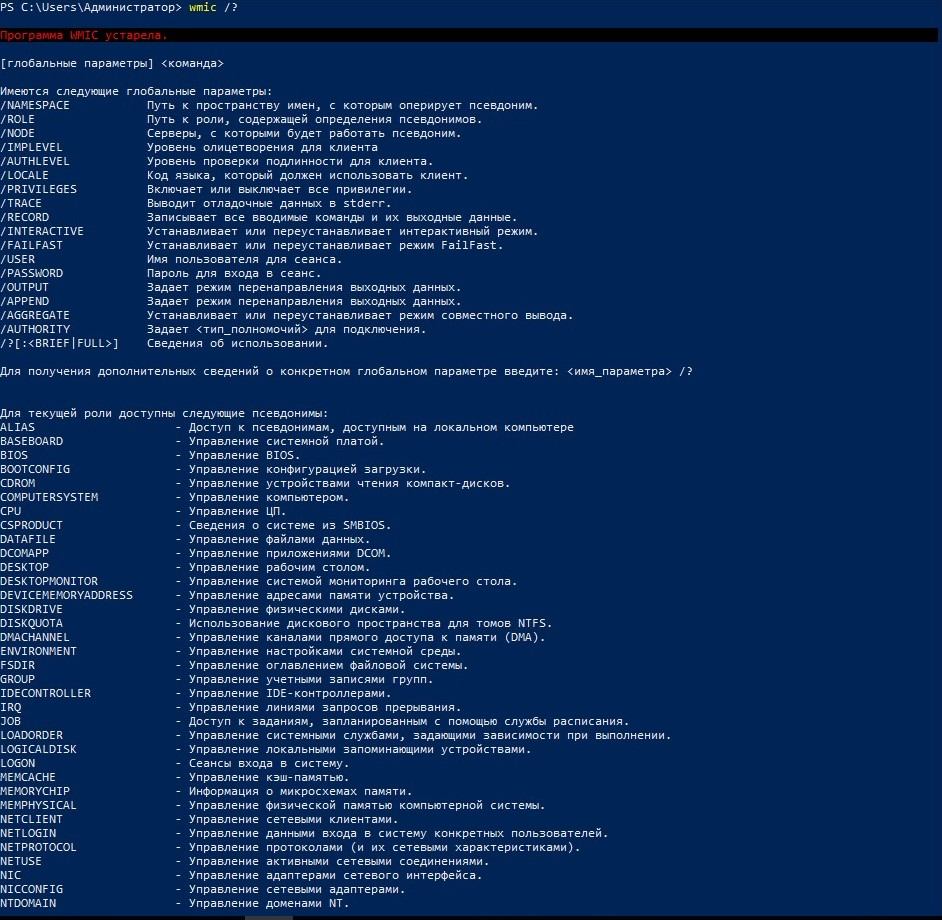

Используя команду ```wmic group where domain="makarov"``` был выведен список всех групп домена.

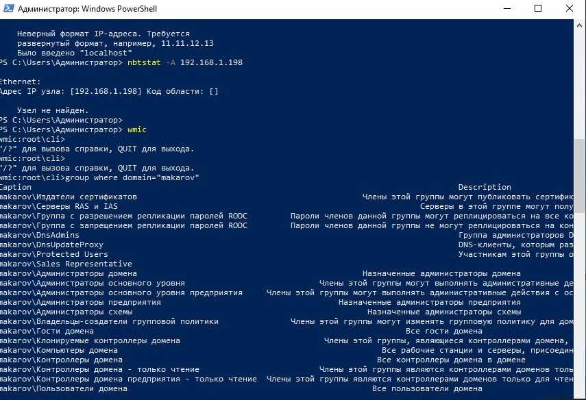

Используя команду ```wmic group where domain="makarov"``` был выведен список всех пользователей домена.

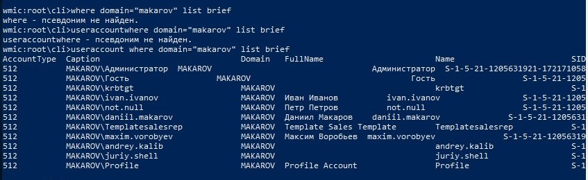

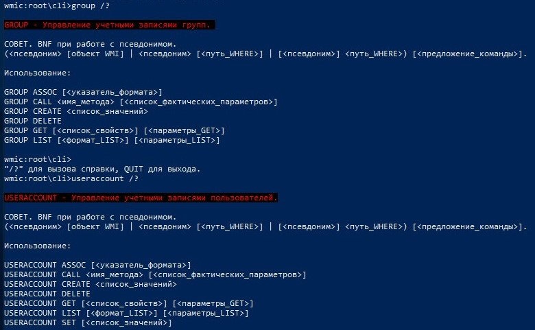

5. Сценарии с использованием WMI

Был создан сценарий с указанным исходным кодом

```vb
On error Resume Next
strComputer="server01"
Set objWMIService = GetObject("winmgmts:\\" & strComputer &"\root\cimv2")
Set colItems=objWMIService.ExecQuery("Select * from Win32_UserAccount")
For each objItem in colItems
if ObjItem.domain="makarov" then
   Wscript.echo "Caption "&ObjItem.caption
   Wscript.echo "Name: "&ObjItem.name
   Wscript.echo "Full name: "&ObjItem.fullname
   Wscript.echo "Disabled: "&ObjItem.disabled
   Wscript.echo "------------------------------"
   end if
Next
```

Сценарий был исполнен при помощи консольной утилиты **cscript**.

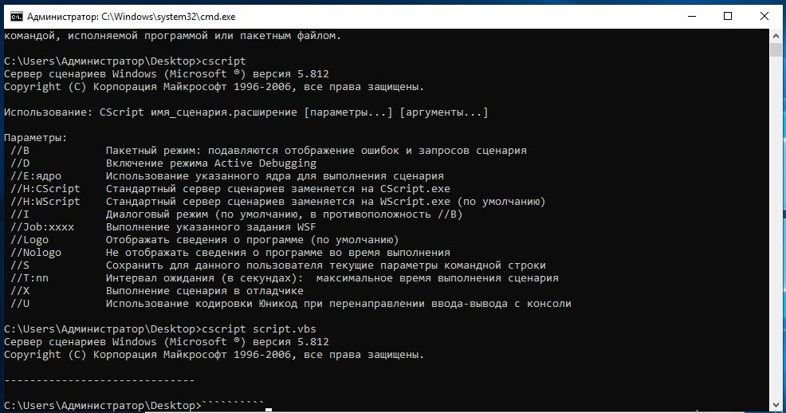

### Вывод

В ходе выполнения данной лабораторной я ознакомился с утилитами использующими WMI, для взаимодействия с объектами домена. Так же я ознакомился с языком запросов WQL позволяющим, создавать SQL-подобные запросы, где вместо строк из таблиц с данными запрос возвращает объекты домена.

### Контрольные вопросы

1. Что такое WMI? Для чего она используется?
   
WMI – Windows Management Instrumentation, он же инструментарий для управления Windows. Представляет из себя набор интерфейсов для управления операционной системой через специальные компоненты, причем как локально, так и по сети. Позволяет использовать различные скриптовые языки для упрощения управления объектами Active Directory.

2. Перечислите средства работы с WMI для администратора.
 
   *	mofcomp.exe
   *	winmgmt.exe
   *	wmimgmt.msc
   *	wbemtest.exe
   *	wmic.exe

3. Общая структура WMI.

Архитектура WMI состоит из 3 частей:

* ядро WMI (WMI infrastructure) - связующее звено архитектуры WMI, отвечающее за связность компонентов.

* управляющие программы (management applications)- потребителями сервисов WMI.
  
* управляемые объекты/ресурсы (managed resources) — любые логические или физические компоненты информационной системы, доступ к которым может быть получен с помощью WMI.

4. Опишите возможности программы WMIC.
 
Инструментарий WMI. Используется для получения сведений об оборудовании и системе, управления процессами и их компонентами, а также изменения настроек с использованием возможностей инструментария управления Windows.

5. Опишите возможности программы WBEMTEST. 
 
Утилита предоставляющая графический интерфейс для доступа к ресурсам WMI, позволяющая получить списки классов, экземпляров классов, связи между ними, а так же выполнять методы классов и WQL запросы.

6. Использование WQL-запросов.

WQL запросы используют синтаксис SQL запросов, за исключением того что вместо связных таблиц с данными выборка производится по классам домена, и вместо строк таблиц возвращаются объекты домена.