1. Создание группы.
   
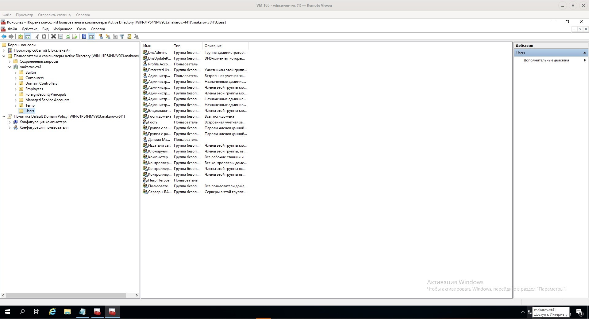

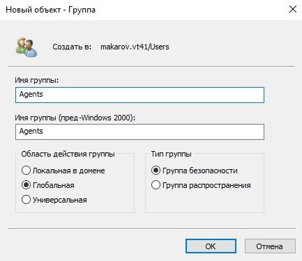

В созданной группе, можно изменить область действия группы.


2. Для выполнения указанных операций был написан скрипт на языке Powershell.

```powershell
New-ADGroup -GroupScope DomainLocal  -Name Group1
New-ADGroup -GroupScope DomainLocal  -Name Group2
New-ADGroup -GroupScope DomainLocal  -Name Group3
Get-ADGroup -Filter 'name -like "Group*"' | Set-ADGroup -GroupScope Universal
Get-ADGroup -Filter 'name -like "Group*"' | Set-ADGroup -GroupScope Global
New-ADUser -Name User1
New-ADUser -Name User2
New-ADUser -Name User3
Add-ADGroupMember -Identity Group1 -Members User1,User2,User3
Get-ADGroupMember -Identity Group1
Get-ADGroupMember Group1 | ForEach-Object {
  Add-ADGroupMember -Identity Group2 -Members $_
  Remove-ADGroupMember -Identity Group1 -Members $_
}
Get-ADGroupMember -Identity Group1
```

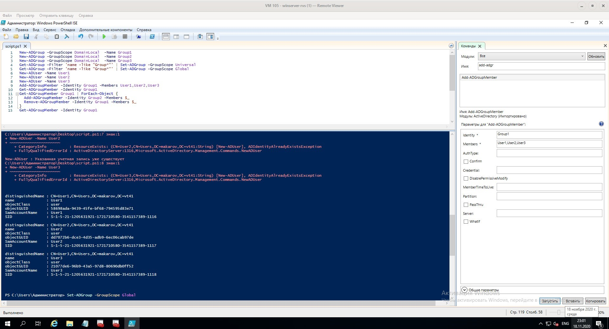

3. Работа с LDIFDE

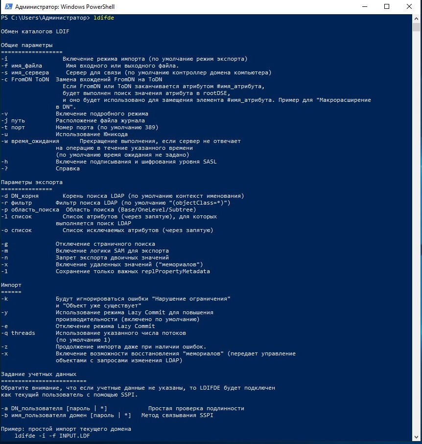

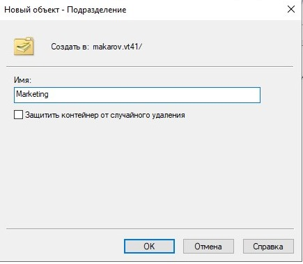

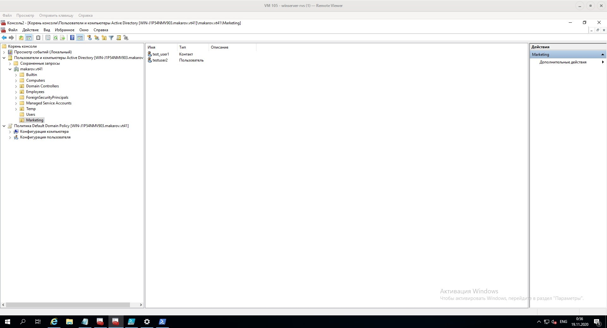

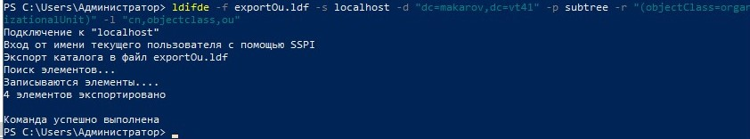

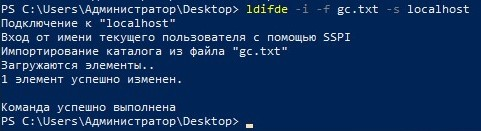

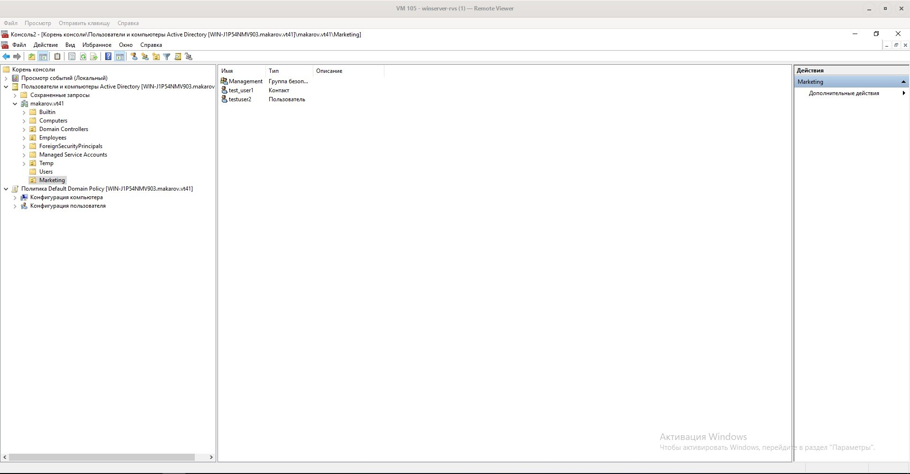


4. Настройка политик Active Directory

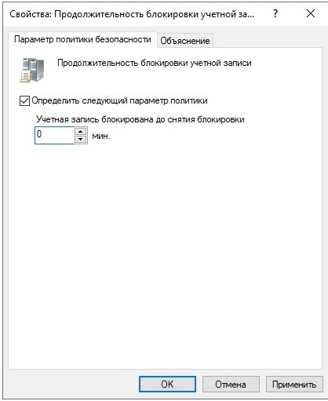

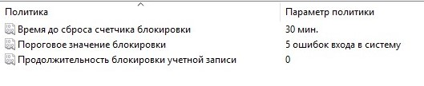

Далее были совершены успешные и неудачные попытки входа в учетную запись

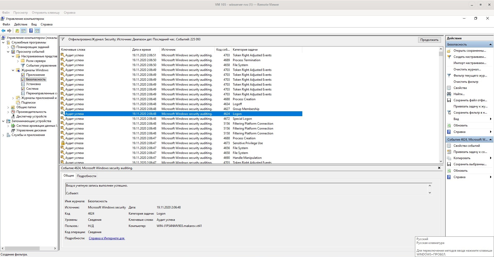

### Вывод

В ходе лабораторной работы были получены навыки работы с группами при помощи Powershell сценариев и утилиты LDIFDE. А так же мы ознакомились с локальными политиками AD и способами их настройки 

### Контрольные вопросы

1.Что такое группы Active Directory? Типы групп.

*Группа Active Directory* - это совокупность объектов в Active Directory. В группу могут входить пользователи, компьютеры, другие группы и другие объекты AD.

Существует 2 типа групп:
   * группы безопасности
   * группы распространения

Так же группы подразделяются по области действия

   * универсальные
   * глобальные 
   * локальные

2. Перечислите политики паролей. Что они определяют?

   * Вести журнал паролей
   * Максимальный срок действия пароля 
   * Минимальный срок жизни пароля
   * Минимальная длина пароля 
   * Пароль должен отвечать требование сложности 
   * Хранить пароли, использую обратимое шифрование

3. Перечислите политики блокировки учетной записи. Что они
определяют?

   * Время до сброса счетчиков блокировки.
   * Пороговое значение блокировки. 
   * Продолжительность блокировки учетной записи.

4. Что такое аудит? Перечислите политики аудита.

Аудит - журналирование событий. 

   * аудит проверки учетных данных
   * отслеживание изменений в учетных записей пользователей и компьютеров
   * аудит активности индивидуальных приложений
   * аудит изменений в объектах службы Active Directory Domain Services
   * аудит интерактивных и сетевых попыток входа на компьютеры и сервера домена
   * аудит доступа к различным объектам
   * аудит изменений в групповых политиках
   * аудит прав доступа к различным категориям данных
   * изменения в настройках компьютеров, потенциально критичных с точки зрения безопасности

5. Что содержит журнал событий безопасности?

Список записей о событиях, с различными фильтрами.
