1.Были созданы несколько учетных записей компьютера разными способами.

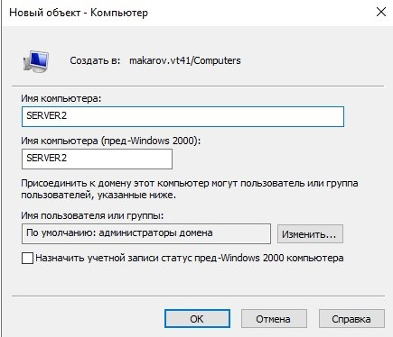
   
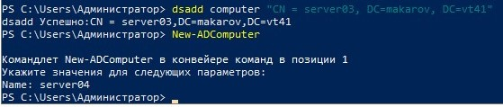

Были созданы ОП Servers и выполнены перемещения учетных записей компьютеров.

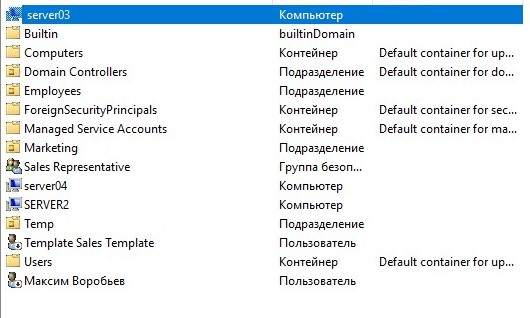

2. Была развернута вторая виртуальная машина на том же гипервизоре что и домен AD и настроено сетевое подключение между ними.

Перед подключением компьютера к домену AD в настройках сетевого подключения в качестве приоритетного DNS сервера был выбран домен AD, для успешного подключения к домену.

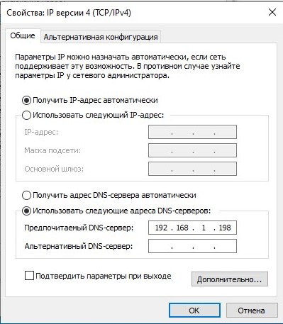

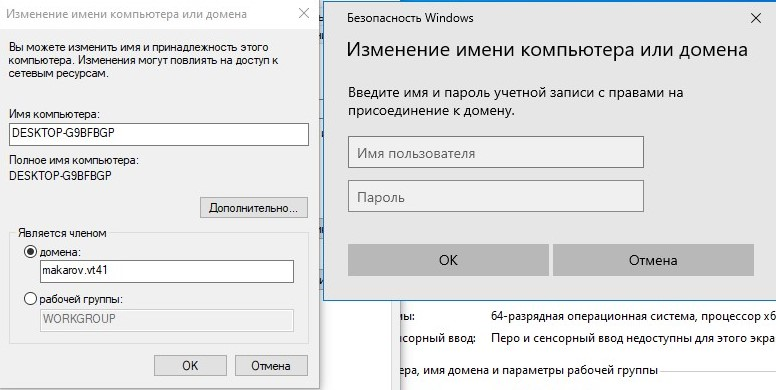

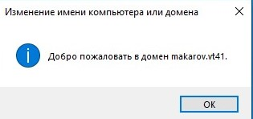

3. Для выполнения следующего пункта л.р. было создана новая группа Deployment

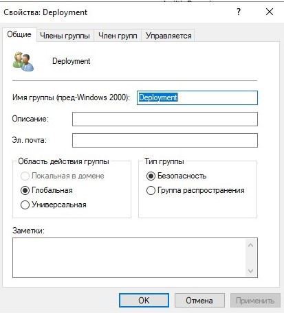

Далее был создан объект компьютер для подключения его в домен,а так же он был добавлен в группу Deployment.

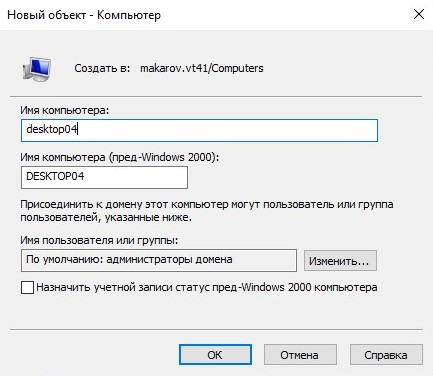

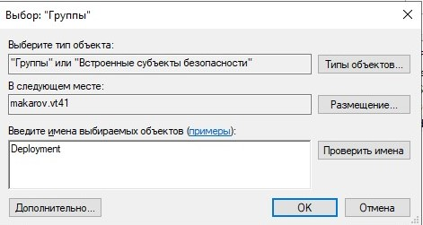

4. В домене AD не были найдены учетные записи компьютеров которые не были активны больше 2 и 12 недель.

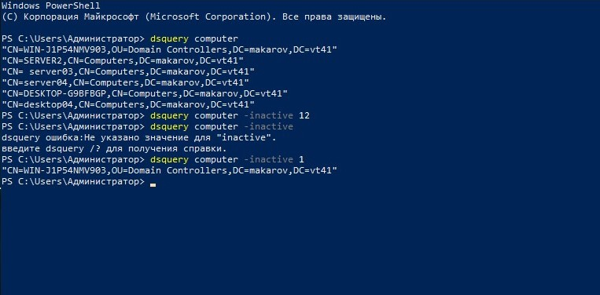

5. В консоле AD был выполнен поиск учетных записей компьютеров.

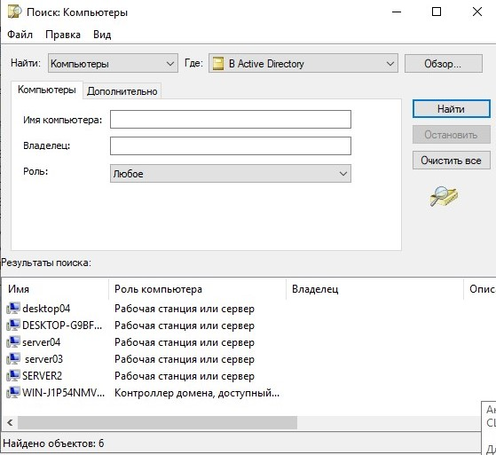

6. Так же были изменены параметры объекта компьютера.

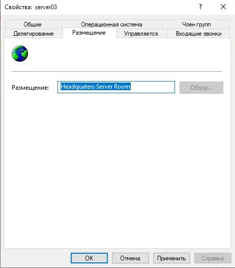

7.  Устранение неполадок 

   1. Безопасный канал связи компьютера с доменом разорван;
   2. Порядок действий: 2,3,4

### Вывод

В ходе лабораторной работы были получены навыки работы с объектами - компьютер в домене AD при помощи различных системный утилит, а так же мы ознакомились с процедурой присоединения компьютера к домену AD и конфигурацией клиентской версии ОС Windows.

### Контрольные вопросы

1. Для чего нужна учетная запись компьютера?

Для удобства управление и администрирования конкретным ПК, а не пользователем.

2. Какими способами можно создавать учетные записи
компьютеров?

При помощи любых утилит которые могут создавать и редактировать объекты домена AD. (Powershell,  DSADD, оснастки консолей)

3. Перечислите свойства объекта компьютера.

Имя, название операционной системы, последнее время входа и журнал входов

4. Для чего необходима возможность удаления, отключения и
переустановки учетных записей компьютеров?

Для обеспечения безопасности, в случае каких-либо форс-мажоров.

5. Почему учетная запись компьютера создается в домене до
присоединения компьютера к домену?

Потому что объект компьютер при присоединении компьютера к домену, учетная запись компьютера связывается с конкретным ПК.