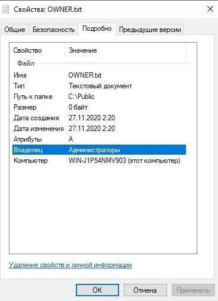

1. Были созданы учетные записи пользователей в соответствии с заданием
   


и созданы папки 

```
C:\Public;
C:\Public\Library.
```
2. Для папки Public были установлены следующие разрешения:


3. После входа в систему от имени пользователя user1 был создан текстовый документ, а так же возможно было выполнить операции изменения файла и удаления.


Однако, при попытке выполнить эти операции от имени пользователя user2 система потребовала права администратора.


4. Установить разрешения NTFS для папки Public.

При этом необходимо соблюдать следующие правила:

* все пользователи должны иметь возможность читать документы и файлы в папке Public;
* все пользователи должны иметь возможность создавать документы в папке Public;
* все пользователи должны иметь возможность изменять содержание, свойства и разрешения для создаваемых ими документов в папке Public;
* пользователь User2 несет ответственность за подержание папки Public и должен иметь возможность изменять и удалять все файлы в папке Public.

Для соблюдения вышеописанных требований необходимо установить следующие разрешения для User2


А так же разрешить создание изменение и удаление файлов в данной директории для группы Пользователи.

5. После изменения разрешений удалось выполнить требуемые операции с файлами от имени пользователей User1 и User2. 

6. Подключившись  используя учетную запись администратор был создан текстовый документ OWNER
   


Владельцем файла является учетная запись используя которую был создан файл.

Далее права владельца были переданы учетной записи user1.


7. Были созданы папки Temp2 и Temp3 с указанными разрешениями

Теmр2

* Администраторы: Полный доступ
* Пользователи: Чтение и выполнение

Теmр3

* Администраторы: Полный доступ
* Операторы архива: Чтение и выполнение
* Пользователи: Полный доступ


Папка Temp2 была скопирована в папку Templ, разрешения были уснаследованы копией и остались прежними.


8. В папке Temp3 был создан файл NOACCESS и удалено разрешение Полный доступ для группы пользователей.


При попытке удаления этого файла учетной записью из группы пользователей система требуют привелегии уровня администратора.

### Вывод

В рамках данной лабораторной работы были получены навыки обеспечения безопасности ресурсов при помощи системы разрешений файловой системы NTFS. Файловая система NTFS позволяет гибко настраивать права доступа для каждого файла и директории, которые будут применятся к различным группам пользователей или конкретным учетным записям пользователей.

### Контрольные вопросы

1. Какое из следующих утверждений правильно описывает разрешения NTFS для папок и файлов?

   * Разрешения NTFS явно указывают, какие пользователи и группы могут получить доступ к файлам и папкам, и какие действия можно совершать с содержимым этих файлов и папок.


2. Какое из следующих разрешений NTFS для папок позволяет вам удалить папку?

   * Администрирование.

3. Какое разрешение NTFS для файлов следует установить для файла, если вы позволяете пользователям удалять файл, но не позволяете становиться владельцем файла?

   * Изменение

4. Что такое список управления доступом (ACL)? Чем ACL отличается от элемента списка управления доступом (ACE)?

   ACL — список управления доступом, который определяет, кто или что может получать доступ к объекту и какие именно операции разрешено или запрещено выполнять субъекту.

5. Что такое эффективные разрешения пользователя для ресурса?
   
   Эффективные разрешения пользователя для ресурса - это совокупность разрешений NTFS, которые вы назначаете отдельному пользователю и всем группам, к которым он принадлежит.

6. Какие объекты по умолчанию наследуют разрешения, установленные для родительской папки?
   
   Файлы наследуют разрешения, установленные для родительской папки.

7. Какое разрешение устанавливается для группы Все при форматировании тома?
   
   Полный доступ

8. Какие разрешения рекомендуется устанавливать при установке разрешений для папок общего доступа для группы Пользователи, а какие для группы Создатель-Владелец?
   
   Создатель-Владелец-Администратор: полный доступ

   Пользователи: чтение, изменение, запись, выполнение

9.  Кто может устанавливать разрешения для отдельных пользователей и групп? (Выберите все правильные ответы.)
    
    * Члены группы Администраторы.
    доступ.
    * Владельцы файлов и папок.

10.  Какой из следующих вкладок диалогового окна свойств файла или папки следует воспользоваться для установки или изменения разрешения NTFS для файла или папки?

        * Безопасность.

11.  Каково назначение особого разрешения Обзор папок/Выполнение файлов?

   Разрешение позволят только читать и исполнять файлы.

12.  Чем отличается разрешение Удаление от разрешения Удаление подпапок и фалов?

Разрешения отличаются тем что Разрешение удаление не распространяется на вложенные объекты.
    
13.   С какими ограничениями следует устанавливать разрешения при установке разрешений NTFS?
    
   Разрешения на использование файлов должны быть только у тех групп пользователей которым эти файлы предназначены. Так же должны существовать группы пользователей имеющие контроль над используемыми файлам.

14.   Если вы хотите, чтобы пользователь или группа не имела доступа к определенной папке или файлу,следует ли запретить разрешения для этой папки или файла?

Разрешения имеют приоритет ниже чем запреты, поэтому для ограничения доступа лучше использовать разрешения на всех уровнях.