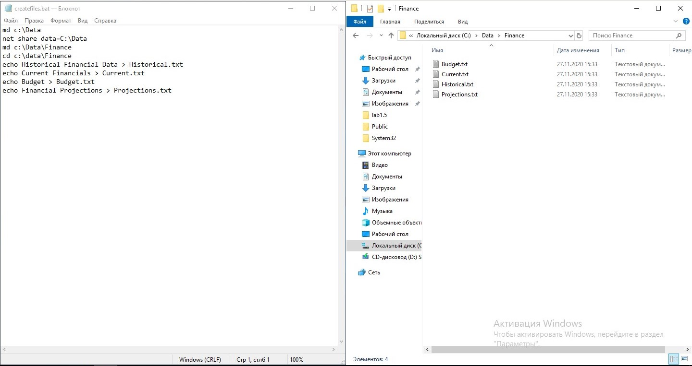

1. Создание данных для выполнения работы.

Для создания тестовых данных был использован следующий скрипт.

```batch
   md c:\Data
   net share data=C:\Data
   md c:\Data\Finance
   cd c:\data\Finance
   echo Historical Financial Data > Historical.txt
   echo Current Financials > Current.txt
   echo Budget > Budget.txt
   echo Financial Projections > Projections.txt
```

Скрипт был сохранен как файл "C:/createfiles.bat", и запущен через командную строку.



2. Утилита ntbackup.exe начиная с Windows Server 2008 была заменена новой инструментом wbadmin, в которой были удалены и изменены некоторые функции используемые в лабораторной работе.

Так как для выполнения лабораторной работы использовалась сборка операционной системы Windows Server 2019, ниже будет описан процесс выполнения работы используя утилиту wbadmin.

Все процессы архивации и восстановления в wbadmin выполняются при помощи мастеров.

**Однократная архивация**

Для однократной архивации используется Мастер однократной архивации. Предлагается выбрать сервер, параметры архивации, файлы которые будут сохранены в архиве и путь назначение куда будет сохранен архив.


**Архивация по расписанию**

Для архивации используется Мастер расписания архивации. В отличии от однократной архивации, в мастере архивации по расписанию необходимо выбрать время и кол-во архиваций в день.


**Востановление из архива**

Для восстановления данных из архива используется Мастер восстановления. В нем предлагается выбрать расположение архива, дату создания архива и восстанавливаемые элементы. 


3. Дополнительные возможности архивации и восстановления.

Утилита wbadmin не предоставляет дополнительных параметров для архивации и восстановления.

Для работы архивации и востановления в wbadmin необходим раздел с файловой системой NTFS и активированным теневым копированием.

Для того чтобы включить теневое копирование необходимо, открыть свойства раздела и во вкладке "Теневые копии" выбрать необходимый том и активировать теневое копирование кнопкой "Включить". После этого станет доступна архивация в утилите wbadmin.


Нажав на кнопку параметры, можно изменить размер выделяемый на теневые копии и настроить автоматическое копирование по расписанию.


### Вывод

В ходе данной лабораторной работы была освоена утилита wbadmin и предоставляемые ей возможности по архивации и восстановлению данных. Были изучены стратегии и методы архивации и восстановления данных.

### Контрольные вопросы

1.Для чего нужна архивация данных?

   Архивация данных необходима для хранения архивных данных (невостребованных на данный момент времени) с низкой частотой обращения к ним, для уменьшения занимаемого пространства на носителях. А также архивация может использоваться как механизм резервного копирования для сохранения особо важных данных

2. Перечислите типы архивации.

* обычная архивация
* разностная архивация
* добавочная архивация
* копирующая архивация
* архивация по расписанию
  
3. Каковы основные стратегии архивации?

Совмещение обычной и разностной или обычной и добавочной архиваций.

4. Перечислите параметры восстановления файлов.

* не заменять существующий файл на компьютере
* не заменять существующий файл на компьютере, если он старее копии
* всегда заменять файлы

5. Каковы дополнительные возможности архивации и восстановления данных?

В файловой системе NTFS существует дополнительная функция облегчающая архивацию - теневые копии разделов.

6. Для чего необходимо планирование заданий архивации?

Планирование архиваций используется для автоматизации процесса архивации.

7. С какой целью используют теневые копии папок.

Используется для быстрого востановления поврежденных или удаленных файлов и директорий.