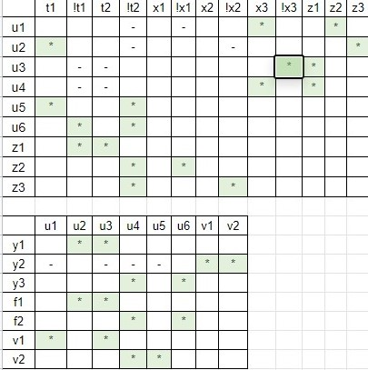
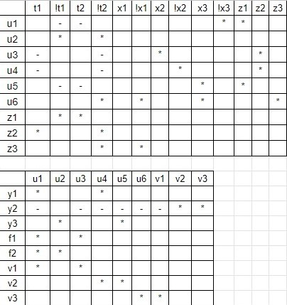

# Построение граф-схемы алгоритма.

Представим алгоритм данный в таблице, в виде граф-схемы алгоритма.

Так же отметим на ГСА состояния автоматов Мили и Мура.

Для дальнейшего удобства записи входов и выходов дадим им символьные метки.

@latex \newpage @/latex

# Получение автоматов Мили и Мура в табличном и графовом виде.

Получим по ГСА таблицы автоматов Мили и Мура.

## Автомат Мили.

Построим граф автомата Мили.

Выполним кодирование состояний автомата Мили, для хранения состояний данного автомата необходимо 2 триггера.

**Кодирование состояний автомата Мили**

| Cостояние |  Код  |
| :-------: | :---: |
|   $a_1$   |  00   |
|   $a_2$   |  01   |
|   $a_3$   |  10   |

Получим функции выходов автомата Мили.
Выходы автомата Мили зависят от входов и от текущего состояния.

**Функция выходов Мили** $y_1:$ 

$(\overline t_1 t_2 \overline x_3 )\lor (t_1 \overline t_2  \overline x_2 )$

**Функция выходов Мили** $y_2:$ 

$(t_1 \overline t_2  x_2 )\lor (\overline t_1 \overline t_2  \overline x_1 x_3 )\lor (\overline t_1 t_2  x_3 )\lor (\overline t_1 t_2  \overline x_3 )\lor (t_1 \overline t_2  \overline x_2 )$

**Функция выходов Милли** $y_3:$ 

$(\overline t_1 \overline t_2  x_1 )\lor (\overline t_1 \overline t_2  \overline x_1 \overline x_3 )\lor (\overline t_1 \overline t_2  \overline x_1 x_3 )\lor (\overline t_1 t_2  x_3 )$

## Автомат Мура.

Получим по ГСА автомат Мура, 

Выполним кодирование состояний автомата Мура, для хранения состояний данного автомата необходимо 3 триггера.

**Кодирование состояний автомата Мура**

| Cостояние |  Код  |
| :-------: | :---: |
|   $a_1$   |  000  |
|   $a_2$   |  001  |
|   $a_3$   |  010  |
|   $a_4$   |  011  |
|   $a_5$   |  100  |

Получим функции выходов Мура.
Выходы автомата Мура зависят только текущего состояния.

**Функция выходов Мура** $r_1:$

$(\overline t_1  t_2  t_3)$

**Функция выходов Мура** $r_2:$

$(\overline t_1 \overline t_2  t_3)\lor (\overline t_1  t_2  t_3)\lor (t_1 \overline t_2 \overline t_3)$

**Функция выходов Мура** $r_3:$

$(\overline t_1 \overline t_2  t_3)\lor (\overline t_1  t_2 \overline t_3)$

# Получение функций возбуждения триггеров и минимизация системы булевых функций автоматов.

## Автомат Мили. D-триггер.

Получим функции возбуждения D-триггера для автомата Мили.

**Функция возбуждения D-триггера** $\phi_1:$ 

$(\overline t_1 t_2 \overline x_3 )\lor (t_1 \overline t_2 \overline x_2 )$

**Функция возбуждения D-триггера** $\phi_2:$ 

$(\overline t_1 \overline t_2 x_1 )\lor (\overline t_1 \overline t_2 \overline x_1 x_3 )\lor (\overline t_1 \overline t_2 \overline x_1 \overline x_3 )\lor (\overline t_1 t_2 x_3 )$

Минимизируем систему булевых функций ($y_1, y_2, y_3,\phi_1, \phi_2$). 

**СДНФ системы булевых функций**

$y_1=\overline t_1t_2\overline x_3\overline x_2\overline x_1\lor \overline t_1t_2\overline x_3\overline x_2x_1\lor \overline t_1t_2\overline x_3x_2\overline x_1\lor \overline t_1t_2\overline x_3x_2x_1\lor t_1\overline t_2\overline x_3\overline x_2\overline x_1\lor t_1\overline t_2\overline x_3\overline x_2x_1\lor t_1\overline t_2x_3\overline x_2\overline x_1\lor t_1\overline t_2x_3\overline x_2x_1$

$y_2=\overline t_1\overline t_2x_3\overline x_2\overline x_1\lor \overline t_1\overline t_2x_3x_2\overline x_1\lor \overline t_1t_2\overline x_3\overline x_2\overline x_1\lor \overline t_1t_2\overline x_3\overline x_2x_1\lor \overline t_1t_2\overline x_3x_2\overline x_1\lor \overline t_1t_2\overline x_3x_2x_1\lor \overline t_1t_2x_3\overline x_2\overline x_1\lor \overline t_1t_2x_3\overline x_2x_1\lor \overline t_1t_2x_3x_2\overline x_1\lor \overline t_1t_2x_3x_2x_1\lor t_1\overline t_2\overline x_3\overline x_2\overline x_1\lor t_1\overline t_2\overline x_3\overline x_2x_1\lor t_1\overline t_2\overline x_3x_2\overline x_1\lor t_1\overline t_2\overline x_3x_2x_1\lor t_1\overline t_2x_3\overline x_2\overline x_1\lor t_1\overline t_2x_3\overline x_2x_1\lor t_1\overline t_2x_3x_2\overline x_1\lor t_1\overline t_2x_3x_2x_1$

$y_3=\overline t_1\overline t_2\overline x_3\overline x_2\overline x_1\lor \overline t_1\overline t_2\overline x_3\overline x_2x_1\lor \overline t_1\overline t_2\overline x_3x_2\overline x_1\lor \overline t_1\overline t_2\overline x_3x_2x_1\lor \overline t_1\overline t_2x_3\overline x_2\overline x_1\lor \overline t_1\overline t_2x_3\overline x_2x_1\lor \overline t_1\overline t_2x_3x_2\overline x_1\lor \overline t_1\overline t_2x_3x_2x_1\lor \overline t_1t_2x_3\overline x_2\overline x_1\lor \overline t_1t_2x_3\overline x_2x_1\lor \overline t_1t_2x_3x_2\overline x_1\lor \overline t_1t_2x_3x_2x_1$

$f_1=\overline t_1t_2\overline x_3\overline x_2\overline x_1\lor \overline t_1t_2\overline x_3\overline x_2x_1\lor \overline t_1t_2\overline x_3x_2\overline x_1\lor \overline t_1t_2\overline x_3x_2x_1\lor t_1\overline t_2\overline x_3\overline x_2\overline x_1\lor t_1\overline t_2\overline x_3\overline x_2x_1\lor t_1\overline t_2x_3\overline x_2\overline x_1\lor t_1\overline t_2x_3\overline x_2x_1$

$f_2=\overline t_1\overline t_2\overline x_3\overline x_2\overline x_1\lor \overline t_1\overline t_2\overline x_3\overline x_2x_1\lor \overline t_1\overline t_2\overline x_3x_2\overline x_1\lor \overline t_1\overline t_2\overline x_3x_2x_1\lor \overline t_1\overline t_2x_3\overline x_2\overline x_1\lor \overline t_1\overline t_2x_3\overline x_2x_1\lor \overline t_1\overline t_2x_3x_2\overline x_1\lor \overline t_1\overline t_2x_3x_2x_1\lor \overline t_1t_2x_3\overline x_2\overline x_1\lor \overline t_1t_2x_3\overline x_2x_1\lor \overline t_1t_2x_3x_2\overline x_1\lor \overline t_1t_2x_3x_2x_1$

Получим все простые импликанты системы булевых функций с учетом признака принадлежности.

**Простые импликанты после "склеивания":**

1. $\overline t_1t_2\overline x_3(1,2,4)$
2. $t_1\overline t_2\overline x_2(1,2,4)$
3. $\overline t_2x_3\overline x_1(2)$
4. $\overline t_1x_3\overline x_1(2,3,5)$
5. $\overline t_1t_2x_3(2,3,5)$
6. $\overline t_1t_2(2)$
7. $t_1\overline t_2(2)$
8. $\overline t_1x_3(3,5)$
9. $\overline t_1\overline t_2(3,5)$

Из полученных импликант построим таблицу импликант.

.jpg)

**Полученное покрытие:**

1. $\overline t_2x_3\overline x_1(2)$
2. $t_1\overline t_2\overline x_2(1,4)$
3. $\overline t_1t_2\overline x_3(1,2,4)$
4. $\overline t_1t_2x_3(2,3,5)$
5. $t_1\overline t_2(2)$
6. $\overline t_1\overline t_2(3,5)$

Далее применим факторизационный метод для получения схемы в базисе НЕ-ИЛИ-И с элементами имеющими 2 входа.

Подсчитаем общее кол-во входов получившейся схемы. 

Входы элементов НЕ: 5

Входы элементов И: 18

Входы элементов ИЛИ: 14

Сложность по Квайну: 37

По этому же принципу получим схему автомата Мили с T-триггерами и автоматов Мура.

## Автомат Мили. T-триггер.

**Функция возбуждения T-триггера** $\phi_1:$ 

$(\overline t_1 t_2 \overline x_3 )\lor (t_1 \overline t_2 x_2 )$

**Функция возбуждения T-триггера** $\phi_2:$ 

$(\overline t_1 \overline t_2 x_1 )\lor (\overline t_1 \overline t_2 \overline x_1 x_3 )\lor (\overline t_1 \overline t_2 \overline x_1 \overline x_3 )\lor (\overline t_1 t_2 \overline x_3 )$

**СДНФ системы булевых функций**

$y_1=\overline t_1t_2\overline x_3\overline x_2\overline x_1 \lor  \overline t_1t_2\overline x_3\overline x_2x_1 \lor  \overline t_1t_2\overline x_3x_2\overline x_1 \lor  \overline t_1t_2\overline x_3x_2x_1 \lor  t_1\overline t_2\overline x_3\overline x_2\overline x_1 \lor  t_1\overline t_2\overline x_3\overline x_2x_1 \lor  t_1\overline t_2x_3\overline x_2\overline x_1 \lor  t_1\overline t_2x_3\overline x_2x_1$

$y_2=\overline t_1\overline t_2x_3\overline x_2\overline x_1 \lor  \overline t_1\overline t_2x_3x_2\overline x_1 \lor  \overline t_1t_2\overline x_3\overline x_2\overline x_1 \lor  \overline t_1t_2\overline x_3\overline x_2x_1 \lor  \overline t_1t_2\overline x_3x_2\overline x_1 \lor  \overline t_1t_2\overline x_3x_2x_1 \lor  \overline t_1t_2x_3\overline x_2\overline x_1 \lor  \overline t_1t_2x_3\overline x_2x_1 \lor  \overline t_1t_2x_3x_2\overline x_1 \lor  \overline t_1t_2x_3x_2x_1 \lor  t_1\overline t_2\overline x_3\overline x_2\overline x_1 \lor  t_1\overline t_2\overline x_3\overline x_2x_1 \lor  t_1\overline t_2\overline x_3x_2\overline x_1 \lor  t_1\overline t_2\overline x_3x_2x_1 \lor  t_1\overline t_2x_3\overline x_2\overline x_1 \lor  t_1\overline t_2x_3\overline x_2x_1 \lor  t_1\overline t_2x_3x_2\overline x_1 \lor  t_1\overline t_2x_3x_2x_1$

$y_3=\overline t_1\overline t_2\overline x_3\overline x_2\overline x_1 \lor  \overline t_1\overline t_2\overline x_3\overline x_2x_1 \lor  \overline t_1\overline t_2\overline x_3x_2\overline x_1 \lor  \overline t_1\overline t_2\overline x_3x_2x_1 \lor  \overline t_1\overline t_2x_3\overline x_2\overline x_1 \lor  \overline t_1\overline t_2x_3\overline x_2x_1 \lor  \overline t_1\overline t_2x_3x_2\overline x_1 \lor  \overline t_1\overline t_2x_3x_2x_1 \lor  \overline t_1t_2x_3\overline x_2\overline x_1 \lor  \overline t_1t_2x_3\overline x_2x_1 \lor  \overline t_1t_2x_3x_2\overline x_1 \lor  \overline t_1t_2x_3x_2x_1$

$f_1=\overline t_1t_2\overline x_3\overline x_2\overline x_1 \lor  \overline t_1t_2\overline x_3\overline x_2x_1 \lor  \overline t_1t_2\overline x_3x_2\overline x_1 \lor  \overline t_1t_2\overline x_3x_2x_1 \lor  t_1\overline t_2\overline x_3x_2\overline x_1 \lor  t_1\overline t_2\overline x_3x_2x_1 \lor  t_1\overline t_2x_3x_2\overline x_1 \lor  t_1\overline t_2x_3x_2x_1$

$f_2=\overline t_1\overline t_2\overline x_3\overline x_2\overline x_1 \lor  \overline t_1\overline t_2\overline x_3\overline x_2x_1 \lor  \overline t_1\overline t_2\overline x_3x_2\overline x_1 \lor  \overline t_1\overline t_2\overline x_3x_2x_1 \lor  \overline t_1\overline t_2x_3\overline x_2\overline x_1 \lor  \overline t_1\overline t_2x_3\overline x_2x_1 \lor  \overline t_1\overline t_2x_3x_2\overline x_1 \lor  \overline t_1\overline t_2x_3x_2x_1 \lor  \overline t_1t_2\overline x_3\overline x_2\overline x_1 \lor  \overline t_1t_2\overline x_3\overline x_2x_1 \lor  \overline t_1t_2\overline x_3x_2\overline x_1 \lor  \overline t_1t_2\overline x_3x_2x_1$

**Простые импликанты после "склеивания":**

1. $\overline t_1\overline t_2x_3\overline x_1(2,3,5)$
2. $\overline t_1t_2\overline x_3(1,2,4,5)$
1. $t_1\overline t_2\overline x_2(1,2)$
2. $\overline t_2x_3\overline x_1(2)$
3. $\overline t_1x_3\overline x_1(2,3)$
4. $\overline t_1t_2x_3(2,3)$
5. $t_1\overline t_2x_2(2,4)$
6. $\overline t_1t_2(2)$
7. $\overline t_1\overline x_3(5)$
8.  $t_1\overline t_2(2)$
9.  $\overline t_1x_3(3)$
10. $\overline t_1\overline t_2(3,5)$

.jpg)

Полученное покрытие 

1. $\overline t_1t_2\overline x_3(1,2,4,5)$
2.  $\overline t_1\overline t_2(3,5)$
3. $t_1\overline t_2x_2(2,4)$
4. $t_1\overline t_2\overline x_2(1,2)$
5. $\overline t_1t_2x_3(2,3)$
6. $\overline t_2x_3\overline x_1(2)$

Входы элементов НЕ: 5

Входы элементов И: 18

Входы элементов ИЛИ: 16

Сложность по Квайну: 39

## Автомат Мура. D-триггер.

**Функция возбуждения D-триггера** $\phi_1:$ 

$(\overline t_1 \overline t_2 t_3 \overline x_3 )\lor (\overline t_1 t_2 \overline t_3 \overline x_3 )\lor (\overline t_1 t_2 t_3 \overline x_3 )\lor (t_1 \overline t_2 \overline t_3 \overline x_2 )$

**Функция возбуждения D-триггера** $\phi_2:$ 

$(\overline t_1 \overline t_2 \overline t_3 \overline x_1 x_3 )\lor (\overline t_1 \overline t_2 \overline t_3 \overline x_1 \overline x_3 )\lor (\overline t_1 \overline t_2 t_3 x_3 )\lor (\overline t_1 t_2 \overline t_3 x_3 )\lor (\overline t_1 t_2 t_3 x_3 )$

**Функция возбуждения D-триггера** $\phi_3:$ 

$(\overline t_1 \overline t_2 \overline t_3 x_1 )\lor (\overline t_1 \overline t_2 \overline t_3 \overline x_1 \overline x_3 )$

**СДНФ системы булевых функций**

$y_1=\overline t_1t_2t_3\overline x_3\overline x_2\overline x_1 \lor  \overline t_1t_2t_3\overline x_3\overline x_2x_1 \lor  \overline t_1t_2t_3\overline x_3x_2\overline x_1 \lor  \overline t_1t_2t_3\overline x_3x_2x_1 \lor  \overline t_1t_2t_3x_3\overline x_2\overline x_1 \lor  \overline t_1t_2t_3x_3\overline x_2x_1 \lor  \overline t_1t_2t_3x_3x_2\overline x_1 \lor  \overline t_1t_2t_3x_3x_2x_1$

$y_2=\overline t_1\overline t_2t_3\overline x_3\overline x_2\overline x_1 \lor  \overline t_1\overline t_2t_3\overline x_3\overline x_2x_1 \lor  \overline t_1\overline t_2t_3\overline x_3x_2\overline x_1 \lor  \overline t_1\overline t_2t_3\overline x_3x_2x_1 \lor  \overline t_1\overline t_2t_3x_3\overline x_2\overline x_1 \lor  \overline t_1\overline t_2t_3x_3\overline x_2x_1 \lor  \overline t_1\overline t_2t_3x_3x_2\overline x_1 \lor  \overline t_1\overline t_2t_3x_3x_2x_1 \lor  \overline t_1t_2t_3\overline x_3\overline x_2\overline x_1 \lor  \overline t_1t_2t_3\overline x_3\overline x_2x_1 \lor  \overline t_1t_2t_3\overline x_3x_2\overline x_1 \lor  \overline t_1t_2t_3\overline x_3x_2x_1 \lor  \overline t_1t_2t_3x_3\overline x_2\overline x_1 \lor  \overline t_1t_2t_3x_3\overline x_2x_1 \lor  \overline t_1t_2t_3x_3x_2\overline x_1 \lor  \overline t_1t_2t_3x_3x_2x_1 \lor  t_1\overline t_2\overline t_3\overline x_3\overline x_2\overline x_1 \lor  t_1\overline t_2\overline t_3\overline x_3\overline x_2x_1 \lor  t_1\overline t_2\overline t_3\overline x_3x_2\overline x_1 \lor  t_1\overline t_2\overline t_3\overline x_3x_2x_1 \lor  t_1\overline t_2\overline t_3x_3\overline x_2\overline x_1 \lor  t_1\overline t_2\overline t_3x_3\overline x_2x_1 \lor  t_1\overline t_2\overline t_3x_3x_2\overline x_1 \lor  t_1\overline t_2\overline t_3x_3x_2x_1$

$y_3=\overline t_1\overline t_2t_3\overline x_3\overline x_2\overline x_1 \lor  \overline t_1\overline t_2t_3\overline x_3\overline x_2x_1 \lor  \overline t_1\overline t_2t_3\overline x_3x_2\overline x_1 \lor  \overline t_1\overline t_2t_3\overline x_3x_2x_1 \lor  \overline t_1\overline t_2t_3x_3\overline x_2\overline x_1 \lor  \overline t_1\overline t_2t_3x_3\overline x_2x_1 \lor  \overline t_1\overline t_2t_3x_3x_2\overline x_1 \lor  \overline t_1\overline t_2t_3x_3x_2x_1 \lor  \overline t_1t_2\overline t_3\overline x_3\overline x_2\overline x_1 \lor  \overline t_1t_2\overline t_3\overline x_3\overline x_2x_1 \lor  \overline t_1t_2\overline t_3\overline x_3x_2\overline x_1 \lor  \overline t_1t_2\overline t_3\overline x_3x_2x_1 \lor  \overline t_1t_2\overline t_3x_3\overline x_2\overline x_1 \lor  \overline t_1t_2\overline t_3x_3\overline x_2x_1 \lor  \overline t_1t_2\overline t_3x_3x_2\overline x_1 \lor  \overline t_1t_2\overline t_3x_3x_2x_1$

$f_1=\overline t_1\overline t_2t_3\overline x_3\overline x_2\overline x_1 \lor  \overline t_1\overline t_2t_3\overline x_3\overline x_2x_1 \lor  \overline t_1\overline t_2t_3\overline x_3x_2\overline x_1 \lor  \overline t_1\overline t_2t_3\overline x_3x_2x_1 \lor  \overline t_1t_2\overline t_3\overline x_3\overline x_2\overline x_1 \lor  \overline t_1t_2\overline t_3\overline x_3\overline x_2x_1 \lor  \overline t_1t_2\overline t_3\overline x_3x_2\overline x_1 \lor  \overline t_1t_2\overline t_3\overline x_3x_2x_1 \lor  \overline t_1t_2t_3\overline x_3\overline x_2\overline x_1 \lor  \overline t_1t_2t_3\overline x_3\overline x_2x_1 \lor  \overline t_1t_2t_3\overline x_3x_2\overline x_1 \lor  \overline t_1t_2t_3\overline x_3x_2x_1 \lor  t_1\overline t_2\overline t_3\overline x_3\overline x_2\overline x_1 \lor  t_1\overline t_2\overline t_3\overline x_3\overline x_2x_1 \lor  t_1\overline t_2\overline t_3x_3\overline x_2\overline x_1 \lor  t_1\overline t_2\overline t_3x_3\overline x_2x_1$

$f_2=\overline t_1\overline t_2\overline t_3\overline x_3\overline x_2\overline x_1 \lor  \overline t_1\overline t_2\overline t_3\overline x_3x_2\overline x_1 \lor  \overline t_1\overline t_2\overline t_3x_3\overline x_2\overline x_1 \lor  \overline t_1\overline t_2\overline t_3x_3x_2\overline x_1 \lor  \overline t_1\overline t_2t_3x_3\overline x_2\overline x_1 \lor  \overline t_1\overline t_2t_3x_3\overline x_2x_1 \lor  \overline t_1\overline t_2t_3x_3x_2\overline x_1 \lor  \overline t_1\overline t_2t_3x_3x_2x_1 \lor  \overline t_1t_2\overline t_3x_3\overline x_2\overline x_1 \lor  \overline t_1t_2\overline t_3x_3\overline x_2x_1 \lor  \overline t_1t_2\overline t_3x_3x_2\overline x_1 \lor  \overline t_1t_2\overline t_3x_3x_2x_1 \lor  \overline t_1t_2t_3x_3\overline x_2\overline x_1 \lor  \overline t_1t_2t_3x_3\overline x_2x_1 \lor  \overline t_1t_2t_3x_3x_2\overline x_1 \lor  \overline t_1t_2t_3x_3x_2x_1$

$f_3=\overline t_1\overline t_2\overline t_3\overline x_3\overline x_2\overline x_1 \lor  \overline t_1\overline t_2\overline t_3\overline x_3\overline x_2x_1 \lor  \overline t_1\overline t_2\overline t_3\overline x_3x_2\overline x_1 \lor  \overline t_1\overline t_2\overline t_3\overline x_3x_2x_1 \lor  \overline t_1\overline t_2\overline t_3x_3\overline x_2x_1 \lor  \overline t_1\overline t_2\overline t_3x_3x_2x_1$

**Простые импликанты после "склеивания":**

1. $\overline t_1\overline t_2\overline t_3\overline x_3\overline x_1(5,6)$
2. $\overline t_1t_2t_3\overline x_3(1,2,4)$
3. $\overline t_1t_2t_3x_3(1,2,5)$
4. $\overline t_1\overline t_2t_3\overline x_3(2,3,4)$
5. $\overline t_1\overline t_2t_3x_3(2,3,5)$
6. $t_1\overline t_2\overline t_3\overline x_2(2,4)$
7. $\overline t_1t_2\overline t_3\overline x_3(3,4)$
8. $\overline t_1t_2\overline t_3x_3(3,5)$
9. $\overline t_1\overline t_2\overline t_3\overline x_1(5)$
10. $\overline t_1\overline t_2\overline t_3\overline x_3(6)$
11. $\overline t_1\overline t_2\overline t_3x_1(6)$
12. $\overline t_1t_2t_3(1,2)$
13. $\overline t_1t_3\overline x_3(2,4)$
14. $\overline t_1t_2\overline x_3(4)$
15. $\overline t_1t_3x_3(2,5)$
16. $\overline t_1t_2x_3(5)$
17. $\overline t_1x_3\overline x_1(5)$
18. $\overline t_1\overline t_2t_3(2,3)$
19. $t_1\overline t_2\overline t_3(2)$
20. $\overline t_1t_2\overline t_3(3)$
21. $\overline t_1t_3(2)$
    

.jpg)

.jpg)

**Полученное покрытие:**

1.  $\overline t_1\overline t_2\overline t_3\overline x_3(6)$
2. $t_1\overline t_2\overline t_3\overline x_2(4)$
3.  $\overline t_1\overline t_2\overline t_3x_1(6)$
4. $\overline t_1\overline t_2\overline t_3\overline x_1(5)$
5.  $\overline t_1t_2x_3(5)$
6.  $t_1\overline t_2\overline t_3(2)$
7.  $\overline t_1t_2\overline x_3(4)$
8. $\overline t_1\overline t_2t_3x_3(2,3,5)$
9.  $\overline t_1t_2t_3(1,2)$
10. $\overline t_1\overline t_2t_3\overline x_3(2,3,4)$
11. $\overline t_1t_2\overline t_3(3)$

Входы элементов НЕ: 6

Входы элементов И: 32

Входы элементов ИЛИ: 18

Сложность по Квайну: 56

## Автомат Мура. T-триггер.

**Функция возбуждения T-триггера** $\phi_1:$ 

$(\overline t_1 \overline t_2 t_3 \overline x_3 )\lor (\overline t_1 t_2 \overline t_3 \overline x_3 )\lor (\overline t_1 t_2 t_3 \overline x_3 )\lor (t_1 \overline t_2 \overline t_3 x_2 )$

**Функция возбуждения T-триггера** $\phi_2:$ 

$(\overline t_1 \overline t_2 \overline t_3 \overline x_1 x_3 )\lor (\overline t_1 \overline t_2 \overline t_3 \overline x_1 \overline x_3 )\lor (\overline t_1 \overline t_2 t_3 x_3 )\lor (\overline t_1 t_2 \overline t_3 \overline x_3 )\lor (\overline t_1 t_2 t_3 \overline x_3 )$

**Функция возбуждения T-триггера** $\phi_3:$ 

$(\overline t_1 \overline t_2 \overline t_3 x_1 )\lor (\overline t_1 \overline t_2 \overline t_3 \overline x_1 \overline x_3 )\lor (\overline t_1 \overline t_2 t_3 x_3 )\lor (\overline t_1 t_2 t_3 x_3 )\lor (\overline t_1 \overline t_2 t_3 \overline x_3 )\lor (\overline t_1 t_2 t_3 \overline x_3 )$

**СДНФ системы булевых функций**

$y_1=\overline t_1t_2t_3\overline x_3\overline x_2\overline x_1 \lor  \overline t_1t_2t_3\overline x_3\overline x_2x_1 \lor  \overline t_1t_2t_3\overline x_3x_2\overline x_1 \lor  \overline t_1t_2t_3\overline x_3x_2x_1 \lor  \overline t_1t_2t_3x_3\overline x_2\overline x_1 \lor  \overline t_1t_2t_3x_3\overline x_2x_1 \lor  \overline t_1t_2t_3x_3x_2\overline x_1 \lor  \overline t_1t_2t_3x_3x_2x_1$

$y_2=\overline t_1\overline t_2t_3\overline x_3\overline x_2\overline x_1 \lor  \overline t_1\overline t_2t_3\overline x_3\overline x_2x_1 \lor  \overline t_1\overline t_2t_3\overline x_3x_2\overline x_1 \lor  \overline t_1\overline t_2t_3\overline x_3x_2x_1 \lor  \overline t_1\overline t_2t_3x_3\overline x_2\overline x_1 \lor  \overline t_1\overline t_2t_3x_3\overline x_2x_1 \lor  \overline t_1\overline t_2t_3x_3x_2\overline x_1 \lor  \overline t_1\overline t_2t_3x_3x_2x_1 \lor  \overline t_1t_2t_3\overline x_3\overline x_2\overline x_1 \lor  \overline t_1t_2t_3\overline x_3\overline x_2x_1 \lor  \overline t_1t_2t_3\overline x_3x_2\overline x_1 \lor  \overline t_1t_2t_3\overline x_3x_2x_1 \lor  \overline t_1t_2t_3x_3\overline x_2\overline x_1 \lor  \overline t_1t_2t_3x_3\overline x_2x_1 \lor  \overline t_1t_2t_3x_3x_2\overline x_1 \lor  \overline t_1t_2t_3x_3x_2x_1 \lor  t_1\overline t_2\overline t_3\overline x_3\overline x_2\overline x_1 \lor  t_1\overline t_2\overline t_3\overline x_3\overline x_2x_1 \lor  t_1\overline t_2\overline t_3\overline x_3x_2\overline x_1 \lor  t_1\overline t_2\overline t_3\overline x_3x_2x_1 \lor  t_1\overline t_2\overline t_3x_3\overline x_2\overline x_1 \lor  t_1\overline t_2\overline t_3x_3\overline x_2x_1 \lor  t_1\overline t_2\overline t_3x_3x_2\overline x_1 \lor  t_1\overline t_2\overline t_3x_3x_2x_1$

$y_3=\overline t_1\overline t_2t_3\overline x_3\overline x_2\overline x_1 \lor  \overline t_1\overline t_2t_3\overline x_3\overline x_2x_1 \lor  \overline t_1\overline t_2t_3\overline x_3x_2\overline x_1 \lor  \overline t_1\overline t_2t_3\overline x_3x_2x_1 \lor  \overline t_1\overline t_2t_3x_3\overline x_2\overline x_1 \lor  \overline t_1\overline t_2t_3x_3\overline x_2x_1 \lor  \overline t_1\overline t_2t_3x_3x_2\overline x_1 \lor  \overline t_1\overline t_2t_3x_3x_2x_1 \lor  \overline t_1t_2\overline t_3\overline x_3\overline x_2\overline x_1 \lor  \overline t_1t_2\overline t_3\overline x_3\overline x_2x_1 \lor  \overline t_1t_2\overline t_3\overline x_3x_2\overline x_1 \lor  \overline t_1t_2\overline t_3\overline x_3x_2x_1 \lor  \overline t_1t_2\overline t_3x_3\overline x_2\overline x_1 \lor  \overline t_1t_2\overline t_3x_3\overline x_2x_1 \lor  \overline t_1t_2\overline t_3x_3x_2\overline x_1 \lor  \overline t_1t_2\overline t_3x_3x_2x_1$

$f_1=\overline t_1\overline t_2t_3\overline x_3\overline x_2\overline x_1 \lor  \overline t_1\overline t_2t_3\overline x_3\overline x_2x_1 \lor  \overline t_1\overline t_2t_3\overline x_3x_2\overline x_1 \lor  \overline t_1\overline t_2t_3\overline x_3x_2x_1 \lor  \overline t_1t_2\overline t_3\overline x_3\overline x_2\overline x_1 \lor  \overline t_1t_2\overline t_3\overline x_3\overline x_2x_1 \lor  \overline t_1t_2\overline t_3\overline x_3x_2\overline x_1 \lor  \overline t_1t_2\overline t_3\overline x_3x_2x_1 \lor  \overline t_1t_2t_3\overline x_3\overline x_2\overline x_1 \lor  \overline t_1t_2t_3\overline x_3\overline x_2x_1 \lor  \overline t_1t_2t_3\overline x_3x_2\overline x_1 \lor  \overline t_1t_2t_3\overline x_3x_2x_1 \lor  t_1\overline t_2\overline t_3\overline x_3x_2\overline x_1 \lor  t_1\overline t_2\overline t_3\overline x_3x_2x_1 \lor  t_1\overline t_2\overline t_3x_3x_2\overline x_1 \lor  t_1\overline t_2\overline t_3x_3x_2x_1$

$f_2=\overline t_1\overline t_2\overline t_3\overline x_3\overline x_2\overline x_1 \lor  \overline t_1\overline t_2\overline t_3\overline x_3x_2\overline x_1 \lor  \overline t_1\overline t_2\overline t_3x_3\overline x_2\overline x_1 \lor  \overline t_1\overline t_2\overline t_3x_3x_2\overline x_1 \lor  \overline t_1\overline t_2t_3x_3\overline x_2\overline x_1 \lor  \overline t_1\overline t_2t_3x_3\overline x_2x_1 \lor  \overline t_1\overline t_2t_3x_3x_2\overline x_1 \lor  \overline t_1\overline t_2t_3x_3x_2x_1 \lor  \overline t_1t_2\overline t_3\overline x_3\overline x_2\overline x_1 \lor  \overline t_1t_2\overline t_3\overline x_3\overline x_2x_1 \lor  \overline t_1t_2\overline t_3\overline x_3x_2\overline x_1 \lor  \overline t_1t_2\overline t_3\overline x_3x_2x_1 \lor  \overline t_1t_2t_3\overline x_3\overline x_2\overline x_1 \lor  \overline t_1t_2t_3\overline x_3\overline x_2x_1 \lor  \overline t_1t_2t_3\overline x_3x_2\overline x_1 \lor  \overline t_1t_2t_3\overline x_3x_2x_1$

$f_3=\overline t_1\overline t_2\overline t_3\overline x_3\overline x_2\overline x_1 \lor  \overline t_1\overline t_2\overline t_3\overline x_3\overline x_2x_1 \lor  \overline t_1\overline t_2\overline t_3\overline x_3x_2\overline x_1 \lor  \overline t_1\overline t_2\overline t_3\overline x_3x_2x_1 \lor  \overline t_1\overline t_2\overline t_3x_3\overline x_2x_1 \lor  \overline t_1\overline t_2\overline t_3x_3x_2x_1 \lor  \overline t_1\overline t_2t_3\overline x_3\overline x_2\overline x_1 \lor  \overline t_1\overline t_2t_3\overline x_3\overline x_2x_1 \lor  \overline t_1\overline t_2t_3\overline x_3x_2\overline x_1 \lor  \overline t_1\overline t_2t_3\overline x_3x_2x_1 \lor  \overline t_1\overline t_2t_3x_3\overline x_2\overline x_1 \lor  \overline t_1\overline t_2t_3x_3\overline x_2x_1 \lor  \overline t_1\overline t_2t_3x_3x_2\overline x_1 \lor  \overline t_1\overline t_2t_3x_3x_2x_1 \lor  \overline t_1t_2t_3\overline x_3\overline x_2\overline x_1 \lor  \overline t_1t_2t_3\overline x_3\overline x_2x_1 \lor  \overline t_1t_2t_3\overline x_3x_2\overline x_1 \lor  \overline t_1t_2t_3\overline x_3x_2x_1 \lor  \overline t_1t_2t_3x_3\overline x_2\overline x_1 \lor  \overline t_1t_2t_3x_3\overline x_2x_1 \lor  \overline t_1t_2t_3x_3x_2\overline x_1 \lor  \overline t_1t_2t_3x_3x_2x_1$

**Простые импликанты после "склеивания":**

1. $\overline t_1\overline t_2\overline t_3\overline x_3\overline x_1(5,6)$
2.  $\overline t_1t_2t_3\overline x_3(1,2,4,5,6)$
3.  $\overline t_1\overline t_2t_3\overline x_3(2,3,4,6)$
4.  $\overline t_1\overline t_2t_3x_3(2,3,5,6)$
5.  $\overline t_1\overline t_2x_3\overline x_1(5)$
6.  $t_1\overline t_2\overline t_3x_2(2,4)$
7.  $\overline t_1t_2\overline t_3\overline x_3(3,4,5)$
8.  $\overline t_1\overline t_3\overline x_3\overline x_1(5)$
9.  $\overline t_1\overline t_2\overline t_3\overline x_1(5)$
10. $\overline t_1t_2t_3(1,2,6)$
11. $\overline t_1t_3\overline x_3(2,4,6)$
12. $\overline t_1t_2\overline x_3(4,5)$ 
13. $\overline t_1\overline t_2t_3(2,3,6)$
14. $\overline t_1\overline t_2\overline x_3(6)$ 
15. $\overline t_1\overline t_2x_1(6)$  
16. $t_1\overline t_2\overline t_3(2)$
17. $\overline t_1t_2\overline t_3(3)$
18. $\overline t_1t_3(2,6)$

.jpg)

.jpg)

**Полученное покрытие:**

1.  $t_1\overline t_2\overline t_3x_2(4)$
2.  $\overline t_1\overline t_2\overline t_3\overline x_1(5)$
3.  $t_1\overline t_2\overline t_3(2)$
4.  $\overline t_1t_2\overline t_3(3)$
5.  $\overline t_1t_2\overline x_3(4,5)$ 
6.  $\overline t_1\overline t_2x_1(6)$  
7.  $\overline t_1\overline t_2t_3\overline x_3(2,3,4)$
8.  $\overline t_1\overline t_2\overline x_3(6)$ 
9.  $\overline t_1t_2t_3(1,2,6)$
10. $\overline t_1\overline t_2t_3x_3(2,3,5,6)$

Входы элементов НЕ: 5

Входы элементов И: 30

Входы элементов ИЛИ: 11

Сложность по Квайну: 46

## Выбор минимальной схемы автомата.

Выбрать схему автомата минимальной сложности (по Квайну).

Минимальной схемой автомата оказалась схема автомата Мили с D-триггерами, с сложностью по Квайну 37.

# Программа-симулятор автомата и ее тестирование.

Написать программу моделирования выбранной схемы автомата. На входе –
последовательность наборов входных сигналов, на выходе – последовательность
состояний триггеров и значений сигналов на выходе.

Текст программы в см. в приложении.

Найти последовательность наборов входных сигналов, при обработке которой
каждый триггер изменит своё состояние с нуля в единицу и с единицы в ноль хотя бы
один раз и, аналогично, произойдут изменения сигналов на каждом выходе.

1. Вход 100 Текущее состояние 00 $\rightarrow$ Переходное состояние 01 Выход 001
2. Вход 001  Текущее состояние 01 $\rightarrow$ Переходное состояние 01 Выход 011
3. Вход 000  Текущее состояние 01 $\rightarrow$ Переходное состояние 10 Выход 110
4. Вход 100  Текущее состояние 10 $\rightarrow$ Переходное состояние 01 Выход 010

@latex
\clearpage
@/latex

# Вывод

В процессе выполнения данной работы, получены навыки разметки ГСА для синтеза структурных автоматов Мили и Мура.

Были синтезированы 4 автомата:

* автомат Мили с D-триггерами.
* автомат Мили с T-триггерами.
* автомат Мура с D-триггерами.
* автомат Мура с T-триггерами.

После получения функций выходов автомата и функций возбуждения триггеров, были минимизированны системы булевых функций и при помощи факторизационного метода получены схемы автоматов в базисе И-ИЛИ-НЕ.

Схема с минимальной сложностью по Квайну оказалась схема автомата Мили с D-триггерами.

Симуляция полученной схемы показала, что полученная схема автомата корректна.

Можно сказать, что для получения оптимальной схемы автомата по ГСА необходимо проверить все типы автоматов и триггеров.

@latex
\clearpage

\begin{thebibliography}{3}
\bibitem{1}
\textbf{Баранов С.И.} Синтез микропрограммных автоматов (граф-схемы и автоматы). / 2-e изд., перераб и доп. Энергия, Ленингр. отд-ние 1979.

\bibitem{2}
 Построение абстрактных автоматов по граф-схеме микропрограммы [Электронный ресурс] URL: \texttt{https://www.intuit.ru/studies/courses/1031/242/lecture/6232} 
\end{thebibliography}

@/latex