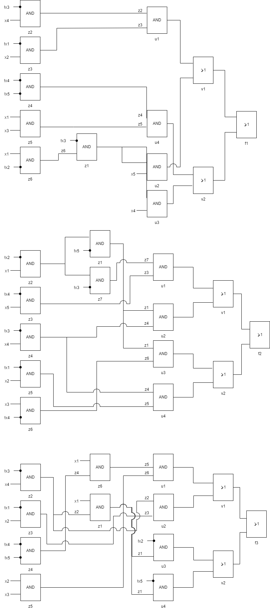
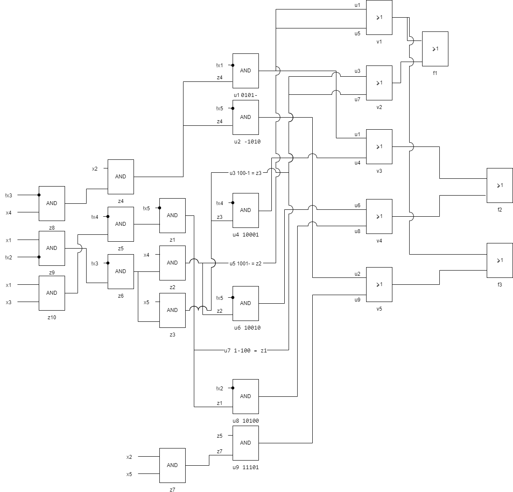

$$f_1 = f_{v9} \land f_{v12}$$
$$f_2 = f_{v9} \land f_{v12}$$
$$f_3 = f_{v9} \land f_{v12}$$

$$f_{v9} = 3<( x_4x_5+x_1x_2x_3)<8$$
$$f_{v10} = 4\le ( x_1x_2x_3+x_4x_5)\le6$$
$$f_{v11} = 5\le(x_2x_3+x_4x_5x_1)\le8$$
$$f_{v12} = -2\le(x_1x_2-x_3x_4x_5)\le1$$

 №    $x_1x_2x_3x_4x_5$    f_v9    f_v10    f_v11    f_v12    f1    f2    f3
---  -------------------  ------  -------  -------  -------  ----  ----  ----
  1                00000       0        0        0        1     0     0     0
  2                00001       0        0        0        1     0     0     0
  3                00010       0        0        0        1     0     0     0
  4                00011       0        0        1        0     0     0     0
  5                00100       0        0        0        0     0     0     0
  6                00101       0        0        0        0     0     0     0
  7                00110       0        0        1        0     0     0     0
  8                00111       1        1        1        0     0     0     0
  9                01000       0        0        0        1     0     0     0
 10                01001       0        0        0        1     0     0     0
 11                01010       1        1        1        1     1     1     1
 12                01011       1        1        1        1     1     1     1
 13                01100       0        0        0        0     0     0     0
 14                01101       1        1        1        0     0     0     0
 15                01110       1        1        1        0     0     0     0
 16                01111       1        1        0        0     0     0     0
 17                10000       1        1        0        0     0     0     0
 18                10001       1        1        0        1     1     1     0
 19                10010       1        1        1        1     1     1     1
 20                10011       1        0        1        1     1     0     1
 21                10100       1        1        0        1     1     1     0
 22                10101       1        1        0        0     0     0     0
 23                10110       1        0        1        0     0     0     0
 24                10111       0        0        1        0     0     0     0
 25                11000       1        1        0        0     0     0     0
 26                11001       1        0        1        0     0     0     0
 27                11010       0        0        1        1     0     0     1
 28                11011       0        0        0        1     0     0     0
 29                11100       1        0        0        1     1     0     0
 30                11101       0        0        1        1     0     0     1
 31                11110       0        0        1        0     0     0     0
 32                11111       0        0        0        0     0     0     0

**Система минимальных булевых функций**

$f_1$

**СДНФ**

№       $x_1x_2x_3x_4x_5$  Простая импликанта?
----  -------------------  ---------------------
[11]                01010
[12]                01011
[18]                10001
[19]                10010
[20]                10011
[21]                10100
[29]                11100

Список простых импликант

№         $x_1x_2x_3x_4x_5$    Простая импликанта?
--------  -------------------  ---------------------
[11, 12]  0101-                *
[18, 20]  100-1                *
[19, 20]  1001-                *
[21, 29]  1-100                *

Таблица простых импликант

Простая импликанта    11    12    18    19    20    21    29
--------------------  ----  ----  ----  ----  ----  ----  ----
0101-                 *     *
100-1                             *           *
1001-                                   *     *
1-100                                               *     *

$$( \overline x_1x_2\overline x_3x_4 ) \lor ( x_1\overline x_2\overline x_3x_5 ) \lor ( x_1\overline x_2\overline x_3x_4 ) \lor ( x_1x_3\overline x_4\overline x_5 )$$

| Простые импликанты | $x1$ | $\overline x1$ | $x2$ | $\overline x2$ | $x3$ | $\overline x3$ | $x4$ | $\overline x4$ | $x5$ | $\overline x5$ | $z_1$ | $z_2$ | $z_3$ | $z_4$ | $z_5$ | $z_6$ |
| ------------------ | ---- | -------------- | ---- | -------------- | ---- | -------------- | ---- | -------------- | ---- | -------------- | ----- | ----- | ----- | ----- | ----- | ----- |
| $u_1$              |      | -              | -    |                |      | -              | -    |                |      |                |       | *     | *     |       |       |       |
| $u_2$              | -    |                |      | -              |      | -              |      |                | *    |                | *     |       |       |       |       |       |
| $u_3$              | -    |                |      | -              |      | -              | *    |                |      |                | *     |       |       |       |       |       |
| $u_4$              | -    |                |      |                | -    |                |      | -              |      | -              |       |       |       | *     | *     |       |
| $z_1$              | -    |                |      | -              |      | *              |      |                |      |                |       |       |       |       |       | *     |
| $z_2$              |      |                |      |                |      | *              | *    |                |      |                |       |       |       |       |       |       |
| $z_3$              |      | *              | *    |                |      |                |      |                |      |                |       |       |       |       |       |       |
| $z_4$              |      |                |      |                |      |                |      | *              |      | *              |       |       |       |       |       |       |
| $z_5$              | *    |                |      |                | *    |                |      |                |      |                |       |       |       |       |       |       |
| $z_6$              | *    |                |      | *              |      |                |      |                |      |                |       |       |       |       |       |       |

|       | $u_1$ | $u_2$ | $u_3$ | $u_4$ | $v_1$ | $v_2$ |
| ----- | ----- | ----- | ----- | ----- | ----- | ----- |
| $f$   | -     | -     | -     | -     | *     | *     |
| $v_1$ | *     | *     |       |       |       |       |
| $v_2$ |       |       | *     | *     |       |       |

$f_2$

**СДНФ**

№       $x_1x_2x_3x_4x_5$  Простая импликанта?
----  -------------------  ---------------------
[11]                01010
[12]                01011
[18]                10001  *
[19]                10010  *
[21]                10100  *

Список простых импликант

№         $x_1x_2x_3x_4x_5$    Простая импликанта?
--------  -------------------  ---------------------
[18]      10001                *
[19]      10010                *
[21]      10100                *
[11, 12]  0101-                *

Таблица простых импликант

Простая импликанта    11    12    18    19    21
--------------------  ----  ----  ----  ----  ----
10001                             *
10010                                   *
10100                                         *
0101-                 *     *

$$( x_1\overline x_2\overline x_3\overline x_4x_5 ) \lor ( x_1\overline x_2\overline x_3x_4\overline x_5 ) \lor ( x_1\overline x_2x_3\overline x_4\overline x_5 ) \lor ( \overline x_1x_2\overline x_3x_4 )$$

| Простые импликанты | $x1$ | $\overline x1$ | $x2$ | $\overline x2$ | $x3$ | $\overline x3$ | $x4$ | $\overline x4$ | $x5$ | $\overline x5$ | $z_1$ | $z_2$ | $z_3$ | $z_4$ | $z_5$ | $z_6$ | $z_7$ |
| ------------------ | ---- | -------------- | ---- | -------------- | ---- | -------------- | ---- | -------------- | ---- | -------------- | ----- | ----- | ----- | ----- | ----- | ----- | ----- |
| $u_1$              | -    |                |      | -              |      | -              |      | -              | -    |                |       | -     | *     |       |       |       | *     |
| $u_2$              | -    |                |      | -              |      | -              | -    |                |      | -              | *     |       |       | *     |       |       |       |
| $u_3$              | -    |                |      | -              | -    |                |      | -              |      | -              | *     |       |       |       |       | *     |       |
| $u_4$              |      | -              | -    |                |      | -              | -    |                |      |                |       |       |       | *     | *     |       |       |
| $z_1$              | -    |                |      | -              |      |                |      |                |      | *              |       | *     |       |       |       |       |       |
| $z_2$              | *    |                |      | *              |      |                |      |                |      |                |       |       |       |       |       |       |       |
| $z_3$              |      |                |      |                |      |                |      | *              | *    |                |       |       |       |       |       |       |       |
| $z_4$              |      |                |      |                |      | *              | *    |                |      |                |       |       |       |       |       |       |       |
| $z_5$              |      | *              | *    |                |      |                |      |                |      |                |       |       |       |       |       |       |       |
| $z_6$              |      |                |      |                | *    |                |      | *              |      |                |       |       |       |       |       |       |       |
| $z_7$              |      |                |      |                |      | *              |      |                |      |                |       | *     |       |       |       |       |       |

|       | $u_1$ | $u_2$ | $u_3$ | $u_4$ | $v_1$ | $v_2$ |
| ----- | ----- | ----- | ----- | ----- | ----- | ----- |
| $f$   | -     | -     | -     | -     | *     | *     |
| $v_1$ | *     | *     |       |       |       |       |
| $v_2$ |       |       | *     | *     |       |       |

$f_3$

**СДНФ**

№       $x_1x_2x_3x_4x_5$  Простая импликанта?
----  -------------------  ---------------------
[11]                01010
[12]                01011
[19]                10010
[20]                10011
[27]                11010
[30]                11101  *

Список простых импликант

№         $x_1x_2x_3x_4x_5$    Простая импликанта?
--------  -------------------  ---------------------
[30]      11101                *
[11, 12]  0101-                *
[11, 27]  -1010                *
[19, 20]  1001-                *
[19, 27]  1-010                *

Таблица простых импликант

Простая импликанта    11    12    19    20    27    30
--------------------  ----  ----  ----  ----  ----  ----
11101                                               *
0101-                 *     *
-1010                 *                       *
1001-                             *     *
1-010                             *           *

$$( x_1x_2x_3\overline x_4x_5 ) \lor ( \overline x_1x_2\overline x_3x_4 )  \lor ( x_1\overline x_2\overline x_3x_4 ) \lor ( x_1\overline x_3x_4\overline x_5 )$$

| Простые импликанты | $x1$ | $\overline x1$ | $x2$ | $\overline x2$ | $x3$ | $\overline x3$ | $x4$ | $\overline x4$ | $x5$ | $\overline x5$ | $z_1$ | $z_2$ | $z_3$ | $z_4$ | $z_5$ | $z_6$ |
| ------------------ | ---- | -------------- | ---- | -------------- | ---- | -------------- | ---- | -------------- | ---- | -------------- | ----- | ----- | ----- | ----- | ----- | ----- |
| $u_1$              | -    |                | -    |                | -    |                |      | -              | -    |                |       |       |       | -     | *     | *     |
| $u_2$              |      | -              | -    |                |      | -              | -    |                |      |                |       | *     | *     |       |       |       |
| $u_3$              | -    |                |      | *              |      | -              | -    |                |      |                | *     |       |       |       |       |       |
| $u_4$              | -    |                |      |                |      | -              | -    |                |      | *              | *     |       |       |       |       |       |
| $z_1$              | *    |                |      |                |      | -              | -    |                |      |                |       | *     |       |       |       |       |
| $z_2$              |      |                |      |                |      | *              | *    |                |      |                |       |       |       |       |       |       |
| $z_3$              |      | *              | *    |                |      |                |      |                |      |                |       |       |       |       |       |       |
| $z_4$              |      |                |      |                |      |                |      | *              | *    |                |       |       |       |       |       |       |
| $z_5$              |      |                | *    |                | *    |                |      |                |      |                |       |       |       |       |       |       |
| $z_6$              | *    |                |      |                |      |                |      |                |      |                |       |       |       | *     |       |       |

|       | $u_1$ | $u_2$ | $u_3$ | $u_4$ | $v_1$ | $v_2$ |
| ----- | ----- | ----- | ----- | ----- | ----- | ----- |
| $f$   | -     | -     | -     | -     | *     | *     |
| $v_1$ | *     | *     |       |       |       |       |
| $v_2$ |       |       | *     | *     |       |       |

**Минимальная система булевых функций**

**СДНФ**

№       $x_1x_2x_3x_4x_5$  Простая импликанта?    Признаки принадлежности
----  -------------------  ---------------------  -------------------------
{11}                01010                         {1, 2, 3}
{12}                01011                         {1, 2, 3}
{18}                10001                         {1, 2}
{19}                10010                         {1, 2, 3}
{20}                10011                         {1, 3}
{21}                10100                         {1, 2}
{27}                11010                         {3}
{29}                11100                         {1}
{30}                11101  *                      {3}

$$\textbf{11-12:}\quad  0101-_{\{1,2,3\}} \lor 01010_{\{1,2,3\}} \lor 01011_{\{1,2,3\}} = 0101-_{\{1,2,3\}}$$
$$\textbf{11-27:}\quad  -1010_{\{3\}} \lor 01010_{\{1,2,3\}} \lor 11010_{\{3\}} = -1010_{\{3\}} \lor 01010_{\{1,2,3\}}$$
$$\textbf{18-20:}\quad  100-1_{\{1\}} \lor 10001_{\{1,2\}} \lor 10011_{\{1,3\}} = 100-1_{\{1\}} \lor 10001_{\{2\}} \lor 10011_{\{3\}}$$
$$\textbf{19-20:}\quad  1001-_{\{1,3\}} \lor 10010_{\{1, 2, 3\}} \lor 10011_{\{1,3\}} = 1001-_{\{1,3\}} \lor 10010_{\{2\}}$$
$$\textbf{19-27:}\quad 1-010_{\{3\}} \lor 10010_{\{1, 2, 3\}} \lor 11010_{\{3\}} = 1-010_{\{3\}} \lor 10010_{\{1,2\}}$$

$$\textbf{21-29:}\quad  1-100_{\{1\}} \lor 10100_{\{1, 2\}} \lor 11100_{\{1\}} = 1-100_{\{1\}} \lor 10100_{\{2\}}$$

Простые импликанты:

* $11101_{\{3\}}$
* $0101-_{\{1,2,3\}}$
* $-1010_{\{3\}}$ 
* $100-1_{\{1\}}$
* $10001_{\{2\}}$
* $1001-_{\{1,3\}}$
* $1-010_{\{3\}}$
* $10010_{\{2\}}$
* $1-100_{\{1\}}$
* $10100_{\{2\}}$

|      Простые импликанты       | 11   |      |      | 12   |      |      | 18   |      |      | 19   |      |      | 20   |      |      | 21   |      |      | 27   |      |      | 29   |      |      | 30   |      |      |
| :---------------------------: | ---- | ---- | ---- | ---- | ---- | ---- | ---- | ---- | ---- | ---- | ---- | ---- | ---- | ---- | ---- | ---- | ---- | ---- | ---- | ---- | ---- | ---- | ---- | ---- | ---- | ---- | ---- |
|                               | 1    | 2    | 3    | 1    | 2    | 3    | 1    | 2    | 3    | 1    | 2    | 3    | 1    | 2    | 3    | 1    | 2    | 3    | 1    | 2    | 3    | 1    | 2    | 3    | 1    | 2    | 3    |
|  $\checkmark 11101_{\{3\}}$   |      |      |      |      |      |      |      |      |      |      |      |      |      |      |      |      |      |      |      |      |      |      |      |      |      |      | *    |
| $\checkmark0101-_{\{1,2,3\}}$ | *    | *    | *    | *    | *    | *    |      |      |      |      |      |      |      |      |      |      |      |      |      |      |      |      |      |      |      |      |      |
|   $\checkmark-1010_{\{3\}}$   |      |      | *    |      |      |      |      |      |      |      |      |      |      |      |      |      |      |      |      |      | *    |      |      |      |      |      |      |
|   $\checkmark100-1_{\{1\}}$   |      |      |      |      |      |      | *    |      |      |      |      |      | *    |      |      |      |      |      |      |      |      |      |      |      |      |      |      |
|   $\checkmark10001_{\{2\}}$   |      |      |      |      |      |      |      | *    |      |      |      |      |      |      |      |      |      |      |      |      |      |      |      |      |      |      |      |
| $\checkmark 1001-_{\{1,3\}}$  |      |      |      |      |      |      |      |      |      | *    |      | *    | *    |      | *    |      |      |      |      |      |      |      |      |      |      |      |      |
|        $1-010_{\{3\}}$        |      |      |      |      |      |      |      |      |      |      |      | *    |      |      |      |      |      |      |      |      | *    |      |      |      |      |      |      |
|   $\checkmark10010_{\{2\}}$   |      |      |      |      |      |      |      |      |      | *    | *    |      |      |      |      |      |      |      |      |      |      |      |      |      |      |      |      |
|  $\checkmark 1-100_{\{1\}}$   |      |      |      |      |      |      |      |      |      |      |      |      |      |      |      | *    |      |      |      |      |      | *    |      |      |      |      |      |
|   $\checkmark10100_{\{2\}}$   |      |      |      |      |      |      |      |      |      |      |      |      |      |      |      |      | *    |      |      |      |      |      |      |      |      |      |      |

$$f_1 = \overline x_1 x_2 \overline x_3 x_4  \lor x_1 \overline x_2 \overline x_3 x_4 \lor x_1 \overline x_2 \overline x_3 x_5 \lor x_1 x_3 \overline x_4 \overline x_5$$
$$f2 = \overline x_1 x_2 \overline x_3 x_4  \lor x_1 \overline x_2 \overline x_3 \overline x_4 x_5 \lor x_1 \overline x_2 \overline x_3 x_4 \overline x_5 \lor x_1 \overline x_2 x_3 \overline x_4 \overline x_5$$
$$f3 = \overline x_1 x_2 \overline x_3 x_4  \lor x_1 \overline x_2 \overline x_3 x_4  \lor x_1 x_2 x_3 \overline x_4 x_5 \lor x_2 \overline x_3 x_4 \overline x_5$$

|                     | $x_1$ | $\overline x_1$ | $x_2$ | $\overline x_2$ | $x_3$ | $\overline x_3$ | $x_4$ | $\overline x_4$ | $x_5$ | $\overline x_5$ | $z_1$ | $z_2$ | $z_3$ | $z_4$ | $z_5$ | $z_6$ | $z_7$ | $z_8$ | $z_9$ | $z_{10}$ |
| :-----------------: | ----- | --------------- | ----- | --------------- | ----- | --------------- | ----- | --------------- | ----- | --------------- | ----- | ----- | ----- | ----- | ----- | ----- | ----- | ----- | ----- | -------- |
| $u_1$ |       | *               | -     |                 |       | -               | -     |                 |       |                 |       |       |       | *     |       |       |       |       |       |          |
|   $u_2$   |       |                 | -     |                 |       | -               | -     |                 |       | *               |       |       |       | *     |       |       |       |       |       |          |
|   $u_3$   | -     |                 |       | -               |       | -               |       |                 | -     |                 |       |       | *     |       |       |       |       |       |       |          |
|   $u_4$   | -     |                 |       | -               |       | -               |       | *               | -     |                 |       |       | *     |       |       |       |       |       |       |          |
|  $u_5$  | -     |                 |       | -               |       | -               | -     |                 |       |                 |       | *     |       |       |       |       |       |       |       |          |
|   $u_6$   | -     |                 |       | -               |       | -               | -     |                 |       | *               |       | *     |       |       |       |       |       |       |       |          |
|   $u_7$   | -     |                 |       |                 | -     |                 |       | -               |       | -               | *     |       |       |       |       |       |       |       |       |          |
|   $u_8$   | -     |                 |       | *               | -     |                 |       | -               |       | -               | *     |       |       |       |       |       |       |       |       |          |
|   $u_9$   | -     |                 | -     |                 | -     |                 |       | -               | -     |                 |       |       |       |       | *     |       | *     |       |       |          |
|        $z_1$        | -     |                 |       |                 | -     |                 |       | -               |       | *               |       |       |       |       | *     |       |       |       |       |          |
|        $z_2$        | -     |                 |       | -               |       | -               | *     |                 |       |                 |       |       |       |       |       | *     |       |       |       |          |
|        $z_3$        | -     |                 |       | -               |       | -               |       |                 | *     |                 |       |       |       |       |       | *     |       |       |       |          |
|        $z_4$        |       |                 | *     |                 |       | -               | -     |                 |       |                 |       |       |       |       |       |       |       | *     |       |          |
|        $z_5$        | -     |                 |       |                 | -     |                 |       | *               |       |                 |       |       |       |       |       |       |       |       |       | *        |
|        $z_6$        | -     |                 |       | -               |       | *               |       |                 |       |                 |       |       |       |       |       |       |       |       | *     |          |
|        $z_7$        |       |                 | *     |                 |       |                 |       |                 | *     |                 |       |       |       |       |       |       |       |       |       |          |
|        $z_8$        |       |                 |       |                 |       | *               | *     |                 |       |                 |       |       |       |       |       |       |       |       |       |          |
|        $z_9$        | *     |                 |       | *               |       |                 |       |                 |       |                 |       |       |       |       |       |       |       |       |       |          |
|      $z_{10}$       | *     |                 |       |                 | *     |                 |       |                 |       |                 |       |       |       |       |       |       |       |       |       |          |

|       | $u_1$ | $u_2$ | $u_3$ | $u_4$ | $u_5$ | $u_6$ | $u_7$ | $u_8$ | $u_9$ | $v_1$ | $v_2$ | $v_3$ | $v_4$ | $v_5$ |
| ----- | ------------------- | --------------- | --------------- | --------------- | ----------------- | --------------- | --------------- | --------------- | --------------- | ----- | ----- | ----- | ----- | ----- |
| $f_1$ | -                   |                 | -               |                 | -                 |                 | -               |                 |                 | *     | *     |       |       |       |
| $f_2$ | -                   |                 |                 | -               |                   | -               |                 | -               |                 |       |       | *     | *     |       |
| $f_3$ | -                   | -               |                 |                 | -                 |                 |                 |                 | -               | *     |       |       |       | *     |
| $v_1$ | *                   |                 |                 |                 | *                 |                 |                 |                 |                 |       |       |       |       |       |
| $v_2$ |                     |                 | *               |                 |                   |                 | *               |                 |                 |       |       |       |       |       |
| $v_3$ | *                   |                 |                 | *               |                   |                 |                 |                 |                 |       |       |       |       |       |
| $v_4$ |                     |                 |                 |                 |                   | *               |                 | *               |                 |       |       |       |       |       |
| $v_5$ |                     | *               |                 |                 |                   |                 |                 |                 | *               |       |       |       |       |       |

