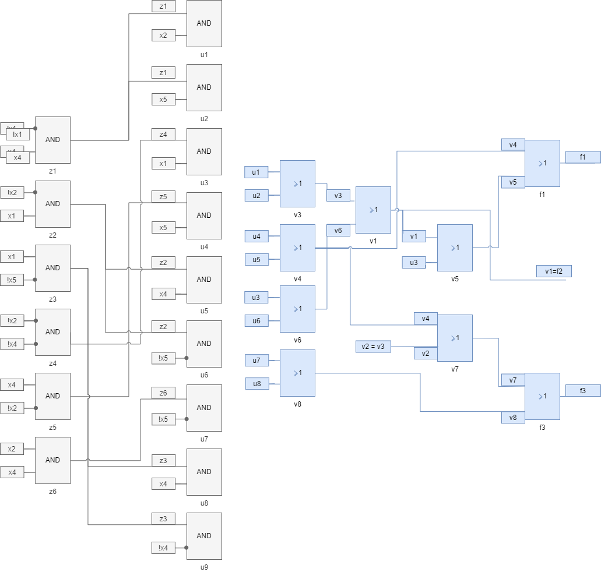

  №    $x_1x_2x_3x_4x_5$  f1    f2    f3
---  -------------------  ----  ----  ----
  1                00000  0     0     0
  2                00001  0     0     0
  3                00010  0     0     0
  4                00011  -     -     -
  5                00100  -     -     -
  6                00101  -     -     -
  7                00110  -     -     -
  8                00111  -     -     -
  9                01000  0     0     0
 10                01001  0     0     0
 11                01010  1     1     1
 12                01011  1     1     1
 13                01100  -     -     -
 14                01101  -     -     -
 15                01110  -     -     -
 16                01111  -     -     -
 17                10000  -     -     -
 18                10001  1     1     0
 19                10010  1     1     1
 20                10011  1     0     1
 21                10100  1     1     0
 22                10101  -     -     -
 23                10110  -     -     -
 24                10111  -     -     -
 25                11000  -     -     -
 26                11001  -     -     -
 27                11010  0     0     1
 28                11011  0     0     0
 29                11100  1     0     0
 30                11101  0     0     1
 31                11110  -     -     -
 32                11111  -     -     -

№       $x_1x_2x_3x_4x_5$    f1    f2    f3
----  -------------------  ----  ----  ----
{1}                 00000     0     0     0
{2}                 00001     0     0     0
{3}                 00010     0     0     0
{9}                 01000     0     0     0
{10}                01001     0     0     0
{11}                01010     1     1     1
{12}                01011     1     1     1
{18}                10001     1     1     0
{19}                10010     1     1     1
{20}                10011     1     0     1
{21}                10100     1     1     0
{27}                11010     0     0     1
{28}                11011     0     0     0
{29}                11100     1     0     0
{30}                11101     0     0     1 

№           x1    x2    x3    x4    x5
--------  ----  ----  ----  ----  ----
{1, 11}      0     1     0     1     0
{1, 12}      0     1     0     1     1
{1, 18}      1     0     0     0     1
{1, 19}      1     0     0     1     0
{1, 20}      1     0     0     1     1
{1, 21}      1     0     1     0     0
{1, 27}      1     1     0     1     0
{1, 29}      1     1     1     0     0
{1, 30}      1     1     1     0     1
{2, 11}      0     1     0     1     1
{2, 12}      0     1     0     1     0
{2, 18}      1     0     0     0     0
{2, 19}      1     0     0     1     1
{2, 20}      1     0     0     1     0
{2, 21}      1     0     1     0     1
{2, 27}      1     1     0     1     1
{2, 29}      1     1     1     0     1
{2, 30}      1     1     1     0     0
{11, 3}      0     1     0     0     0
{3, 12}      0     1     0     0     1
{18, 3}      1     0     0     1     1
{19, 3}      1     0     0     0     0
{3, 20}      1     0     0     0     1
{3, 21}      1     0     1     1     0
{27, 3}      1     1     0     0     0
{3, 29}      1     1     1     1     0
{3, 30}      1     1     1     1     1
{9, 11}      0     0     0     1     0
{9, 12}      0     0     0     1     1
{9, 18}      1     1     0     0     1
{9, 19}      1     1     0     1     0
{9, 20}      1     1     0     1     1
{9, 21}      1     1     1     0     0
{9, 27}      1     0     0     1     0
{9, 29}      1     0     1     0     0
{9, 30}      1     0     1     0     1
{10, 11}     0     0     0     1     1
{10, 12}     0     0     0     1     0
{10, 18}     1     1     0     0     0
{10, 19}     1     1     0     1     1
{10, 20}     1     1     0     1     0
{10, 21}     1     1     1     0     1
{10, 27}     1     0     0     1     1
{10, 29}     1     0     1     0     1
{10, 30}     1     0     1     0     0
{18, 11}     1     1     0     1     1
{11, 20}     1     1     0     0     1
{11, 21}     1     1     1     1     0
{27, 11}     1     0     0     0     0
{11, 28}     1     0     0     0     1
{11, 29}     1     0     1     1     0
{11, 30}     1     0     1     1     1
{18, 12}     1     1     0     1     0
{12, 20}     1     1     0     0     0
{12, 21}     1     1     1     1     1
{27, 12}     1     0     0     0     1
{12, 28}     1     0     0     0     0
{12, 29}     1     0     1     1     1
{12, 30}     1     0     1     1     0
{18, 19}     0     0     0     1     1
{18, 20}     0     0     0     1     0
{18, 27}     0     1     0     1     1
{18, 28}     0     1     0     1     0
{18, 29}     0     1     1     0     1
{18, 30}     0     1     1     0     0
{19, 20}     0     0     0     0     1
{19, 21}     0     0     1     1     0
{27, 19}     0     1     0     0     0
{19, 28}     0     1     0     0     1
{19, 29}     0     1     1     1     0
{19, 30}     0     1     1     1     1
{20, 21}     0     0     1     1     1
{27, 20}     0     1     0     0     1
{20, 28}     0     1     0     0     0
{20, 29}     0     1     1     1     1
{20, 30}     0     1     1     1     0
{27, 21}     0     1     1     1     0
{28, 21}     0     1     1     1     1
{29, 21}     0     1     0     0     0
{21, 30}     0     1     0     0     1
{27, 28}     0     0     0     0     1
{27, 29}     0     0     1     1     0
{28, 29}     0     0     1     1     1
{28, 30}     0     0     1     1     0
{29, 30}     0     0     0     0     1

Убираем дублирующиеся строки

№           x1    x2    x3    x4    x5
--------  ----  ----  ----  ----  ----
{1, 11}      0     1     0     1     0 
{1, 12}      0     1     0     1     1 
{1, 18}      1     0     0     0     1
{1, 19}      1     0     0     1     0
{1, 20}      1     0     0     1     1
{1, 21}      1     0     1     0     0
{1, 27}      1     1     0     1     0
{1, 29}      1     1     1     0     0 
{1, 30}      1     1     1     0     1 
{2, 18}      1     0     0     0     0 
{2, 21}      1     0     1     0     1 
{2, 27}      1     1     0     1     1 
{11, 3}      0     1     0     0     0 
{3, 12}      0     1     0     0     1 
{3, 21}      1     0     1     1     0 
{27, 3}      1     1     0     0     0 
{3, 29}      1     1     1     1     0 
{3, 30}      1     1     1     1     1 
{9, 11}      0     0     0     1     0 
{9, 12}      0     0     0     1     1 
{9, 18}      1     1     0     0     1 
{11, 30}     1     0     1     1     1 
{18, 29}     0     1     1     0     1 
{18, 30}     0     1     1     0     0 
{19, 20}     0     0     0     0     1 
{19, 21}     0     0     1     1     0 
{19, 29}     0     1     1     1     0 
{19, 30}     0     1     1     1     1
{20, 21}     0     0     1     1     1 

Вошедшие аргументы $x_1,x_2,x_4,x_5$

№          $x_1x_2x_4x_5$    f1    f2    f3
----  -------------------  ----  ----  ----
{1}                  0000     0     0     0
{2}                  0001     0     0     0
{3}                  0010     0     0     0
{9}                  0100     0     0     0
{10}                 0101     0     0     0
{11}                 0110     1     1     1
{12}                 0111     1     1     1
{18}                 1001     1     1     0
{19}                 1010     1     1     1
{20}                 1011     1     0     1
{21}                 1000     1     1     0
{27}                 1110     0     0     1
{28}                 1111     0     0     0
{29}                 1100     1     0     0
{30}                 1101     0     0     1

Конституенты 1

* 0110 {1,2,3}
* 0111 {1,2,3}
* 1001 {1,2}
* 1010 {1,2,3}
* 1011 {1,3}
* 1000 {1,2}
* 1110 {3}
* 1100 {1}
* 1101 {3}

Конституенты 0

* 0000 {1,2,3}
* 0001 {1,2,3}
* 0010 {1,2,3}
* 0100 {1,2,3}
* 0101 {1,2,3}
* 1001 {3}
* 1011 {2}
* 1000 {3}
* 1110 {1,2}
* 1111 {1,2,3}
* 1100 {2,3}
* 1101 {1,2}

Импликанты первого порядка

* 011- {1,2,3}
* 0-11 {1,2,3}
* 100- {1,2}
* -011 {1,3}
* 101- {1,3}
* 10-0 {1,2}
* -110 {3}
* 1-10 {3}
* 1-00 {1}

|       | $x_1$ | $\overline x_1$ | $x_2$ | $\overline x_2$ | $x_4$ | $\overline x_4$ | $x_5$ | $\overline x_5$ | $z_1$ | $z_2$ | $z_3$ | $z_4$ | $z_5$ | $z_6$ |
| ----- | ----- | --------------- | ----- | --------------- | ----- | --------------- | ----- | --------------- | ----- | ----- | ----- | ----- | ----- | ----- |
| $u_1$ |       | -               | *     |                 | -     |                 |       |                 | *     |       |       |       |       |       |
| $u_2$ |       | -               |       |                 | -     |                 | *     |                 | *     |       |       |       |       |       |
| $u_3$ | *     |                 |       | -               |       | -               |       |                 |       |       |       | *     |       |       |
| $u_4$ |       |                 |       | -               | -     |                 | *     |                 |       |       |       |       | *     |       |
| $u_5$ | -     |                 |       | -               | *     |                 |       |                 |       | *     |       |       |       |       |
| $u_6$ | -     |                 |       | -               |       |                 |       | *               |       | *     |       |       |       |       |
| $u_7$ |       |                 | -     |                 | -     |                 |       | *               |       |       |       |       |       | *     |
| $u_8$ | -     |                 |       |                 | *     |                 |       | -               |       |       | *     |       |       |       |
| $u_9$ | -     |                 |       |                 |       | *               |       | -               |       |       | *     |       |       |       |
| $z_1$ |       | *               |       |                 | *     |                 |       |                 |       |       |       |       |       |       |
| $z_2$ | *     |                 |       | *               |       |                 |       |                 |       |       |       |       |       |       |
| $z_3$ | *     |                 |       |                 |       |                 |       | *               |       |       |       |       |       |       |
| $z_4$ |       |                 |       | *               |       | *               |       |                 |       |       |       |       |       |       |
| $z_5$ |       |                 |       | *               | *     |                 |       |                 |       |       |       |       |       |       |
| $z_6$ |       |                 | *     |                 | *     |                 |       |                 |       |       |       |       |       |       |

|       | $u_1$ | $u_2$ | $u_3$ | $u_4$ | $u_5$ | $u_6$ | $u_7$ | $u_8$ | $u_9$ | $v_1$ | $v_2$ | $v_3$ | $v_4$ | $v_5$ | $v_6$ | $v_7$ | $v_8$ |      |
| ----- | ----- | ----- | ----- | ----- | ----- | ----- | ----- | ----- | ----- | ----- | ----- | ----- | ----- | ----- | ----- | ----- | ----- | ---- |
| $f_1$ | -     | -     | -     | -     | -     | -     |       |       | -     | -     |       |       | *     | *     |       |       |       |      |
| $f_2$ | -     | -     | -     |       |       | -     |       |       |       | *     |       |       |       |       |       |       |       |      |
| $f_3$ | -     | -     |       | -     | -     |       | *     | *     |       |       | *     |       | *     |       |       |       |       |      |
| $v_1$ | -     | -     | -     |       |       | -     |       |       |       |       |       | *     |       |       | *     |       |       |      |
| $v_2$ | -     | -     |       |       |       |       |       |       |       |       |       | *     |       |       |       |       |       |      |
| $v_3$ | *     | *     |       |       |       |       |       |       |       |       |       |       |       |       |       |       |       |      |
| $v_4$ |       |       |       | *     | *     |       |       |       |       |       |       |       |       |       |       |       |       |      |
| $v_5$ |       |       |       |       |       |       |       |       | *     | *     |       |       |       |       |       |       |       |      |
| $v_6$ |       |       | *     |       |       | *     |       |       |       |       |       |       |       |       |       |       |       |      |
|       |       |       |       |       |       |       |       |       |       |       |       |       |       |       |       |       |       |      |
|       |       |       |       |       |       |       |       |       |       |       |       |       |       |       |       |       |       |      |
|       |       |       |       |       |       |       |       |       |       |       |       |       |       |       |       |       |       |      |

