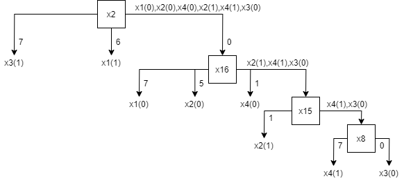

№      $x_1x_2x_3x_4x_5$    f1    f2    f3    F1    F2    F3    F4    F5    F6    F7    F8    F9    F10    F11    F12    F13    F14    F15    F16    F17    F18    F19    F20    F21    F22    F23    F24
---  -------------------  ----  ----  ----  ----  ----  ----  ----  ----  ----  ----  ----  ----  -----  -----  -----  -----  -----  -----  -----  -----  -----  -----  -----  -----  -----  -----  -----
  1                 0000     0     0     0     0     0     0     1     1     0     0     0     0      0      0      0      0      0      0      0      0      0      0      0      0      0      0      0
  2                 0001     0     0     0     0     0     0     1     1     0     0     0     0      0      0      0      0      0      0      1      1      1      0      0      0      0      0      0
  3                 0010     0     0     0     0     0     0     1     1     1     0     0     0      1      1      1      0      0      0      0      0      0      0      0      0      1      1      1
  4                 0011     1     1     1     1     1     1     1     0     1     1     1     1      1      1      1      0      0      0      1      1      1      0      0      0      1      1      1
  5                 0100     0     0     0     0     0     0     0     0     0     0     0     0      0      0      0      0      0      0      1      1      1      0      0      0      0      0      0
  6                 0101     0     0     0     0     0     0     0     0     0     0     0     0      0      0      0      0      0      0      1      1      1      0      0      0      0      0      0
  7                 0110     1     1     1     1     1     1     0     0     1     0     0     0      1      1      1      0      0      0      1      1      1      1      1      1      1      1      1
  8                 0111     1     1     1     1     1     1     0     0     0     1     1     1      1      1      1      0      0      0      1      1      1      1      1      1      1      1      1
  9                 1000     1     1     0     0     0     0     1     1     0     1     1     0      0      0      0      1      1      0      1      1      1      1      1      0      1      1      0
 10                 1001     1     1     0     0     0     0     1     1     0     1     1     0      0      0      0      1      1      0      1      0      1      1      1      0      1      1      0
 11                 1010     1     1     1     0     0     0     1     1     1     1     1     1      0      0      1      1      1      0      1      1      1      1      1      1      1      0      1
 12                 1011     1     0     1     1     1     1     1     0     1     1     0     1      0      0      0      1      1      0      1      0      1      1      1      1      1      0      1
 13                 1100     0     0     0     0     0     0     0     0     0     1     1     0      0      0      0      0      0      0      0      0      1      0      0      0      0      0      0
 14                 1101     0     0     0     0     0     0     0     0     0     1     1     0      0      0      0      0      0      0      0      0      0      0      0      0      0      0      0
 15                 1110     0     0     1     1     1     1     0     0     1     1     1     1      0      0      1      0      0      0      0      0      1      0      0      1      0      0      0
 16                 1111     0     0     0     1     1     1     0     0     0     1     0     1      0      0      0      0      0      0      0      0      0      0      0      1      0      0      0

Необнаружимых и недиагностируемых неисправностей нет.

 №   f1    f2    f3  ||   R1    R2    R3    R4    R5    R6    R7    R8
-- ----  ----  ----  -- ----  ----  ----  ----  ----  ----  ----  ----
 1    0     0     0  ||    0     1     0     0     0     0     0     0 
 2    0     0     0  ||    0     1     0     0     0     1     1     0 
 3    0     0     0  ||    0     1     1     1     1     0     0     1 
 4    1     1     1  ||    0     1     0     0     1     1     1     1 
 5    0     0     0  ||    0     0     0     0     0     1     1     0 
 6    0     0     0  ||    0     0     0     0     0     1     1     0 
 7    1     1     1  ||    0     1     1     1     1     1     0     0 
 8    1     1     1  ||    0     1     1     0     1     1     0     0 
 9    1     1     0  ||    1     1     1     1     1     1     1     1 
10    1     1     0  ||    1     1     1     1     1     1     1     1 
11    1     1     1  ||    1     1     0     1     0     1     0     1 
12    1     0     1  ||    1     1     1     1     1     1     1     1 
13    0     0     0  ||    0     0     1     0     0     0     1     0 
14    0     0     0  ||    0     0     1     0     0     0     0     0 
15    0     0     1  ||    1     1     1     1     1     1     1     1 
16    0     0     0  ||    1     1     1     1     0     0     0     1 

 №   f1    f2    f3  ||   R1    R2    R3    R4    R5    R6    R7    R8
-- ----  ----  ----  -- ----  ----  ----  ----  ----  ----  ----  ----
 2    0     0     0  ||    0     1     0     0     0     1     1     0 
 3    0     0     0  ||    0     1     1     1     1     0     0     1 
 4    1     1     1  ||    0     1     0     0     1     1     1     1 
 8    1     1     1  ||    0     1     1     0     1     1     0     0 
15    0     0     1  ||    1     1     1     1     1     1     1     1 
16    0     0     0  ||    1     1     1     1     0     0     0     1 

№    F   F1    F2    F3    F4    F5    F6    F7    F8
--  -- ----  ----  ----  ----  ----  ----  ----  ----
2    0    0     6     0     0     0     7     0     0
3    0    0     7     0     7     0     0     0     7
4    7    7     5     7     7     0     7     1     7
8    7    7     0     7     7     0     7     7     7
15   1    7     1     7     1     0     1     1     0  
16   7    7     0     5     0     0     0     1     0  

