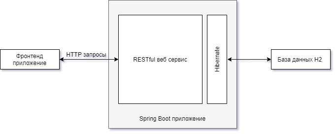
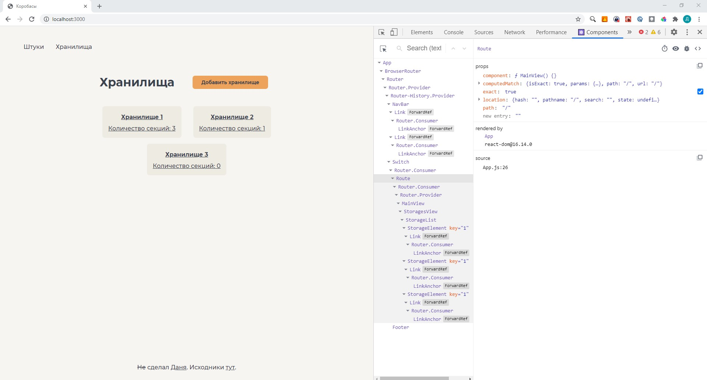

# Основная часть

## Теоретические сведения

Для разработки серверной части приложения был использован язык Java и фреймворк Spring Framework.

Java - язык программирования со строгой типизацией и объектно-ориентированной парадигмой, исходный код Java программ компилируется не сразу в машинный код как в большинстве компилируемых языков, а в промежуточный байт-код, который может запускаться на специальной виртуальной машине JVM. Благодаря этому программа написанная на языке Java может запускаться на любой платформе для которой реализована виртуальная машина.

Spring Framework - фреймворк для внедрения зависимостей, позволяющий избежать большой связности между сущностями. Проект Spring включает в себя множество различных прикладных библиотек, и для упрощения первоначальной настройки использован Spring Boot. Эта библиотека позволяет сгенерировать начальный шаблон для проект с правильно настроенными конфигурациями и зависимости, а так же проект использующий Spring Boot по умолчанию включает в себя встроенный web-сервер, который можно использовать не только для разработки но и для развертывания готового приложения.

Веб приложения будет спроектировано по паттерну MVC (Model View Controller). MVC - это схема разделения данных приложения, пользовательского интерфейса и управляющей логики на три отдельных компонента: модель, представление и контроллер - таким образом, что модификация каждого компонента может осуществляться независимо.

* Модель (Model) предоставляет данные и реагирует на команды контроллера, изменяя своё состояние.
* Представление (View) отвечает за отображение данных модели пользователю, реагируя на изменения модели.
* Контроллер (Controller) интерпретирует действия пользователя, оповещая модель о необходимости изменений.

В качестве для хранения данных была выбрана Java реализация SQL базы данных H2, позволяющая разворачивать базу данных в оперативной памяти (in memory database) для удобства в разработке и тестировании проекта. Так как проект разрабатывался в учебных целях было решено не использовать более тяжеловесные реализации SQL баз данных (PostgreSQL, MySQL) в виду ограниченных времени и ресурсов.

При использовании Spring Framework, не обязательно описывать таблицы для сущностей проекта напрямую на языке запросов БД. Существует дополнительная абстракция над базой данных - ORM, предоставляющая удобный интерфейс к содержимому таблиц и автоматическое создание таблиц в БД при инициализации приложения.

Для описания сущностей проекта необходимо описать модели в виде Java классов, с примененной аннотацией @Entity. Поля класса при этом будут выступать столбцами таблиц, для установки ограничений столбцов необходимо использовать дополнительные аннотации.

Далее реализуются следующие сущности: репозитории - объекты предоставляющие доступ к моделям, сервисы - объекты хранящие в себе "бизнес логику" и контроллеры - объекты которые "прикрепляют" действие к запросам на указанные URL. 

Реализовав все эти компоненты получится API, позволяющее получать доступ к информации и редактировать ее используя HTTP запросы. 

В качестве системы сборки будет использоваться Maven -  фреймворк для автоматизации сборки проектов. Он позволяет декларативно описать спецификацию проекта и его зависимости, которые автоматически загрузятся при первой сборке.

Так же для упрощения написания шаблонных конструкций языка Java была использована библиотека Lombok, предоставляющая аннотации, которые автоматически генерируют код методов get и set у всех полей класса, или же создают конструкторы различных типов.

Клиентская часть приложения представляет собой SPA (Single page application) реализованная на языке JavaScript с использованием библиотеки React. Данная библиотека используется для создания компонентов пользовательского интерфейса, и реализует только отображение данных и компонентов в DOM дерево и диалект для описания компонентов JSX . Для реализации роутинга использовалась библиотека React Router. Сборка клиентской части совершалась интерпретатором Node.js.

Для упрощения процесса разработки была использована система управления версий git.



## Проектирование базы данных

Первым этапом разработки приложения является разработка структуры базы данных. Были спроектированы следующие таблицы:

* thing - информация о типах хранимых вещей
  * id - pk integer autoincrement
  * name - string[128] not_null
* storage - информация о хранилищах
  * id - pk integer autoincrement
  * name - string[128] not_null
* section - информация о секциях хранилища
  * id - pk integer autoincrement
  * name - string[128] not_null
  * storage_id - fk integer storage
* thing_instance - информация о физических хранимых вещах
  * id - pk integer autoincrement
  * name - string[128] not_null 
  * section_id - fk integer section
  * thing_id - fk integer section


Для инициализации базы данных был написан скрипт на языке DML.

Отрывок из скрипта, заполняющий таблицу *section* (весь скрипт см. Приложение. Содержимое файла data.sql)

```sql
    INSERT INTO section (id,name,storage_id) VALUES
        (1,'Секция 1',1),
        (2,'Секция 2',1),
        (3,'Секция 3',1),
        (4,'Секция 4',2);
```

## Разработка серверной части приложения

Далее было получено шаблонное приложение Spring Boot при помощи конфигуратора встроенного в IDE.

Для каждой таблицы базы данных была создана модель (см. Приложение), используя аннотации Spring Framework.

@Entity - аннотация JPA указывающая что данный класс связан с соответствующей таблицей в базе данных.

Так же для описания связей или ограничений БД используются аннотации @Id, @ManyToMany, @OneToOne. Для автогенерации уникального идентификатора был применена аннотация @GeneratedValue, она принимает в качестве аргумента стратегию подбора нового идентификатора при его создании.

Для каждой модели был создан интерфейс-репозиторий реализующий интерфейс CrudRepository, в котором описаны типичные операции над объектами:

* Получение объекта по идентификатору.
* Удаление объекта.
* Частичное объекта.
* Создание объекта.

Используя функционал предоставленный репозиториями были реализованы классы-сервисы, в которых описаны методы-обертки над репозиториями в которых содержится вся "бизнес логика".

Аннотация @RestController позволяет создать класс преобразующие все входящие HTTP запросы по указанным URL в вызовы методов класса к которому применена эта аннотация.

Аннотации @GetMapping, @PostMapping, @DeleteMapping принимают аргумент строку с URL, отправив на него соответствующий запрос, вызовется метод к которому применена аннотация. Так же в строке с URL могут быть указаны дополнительные переменные.

API принимает и отдает данные в формате сериализации JSON.

Пример объекта Thing сериализованного в формате JSON

```json
"thing": {
    "id": 1,
    "name": "Штука 1"
}
```

Полная схема API проекта выглядит следующим образом: 

|           **URL**          | **Доступные методы запроса** |
|:--------------------------:|:----------------------------:|
|           /things          |           GET POST           |
|        /things/{id}        |          GET DELETE          |
|         /instances         |           GET POST           |
|       /instances/{id}      |          GET DELETE          |
| /instances_of_section/{id} |              GET             |
|  /instances_of_thing/{id}  |              GET             |
|          /storages         |           GET POST           |
|       /storages/{id}       |          GET DELETE          |
|          /sections         |           GET POST           |
|       /sections/{id}       |          GET DELETE          |
|  /sections_in_storage/{id} |              GET             |

## Разработка клиентской части приложения

Стартовый шаблон клиентского приложения был создан при помощи утилиты create-react-app, которая предоставляет полностью сконфигурированное окружение для быстрой разработки React приложения: настроенный сборщик, линтер и каркас проекта.

В качестве http клиента была использована библиотека axios. 

Дополнительные библиотеки и фреймворки для построения 
интерфейса не использовались.

Пример react компонента 
```js
import React, {useEffect,useState} from 'react'
import {Link} from "react-router-dom";
import './NavBar.css'

export default function NavBar(){
    return(
        <nav className='navbar'>
            <Link to="/things" className="navbar-item">Штуки</Link>
            <Link to="/storages" className="navbar-item">Хранилища</Link>
        </nav>
    );
}
```

## Проверка работоспособности

Работоспособность API проверялась при помощи утилиты Postman.

При GET запросе по URL /storages, приходил ответ содержащий JSON файл следующего содержания 

```json
[
    {
        "id": 1,
        "name": "Ящик 1"
    },
    {
        "id": 2,
        "name": "Ящик 2"
    },
    {
        "id": 3,
        "name": "Ящик 3"
    }
]
```

Работоспособность клиентской части проверялась в браузере в отладочном режиме



# Заключение

В ходе данной работы были изучены архитектурные паттерны проектирования такие как REST, MVC, освоены навыки работы с библиотеками Spring и реляционной базой данных H2. Так же в процессе освоения данных технологий было реализовано RESTful приложение для учета и упорядочивания инвентаря.

@latex
\clearpage

\begin{thebibliography}{3}
\bibitem{1}
Java Platform, Standard Edition 8 API Specification [Электронный ресурс] URL: \texttt{https://docs.oracle.com/javase/8/docs/api/}

\bibitem{2}
 Java™ Platform, Standard Edition 7
API Specification [Электронный ресурс] URL: \texttt{https://docs.oracle.com/javase/7/docs/api/}

\bibitem{3}
Representational state transfer - Wikipedia [Электронный ресурс] URL: \texttt{https://en.wikipedia.org/wiki/Representational\_state\_transfer}

\bibitem{4}
 Lombok features [Электронный ресурс] URL: \texttt{https://projectlombok.org/features/all}

\bibitem{5}
Spring Boot Docs[Электронный ресурс] URL: \texttt{https://spring.io/projects/spring-boot}
 
\bibitem{6}
Spring Framework Docs[Электронный ресурс] URL: \texttt{https://spring.io/projects/spring-framework}
 
\bibitem{7}
 H2 Documentation [Электронный ресурс] URL: \texttt{https://www.h2database.com/javadoc/index.html}
 
\bibitem{8}
 Maven Documentation [Электронный ресурс] URL: \texttt{https://maven.apache.org/guides/index.html}
 
\bibitem{9}
 React Docs[Электронный ресурс] URL: \texttt{https://reactjs.org/docs}
 
\bibitem{10}
 facebook/create-react-app - Github [Электронный ресурс] URL: \texttt{https://github.com/facebook/create-react-app}
\end{thebibliography}

@/latex