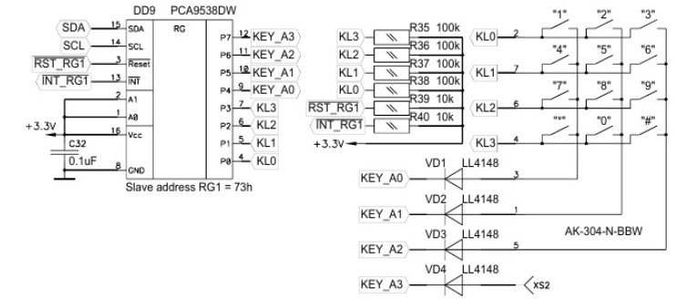
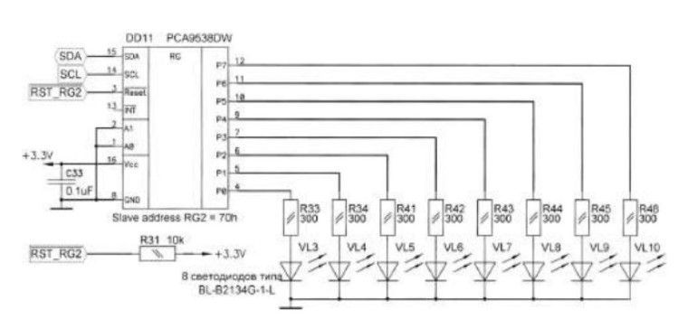

**Схема стенда**

**Вывод:** Я изучил принцип работы двухстороннего протокола обмена данных I2C, его реализацию в микроконтроллерах семейства MSP430, а так же принцип работы порта расширения PCA9538.