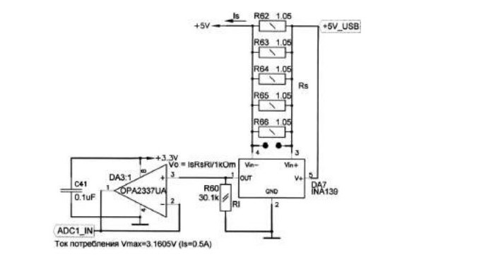
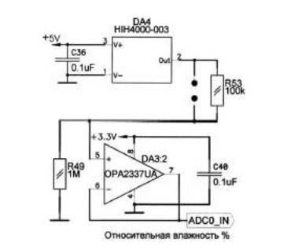

**Схема стенда**

**Вывод:** Я изучил принцип работы модуля АЦП12 в микроконтроллерах семейства **MSP430F16xx**, а так же научился снимать показания с датчиков влажности **HIH4000-003** и датчиков потребления тока **INA139**.
