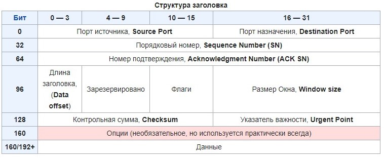
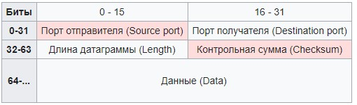

# Теоретические сведения

## Основные термины

### Порт

 **Порт** - целое неотрицательное 16 битное число, используемое в заголовках транспортного уровня по модели OSI, для многоканальной передачи данных различного программного обеспечения в пределах 1 хоста.@latex \cite{wiki_Port}@/latex

Количество портов ограниченно 16 битами (**0-65535**), и все порты разделены на 3 диапазона:

* общеизвестные "*well-known*" порты (**0-1023**).
* зарегистрированные или пользовательские порты (**1024-49151**).
* динамические порты (**49152-65535**).

### Протокол TCP

 **TCP** - протокол передачи данных, транспортного уровня по модели OSI.
 TCP предоставляет поток данных с установкой соединения до передачи данных, при потере пакета осуществляется повторный запрос потерянного пакета, дубликаты пакетов удаляются. Тем самым гарантируется целостность передаваемых данных.@latex \cite{wiki_TCP}@/latex



**Описание содержимого TCP заголовка:**

* **Порт источника** - номер порта из которого был отправлен пакет, ответ формируется по порту источника.

* **Порт назначение** - номер порта на который был отправлен пакет.

* **Порядковый номер** (**SYN**) - число полезные переданных данных в байтах. При установленном флаге SYN поле будет содержать начальный порядковый номер (ISN) - случайно сгенерированное число, а первый байт полезных данных в сессии будет иметь номер ISN+1.

* **Номер подтверждения** (**ACK SN**) - при установленном флаге ACK, поле содержит номер октета, который отправитель хочет получить. Так же это значит что октеты от ISN+1 до ACK-1 были успешно получены.  

* **Длина заголовка** - смещение полезных данных относительно начала пакета.

* Поле **зарезервировано** и **флаги** - 12 бит выделенные под различные флаги (ACK,SYN и др.), а так же зарезервированное пространство для будущих флагов.

* **Размер окна** - количество байт полезны данных после передачи которых отправитель будет ожидать подтверждение получения.

* **Контрольная сумма** - сумма всех 16 битных слов заголовка и данных. Если сегмент не кратен 16 битам то он дополняется нулями. Само поле в момент расчета суммы принимается равным нулю.

* **Указатель важности** - используется для передачи внеполосных данных.

### Протокол UDP

**UDP** - протокол транспортного для работы с датаграммами, расширяет IP добавлением в заголовок полей: порт отправителя, порт получателя, длина датаграммы и контрольной суммы.@latex \cite{wiki_UDP}@/latex



Не требует установки соединения для передачи данных и тем самым не гарантирует доставку пакетов и правильных их порядок. Используется в ситуациях когда нужно принимать множество пакетов от разных пользователей или когда потеря нескольких пакетов не критична.

### Сканирование портов (сканер портов)

**Сканирование портов** - сканирование хоста или сети на наличие открытых портов. ПО для сканирование портов называется **сканером портов**. Так как программное обеспечение работающее по тому или иному порту может иметь уязвимости, такой открытый порт может являться серьезной угрозой информационной безопасности. В связи с этим сканерами портов пользуются или системные администраторы для предотвращения атак или злоумышленники для поиска точек входа в систему.@latex \cite{wiki_Port_Scanner}@/latex

Результаты сканирования сети классифицируются следующим образом:

* открытый порт - сканером получен ответ, хост принимает соединения на данный порт.

* закрытый порт - сканером получен ответ, хост не принимает соединения на данный порт.

* заблокированный порт - сканер не получил ответ.

## Типы сканирования

Перед сканированием любого типа обычно проводится проверка на наличие указанного хоста в сети. При помощи протокола ICMP отправляются echo сообщения на все сканируемые адреса, но отсутствие ответа на echo запрос не всегда означает отсутствие хоста в сети, так как системные администраторы зачастую запрещают работу ICMP в целях безопасности.

Существуют следующие алгоритмы сканирования портов:

### Сканирование TCP портов

* **SYN сканирование** - самый распространенный тип сканирования. Сканер портов генерирует IP пакеты напрямую без использования сетевых функций ОС предназначенных для установки TCP соединения. Это все необходимо для того чтобы напрямую управлять содержимым заголовка TCP и позволяет не создавать полностью открытое соединение.
    Принцип работы SYN сканирования таков.
  
    1. Сканер создает пакет с установленным флагом SYN и отправляет его на указанный адрес (диапазон адресов).

    2. Если порт на целевом хосте открыт то в ответ сканеру придет пакет SYN-ACK и это означает что порт открыт. Если хост не отвечает значит SYN сканирование скорее всего заблокировано на уровне правил межсетевого экрана.

    3. Сканер отвечает пакетом RST и закрывает соединение до завершение его установки.

    Этот способ сканирования позволяет одновременно сканировать большое количество адресов и портов не создавая большой нагрузки на хост и сеть созданием и закрытием множества TCP соединений. Но для работы такого сканера потребуются повышенные привилегии и стороннее ПО для генерации IP пакетов в обход TCP стека операционной системы.

* **TCP сканирование** - самый простой способ сканирования портов. Используя сетевые функции операционной системы осуществляется попытка создать TCP соединение с хостом. При условии что порт открыт соединение будет установлено, иначе порт закрыт. Такой тип сканирования не требует специальный драйверов сетевых устройств и повышенных привилегий для сканирования сети, но сильно нагружает сканируемый хост.

* **ACK сканирование** - этот тип сканирования используется для проверки наличия межсетевого экрана и определения сложности его правил фильтрации. На хост отправляются пакеты с установленным флагом ACK, который устанавливается только при установленном соединении. Если в межсетевом экране используются простые правила фильтрации то экран пропустит этот пакет, более сложные правила учитывают и блокируют такой тип сканирования.

* **FIN сканирование** - данный тип сканирования использует особенность спецификации TCP (RFC 793), в которой описано что на пакет FIN отправленный на закрытый порт, сервер должен ответить пакетом с флагом RST, если порт открыт то сервер игнорирует такой пакет. Такое сканирование применяется если сервер умеет распознавать другие типы сканирования, но не все разработчики ПО придерживаются спецификаций RFC, поэтому FIN сканирование может не дать результатов.

### Сканирование UDP портов

В протоколе UDP отсутствует понятие соединение, поэтому мы не можем определить силами протокола был получен отправленный пакет или нет. Сканирование UDP порта имеет ряд особенностей. При отправке UDP пакета на закрытый порт при включенном протоколе ICMP, сканер получит ответ "порт закрыт", если же системный администратор отключил ICMP то компьютерам извне будет казаться что все порты открыты.

Для того чтобы обойти отключение ICMP или межсетевой экран можно формировать UDP пакет специфичный для ПО работающего с данным портом. Таким образом при открытом порте мы получим ответ уровня приложения. Но подготавливать тестовые пакеты для всего сетевого ПО, работающего по UDP - невозможная задача. Поэтому может использоваться комбинированное сканирование - сначала сканируются все порты UDP отправкой пустого пакета, а далее используются специализированные пакеты для выбранных портов, если они поддерживаются ПО для сканирования.

## Сканирования портов в законодательстве РФ и правилах обслуживания интернет-провайдеров

Уголовный правонарушения связанные с ЭВМ и сетями ЭВМ описаны в 28 главе Уголовного кодекса РФ под названием "*Преступления в сфере компьютерной информации*".@latex \cite{Port_Laws}@/latex

Эта глава содержит 4 статьи:

* **Статья $272$. Неправомерный доступ к компьютерной информации**
* **Статья $273$. Создание, использование и распространение вредоносных компьютерных программ**
* **Статья $274$. Нарушение правил эксплуатации средств хранения, обработки или передачи компьютерной информации и информационно-телекоммуникационных сетей**
* **Статья $274^1$. Неправомерное воздействие на критическую информационную инфраструктуру Российской Федерации**

Ни в одной из вышеперечисленных статей не описано наказание за сканирование сегментов сети, но информацию полученную при сканировании сети такую как: ОС и ее версию, открытые порты для приложений прикладного уровня и их версии, можно использовать для совершения преступлений в информационной сфере.

Так же провайдеры интернет услуг зачастую запрещают использовать сканеры для сканирования портов в сети Интернет.

# Разработка программы

## Выбор инструментов разработки

В рамках данной курсовой работы был реализован TCP сканер портов, SYN сканирование не было реализовано так как ОС Windows не разрешает отправлять пакеты используя "сырые" сокеты ("сырые" сокеты позволяют напрямую изменять и просматривать содержимое IP пакета). Для реализации SYN сканирования в ОС Windows потребовались бы привилегии администратора в системе, а так же специальный сетевой драйвер позволяющий изменять IP пакеты напрямую.

Сканер был реализован на языке С++ с вставками на языке C, а так же использовании кроссплатформенного фреймворка Qt для создания графического интерфейса и многопоточности.

## Проектирование графического интерфейса

Графический интерфейс, был спроектирован используя возможности библиотеки элементов **Qt**. Эта библиотека позволяет создавать программы с графическим интерфейсом, которые имеют одинаковое поведение в разных ОС.
А механизм слотов и сигналов позволяет быстро и эффективно писать приложения с графическим интерфейсом.@latex \cite{QtDocs}@/latex

Интерфейс сканера содержит:

* адресную строку

* шкалу прогресса

* список событий сканера

Корректность введенного адреса проверяется при помощи регулярного выражения.

## Реализация многопоточного сканирования

Многопоточное сканирование использует, объединение потоков в пул потоков для эффективного использование ресурсов компьютера. **QThreadPool** @latex \cite{QtThreadPool}@/latex - реализация пула потоков в фреймворке Qt, при инициализации пула выделяется количество потоков равное количеству логических процессоров. При старте сканирования каждый поток сканирует 1 порт из диапазона общеизвестных портов, при завершении работы поток не закрывается, а используется для сканирование следующего необходимого порта.

## Описание классов используемых в приложении

Для отображения графического интерфейса, и обработки взаимодействий с пользованием используется класс **SimplePortScan**.

В конструкторе класса создаются и настраиваются все элементы интерфейса и их валидация.

```c++
    QRegExp *re = new QRegExp("^(?:(?:25[0-5]|2[0-4][0-9]|[01]?[0-9][0-9]?)\\.){3}(?:25[0-5]|2[0-4][0-9]|[01]?[0-9][0-9]?)$");
    QRegExpValidator *validator = new QRegExpValidator(*re);
    ui->setupUi(this);
    ui->progressBar->hide();
    ui->progressBar->setMinimum(0);
    ui->progressBar->setMaximum(PORT_EDGE);
    ui->modeButton1->hide();
    ui->modeButton2->hide();
    ui->addressLine->setValidator(validator);
```

и выбирается кол-во потоков в пуле.

```c++
    this->threads.setMaxThreadCount(400);
```

В слоте кнопки старта сканирования ```on_pushButton_clicked()``` запускается пул потоков и в цикле добавляются задачи **SimplePortScan** на сканирования конкретного порта (от 0 до PORT_EDGE). Так же запускается шкала процесса сканирования и она отображается на экран.

Каждая задача **SimplePortScan** вызывает сигнал ```exit_code(int,int)``` указывающий на завершение сканирование порта. он содержит номер сканируемого порта, и его состояние.

Обработчик этих сигналов ```on_result_thread(int,int)``` записывает результаты в **QMap**@latex \cite{QtMap}@/latex - словарь основанный на хеш таблице, где ключ -  это номер порта, а значение - состояние полученное при сканировании. Для того чтобы не возникло состояние гонки потоков в качестве объекта синхронизации используется класс **QMutex** @latex \cite{QtMutex}@/latex реализующий обьект синхронизации мьютекс. Он блокируется потоком во время инкрементирования счетчика полосы прогресса и записи в **QMap**@latex \cite{QtMap}@/latex.

Архитектура программы спроектирована так что, можно легко и быстро реализовывать различные способы сканирования.

Используя наследования от класса **QRunnable**@latex \cite{QtRunnable}@/latex, мы можем создать новый тип задачи в котором будет реализовано то или иное сканирование.

В данной программе в связи с особенностями сетевой архитектуры Windows, реализовано простейшее TCP сканирование в классе **SimplePortScan**

В качестве конструктора используется конструктор родительского класса **QRunnable**@latex \cite{QtRunnable}@/latex, а так же переопределена виртуальная функция **run()** запускающая поток с задачей.

Внутри этого потока создается TCP сокет и происходит попытка открыть TCP соединение, если спустя 500 мс соединение не было установлено, то порт считается закрытым и задача завершает с кодом 1, иначе при установленном соединении сокет закрывает соединение и задача завершается с кодом 0.

# Руководство пользователя

При запуске сканера выводится предупреждение о запрете сканирования в глобальных сетях.

В поле адрес необходимо ввести сканируемый адрес сети в формате IPv4/

Далее необходимо нажать кнопку "Сканировать" для начала процесса сканирования.

Программа сканирует порты из списка общеизвестных портов (**0-1023**) и зарегистрированных портов (**1024-49151**).

В процессе работы сканера появится шкала прогресса и в логе отобразится сообщение о старте сканирования.

После завершения работы в логе сканера отобразится список открытых портов вышеуказанного адреса.

# Тестирование

## Исходные данные

Для проверки работоспособности программы было совершено сканирование 3 хостов в локальной сети.

* Маршрутизатор.

* ПК, на котором был запущен сканер.

* Смартфон, подключенный к маршрутизатору.

## Тест 1. Маршрутизатор

Маршрутизатор с ОС Open-Wrt с вручную открытым портом для SSH (20).  


Программа показала что роутере открыты порты:

* 22 - порт SSH

* 53 - DNS порт

* 1009 - неиспользуемый порт


## Тест 2. ПК

Компьютер работает под управление ОС Windows.


Программа показала что на компьютере открыты порты:

* 135 - порт EPMAP, Microsoft RPC, Locator service

* 445 - порт MICROSOFT-DS

* 2343, 3344, 3580, 5040, 5357, 6463, 8085, 26760, 26761, 27036, 27060, 38167, 40001, 46624, 49139 - неиспользуемые открытые порты.

## Тест 3. Смартфон

Смартфон под управлением ОС Android с отключенным ABD на порту 5555.


Программа показала что на смартфоне открыты порты:

* 1009 - неиспользуемый порт

Через 20 секунд после работы сканера, маршрутизатор отключил ПК с сканером от локальной сети. Сработало правило сетевого экрана.  

# Заключение

В ходе выполнения данной курсовой работы был реализован многопоточный сканер портов с графическим интерфейсом, а так же проверена его работоспособность в локальной сети. В процессе написания работы были изучены различные типы сканирования портов, законность выполнения сканирования портов, основные диапазоны портов. В ходе написания программы были изучены принципы построения графических интерфейсов в библиотеке Qt, а так же архитектурные решения предоставляемые этой библиотекой для создания многопоточных приложений. При написании сканера оптимизации для многопоточной работы было применено архитектурный шаблон "пул" потоков, из-за технических особенностей ОС Windows был реализован только 1 тип сканирования портов - TCP, для реализации других типов сканирования необходимо использовать специализированные драйвера сетевых устройств, позволяющие работать на уровне IP пакетов.

@latex
\clearpage

\begin{thebibliography}{3}
\bibitem{wiki_TCP}
Интернет-ресурс \textit{Википедия. Протокол TCP.} URL: \texttt{https://ru.wikipedia.org/wiki/TCP}

\bibitem{wiki_UDP}
Интернет-ресурс \textit{Википедия. Протокол UDP.} URL: \texttt{https://ru.wikipedia.org/wiki/UDP}

\bibitem{wiki_Port}
Интернет-ресурс \textit{Википедия. Порт.} URL: \texttt{https://ru.wikipedia.org/wiki/Порт\_(компьютерные\_сети)}

\bibitem{wiki_Port_Scanner}
Интернет-ресурс \textit{Википедия. Сканер портов.} URL: \texttt{https://ru.wikipedia.org/wiki/Сканирование\_портов}

\bibitem{Port_Laws}
Интернет-ресурс \textit{Викитека. Уголовный кодекс Российской Федерации/Глава 28.} URL: \texttt{https://ru.wikisource.org/wiki/Уголовный\_кодекс\_Российской\_Федерации/Глава\_28}

\bibitem{QtDocs}
Интернет-ресурс \textit{Qt Core 5.14 Documentation.} URL: \texttt{https://doc.qt.io/qt-5}

\bibitem{QtRunnable}
Интернет-ресурс \textit{QRunnable Class | Qt Core 5.14 Documentation.} URL: \texttt{https://doc.qt.io/qt-5/qrunnable.html}

\bibitem{QtMap}
Интернет-ресурс \textit{QMap Class | Qt Core 5.14 Documentation.} URL: \texttt{https://doc.qt.io/qt-5/qmap.html}

\bibitem{QtMutex}
Интернет-ресурс \textit{QMutex Class | Qt Core 5.14 Documentation.} URL: \texttt{https://doc.qt.io/qt-5/qmutex.html}

\bibitem{QtThreadPool}
Интернет-ресурс \textit{QThreadPool Class | Qt Core 5.14 Documentation.} URL: \texttt{https://doc.qt.io/qt-5/qthreadpool.html}

\end{thebibliography}

@/latex