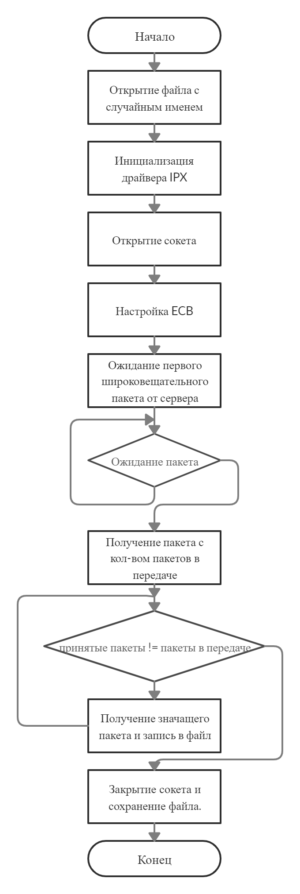
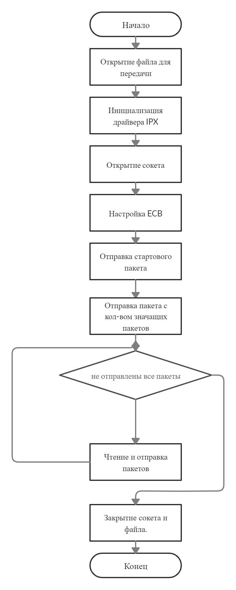
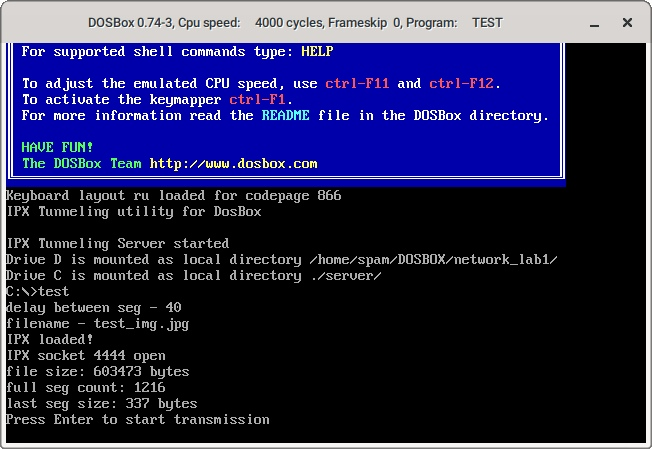
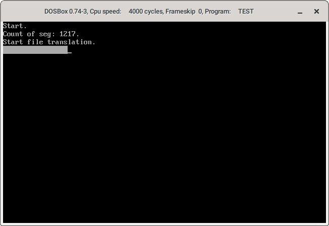
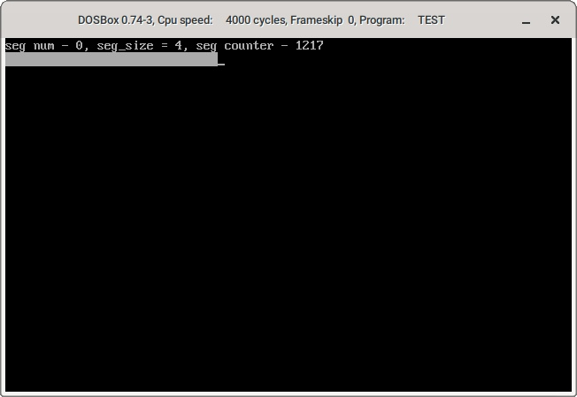

1. **Краткие теоретические сведения.**

   **Протокол IPX**(*internetwork packet exchange*) — протокол сетевого уровня модели OSI в стеке протоколов IPX/SPX. Предназначен для передачи датаграмм. Для передачи данных установки соединения не требуется (так же, как для IP). 

   Роль компьютера в сети определяется программным обеспечением.

   Сетям присваивается адрес от 00:00:00:01 до FF:FF:FF:FE. Адрес 00:00:00:00 - адрес локальной сети, адрес FF:FF:FF:FF - широковещательный адрес (пакеты адресованные этой сети отправляются всей сети).

2. **Основные функции API, использованные в данной работе.**

* Функция `int IPXOpenSocket(int SocketType, unsigned *Socket)`. 
    
    *Входные параметры*: тип сокета (долгосрочный, краткосрочный), номер сокета(от 4000).

    *Выходные параметры*: если Socket пустой то автоматически назначает сокет.
    
    *Назначение*: открывает сокет с номером Socket, типа Type.

* Функция `void IPXCloseSocket(unsigned *Socket)`. 
    
    *Входные параметры*: номер сокета.
    
    *Назначение*: закрывает сокет с номером Socket.

* Функция `void IPXListenForPacket(struct ECB *RxECB)`. 
    
    *Входные параметры*: структура ECB
    
    *Назначение*: запрос к драйверу IPX на получение входящего пакета, и запись результата в ECB.
    
* Функция `void IPXSendPacket(struct ECB *TxECB)`. 
    
    *Входные параметры*: структура ECB
    
    *Назначение*: запрос к драйверу IPX на отправку пакета из структуры ECB

3. **Разработка программы. Блок-схемы программы.**

    

    

4. **Анализ функционирования разработанных программ.**
    
    При отправке изображения блоками по 504 байта, без задержки между пакетами со стороны сервера, полученное изображения имеет сильные дефекты. С добавлением задержки количество дефектов уменьшается, но уменьшается скорость передачи.

5. **Выводы.**

    Протокол IPX не гарантирует порядок и успешность доставки пакетов, поэтому использовать его без надстроек для передачи файлов нецелесообразно.

6. **Тексты программ. Скриншоты программ.**

>Тексты программ см. в приложении.

