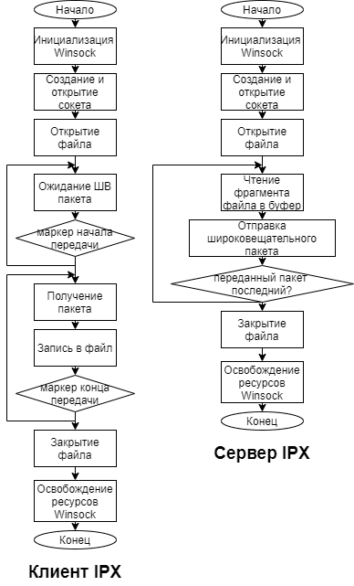
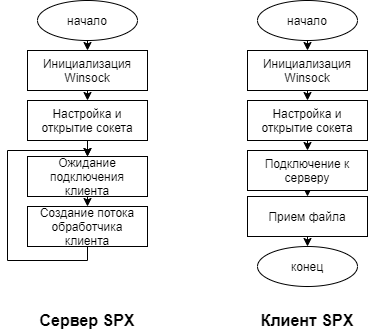
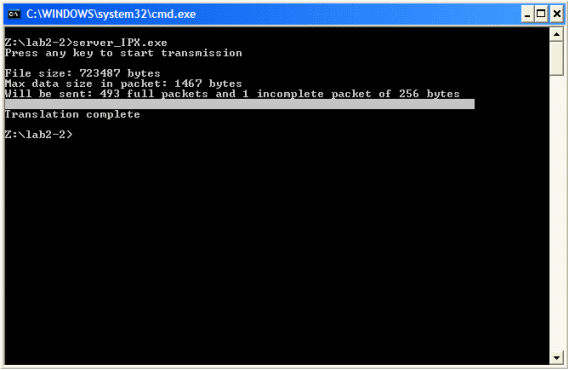
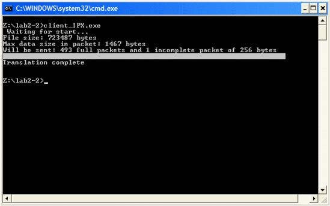
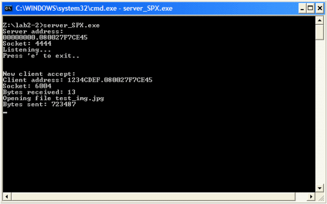
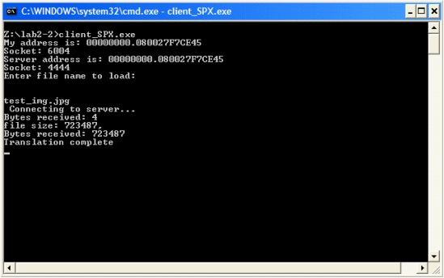

1. **Краткие теоретические сведения.**

**Протокол IPX** (*Internetwork Packet Exchange*) является оригинальным протоколом сетевого уровня стека Novell, разработанным в начале 80-х годов на основе протокола Internetwork Datagram Protocol (IDM) компании Xerox.
Протокол IPX соответствует сетевому уровню модели OSI и поддерживает только дейтаграммный (без установления соединений) способ обмена сообщениями. В сети NetWare самая быстрая передача данных при наиболее экономном расходовании памяти реализуется именно протоколом IPX.

Для надежной передачи пакетов используется протокол транспортного уровня SPX (*Sequenced Packet Exchange*), который работает с установлением соединения и восстанавливает пакеты при их потере или повреждении. Если по каким-то причинам пакет не дошел до получателя, выполняется его повторная передача. Следовательно, последовательность отправления совпадает с последовательностью получения пакетов. Обмен пакетами на уровне сеанса связи реализован с помощью протокола SPX, который построен на базе IPX.
**SPX** – протокол последовательного обмена пакетами (*Sequenced Packet Exchange Protocol*), разработанный Novell. Система адресов протокола SPX аналогична системе адресов протокола IPX и также состоит из 3 частей: номера сети, адреса станции и сокета. Протокол SPX использует такой же блок ECB для передачи и приёма пакетов, что и протокол IPX. Однако, пакет, передаваемый при помощи протокола SPX, имеет более длинный заголовок. Дополнительно к 30 байтам стандартного заголовка пакета IPX добавляется еще 12 байт. 

2. **Основные функции API, использованные в данной работе.**
   
* `WSAStartup (WORD wVersionRequested, LPWSADATA lpWSAData)` 
* `SAGetLastError (void)`
* `WSACleanup (void)`
* `socket (int af, int type, int protocol)`
* `bind (SOCKET s, const struct sockaddr FAR* name, int namelen)`
* `listen (SOCKET s, int backlog)`
* `connect (SOCKET s, const struct sockaddr FAR* name,int namelen)`
* `accept (SOCKET s, struct sockaddr FAR* addr, int FAR* addrlen)`
* `getsockname (SOCKET s, struct sockaddr FAR* name, int FAR* namelen)`
* `sendto ( SOCKET s, const char FAR * buf, int len, int flags, const struct sockaddr FAR * to, int tolen)`
* `send (SOCKET s, const char FAR * buf, int len, int flags)`
* `recvfrom (SOCKET s, char FAR* buf, int len, int flags, struct sockaddr FAR* from, int FAR* fromlen)`
* `recv (SOCKET s, char FAR* buf, int len, int flags)`
* `closesocket(SOCKET s)`

3. **Разработка программы. Блок-схемы программы.**

    

    

4. **Анализ функционирования разработанных программ.**

**IPX**

| Кол-во клиентов |         Время передачи        | Кол-во потерянных пакетов |
|:---------------:|:-----------------------------:|:-------------------------:|
|        1        |           204729 мс           |             3             |
|        2        |      239538 мс, 241053 мс      |            4, 1            |
|        3        | 310356 мс, 303564 мс, 309782 мс |        215, 189, 204        |

**SPX**

| Кол-во клиентов | Время передачи | Кол-во потерянных пакетов |
|:---------------:|:--------------:|:-------------------------:|
|        1        |    36294 мс    |             0             |
|        2        |    51954 мс    |            0, 0            |
|        3        |    75672 мс    |           0, 0, 0           |

5. **Выводы.**

SPX в отличии от IPX гарантирует доставку пакета без потерь, а так же позволяет эффективно использовать канал передачи данных не занимая его широковещательными пакетами. API построенное по архитектуре сокетов Беркли а в частности Winsock предоставляет удобные абстракции для написания программ использующие сетевые соединения.

6. **Тексты программ. Скриншоты программ.**

>Тексты программ см. в приложении.

