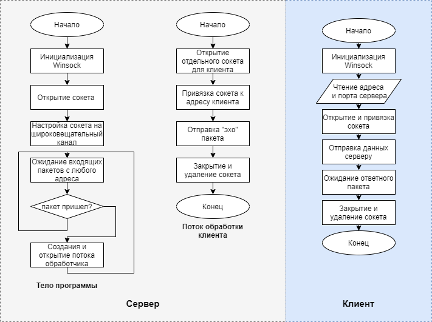
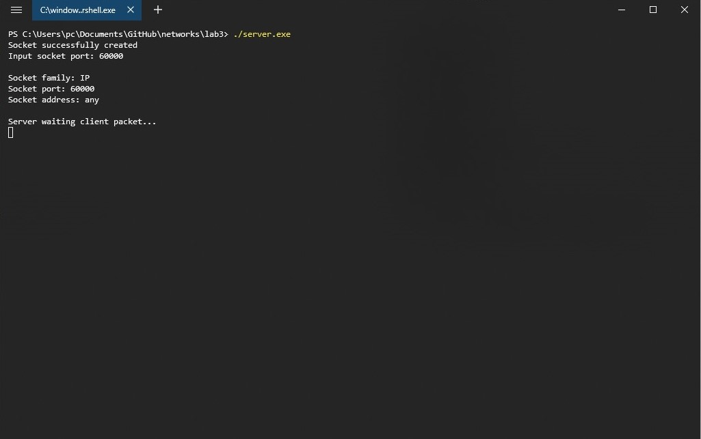
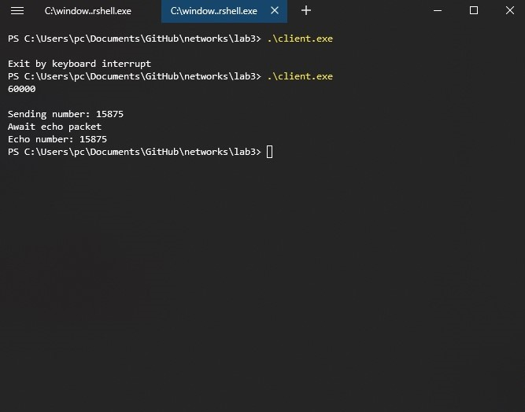

1. **Краткие теоретические сведения.**

**IP** - маршрутизируемый сетевой протокол сетевого уровня семейства TCP/IP. Протокол IP используется для негарантированной доставки данных, разделяемых на так называемые пакеты от одного узла сети к другому. Это означает, что на уровне этого протокола (*третий уровень сетевой модели **OSI***) не даётся гарантий надёжной доставки пакета до адресата. В частности, пакеты могут прийти не в том порядке, в котором были отправлены, продублироваться (когда приходят две копии одного пакета - в реальности это бывает крайне редко), оказаться повреждёнными (обычно повреждённые пакеты уничтожаются) или не прибыть вовсе. Гарантии безошибочной доставки пакетов дают протоколы более высокого (транспортного) уровня сетевой модели OSI - например, TCP - который использует IP в качестве транспорта. Обычно в сетях используется IP четвёртой версии, также
известный как IPv4. 

В протоколе IP этой версии каждому узлу сети ставится в соответствие IP-адрес длиной 4 октета (1 октет состоит из 8 бит). При этом компьютеры в подсетях объединяются общими начальными битами адреса. Количество этих бит, общее для данной подсети, называется маской подсети (*ранее использовалось деление пространства адресов по классам —** A, B, C**; класс сети определяется диапазоном значений старшего октета и определяет число адресуемых узлов в данной сети*). IP-пакет представляет собой форматированный блок информации, передаваемый по вычислительной сети. Соединения вычислительных сетей, которые не поддерживают пакеты, такие как традиционные соединения типа «точка-точка» в телекоммуникациях, просто передают данные в виде последовательности байтов, символов или битов. При использовании пакетного форматирования сеть может передавать длинные сообщения более надежно и эффективно.

1. **Основные функции API, использованные в данной работе.**
   
* `WSAStartup(WORD wVersionRequested,LPWSADATA lpWSAData)`
* `WSACleanup (void)`
* `WSAGetLastError (void)`
* `u_short htons (u_short hostshort)`
* `socket (int af, int type, int protocol)`
* `bind (SOCKET s, const struct sockaddr FAR* name, int namelen)`
* `recvfrom (SOCKET s, char FAR* buf, int len, int flags,struct sockaddr FAR* from, int FAR* fromlen)`
* `sendto (SOCKET s, const char FAR * buf, int len, int flags, const struct sockaddr FAR * to, int tolen)`

3. **Разработка программы. Блок-схемы программы.**

    Программа-сервер ждет широковещательные пакеты по заданному порту, при получении выделяется поток в котором открывается отдельный сокет для возвращение содержимого пакета клиенту, после завершения работы сокет и поток удаляются, тем самым обеспечивая многопоточную работу сервера.

    Программа-клиент генерирует при запуске случайное 4 байтовое число и отправляет его по заданному адресу, после отправки она ждет пакет и выводит содержимое этого пакета на экран.

    


4. **Анализ функционирования разработанных программ.**

Анализ функционирования программ проводился в пределах одного ПК (за неимением возможности протестировать передачу данных между несколькими машинами). Для одновременного запуска нескольких клиентов был написан скрипт, запускающий несколько экземпляров программы-клиент. Текст скрипта приведен ниже:

```batch
@echo off
set loopcount=1000
:loop
start /b client < input.txt
set /a loopcount=loopcount-1
if %loopcount%==0 goto exitloop
goto loop
:exitloop
pause
```

При запуске более 1000 экземпляров программы клиента не было обнаружено ошибок и все программы клиенты корректно получили обратно отправленный ими пакет.

5. **Выводы.**

Библиотека Winsock имеет умеет удобно API для написание многопоточного сетевого программного обеспечения для операционной системы Windows, с использованием протокола IP. Протокол IP не гарантирует доставку пакетов и порядок их доставки.

6. **Тексты программ. Скриншоты программ.**

>Тексты программ см. в приложении.





