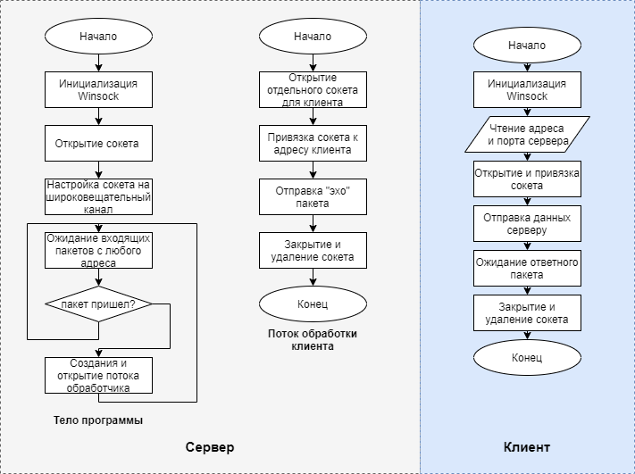
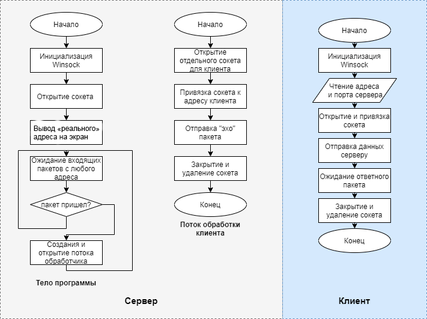
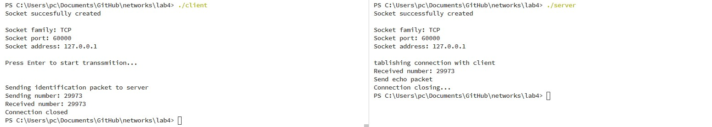
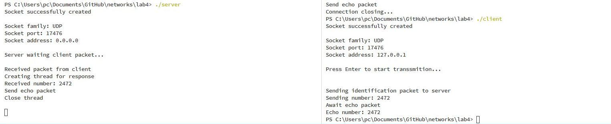

1. **Краткие теоретические сведения.**

Transmission Control Protocol (TCP, протокол управления передачей) — один из основных протоколов передачи данных интернета, предназначенный для управления передачей данных.

В стеке протоколов TCP/IP выполняет функции транспортного уровня модели OSI.

Механизм TCP предоставляет поток данных с предварительной установкой соединения, осуществляет повторный запрос данных в случае потери данных и устраняет дублирование при получении двух копий одного пакета, гарантируя тем самым, в отличие от UDP, целостность передаваемых данных и уведомление отправителя о результатах передачи.

Реализации TCP обычно встроены в ядра ОС. Существуют реализации TCP, работающие в пространстве пользователя.

Когда осуществляется передача от компьютера к компьютеру через Интернет, TCP работает на верхнем уровне между двумя конечными системами, например, браузером и веб-сервером. TCP осуществляет надёжную передачу потока байтов от одного процесса к другому. TCP реализует управление потоком, управление перегрузкой, рукопожатие, надёжную передачу.

UDP (англ. User Datagram Protocol — протокол пользовательских датаграмм) — один из ключевых элементов набора сетевых протоколов для Интернета. С UDP компьютерные приложения могут посылать сообщения (в данном случае называемые датаграммами) другим хостам по IP-сети без необходимости предварительного сообщения для установки специальных каналов передачи или путей данных. Протокол был разработан Дэвидом П. Ридом в 1980 году и официально определён в RFC 768.

UDP использует простую модель передачи, без неявных «рукопожатий» для обеспечения надёжности, упорядочивания или целостности данных. Таким образом, UDP предоставляет ненадёжный сервис, и датаграммы могут прийти не по порядку, дублироваться или вовсе исчезнуть без следа. UDP подразумевает, что проверка ошибок и исправление либо не нужны, либо должны исполняться в приложении. Чувствительные ко времени приложения часто используют UDP, так как предпочтительнее сбросить пакеты, чем ждать задержавшиеся пакеты, что может оказаться невозможным в системах реального времени. При необходимости исправления ошибок на сетевом уровне интерфейса приложение может задействовать TCP или SCTP, разработанные для этой цели.

Природа UDP как протокола без сохранения состояния также полезна для серверов, отвечающих на небольшие запросы от огромного числа клиентов, например DNS и потоковые мультимедийные приложения вроде IPTV, Voice over IP, протоколы туннелирования IP и многие онлайн-игры.

1. **Основные функции API, использованные в данной работе.**
   
* `WSAStartup(WORD wVersionRequested,LPWSADATA lpWSAData)`
* `WSACleanup (void)`
* `WSAGetLastError (void)`
* `u_short htons (u_short hostshort)`
* `socket (int af, int type, int protocol)`
* `bind (SOCKET s, const struct sockaddr FAR* name, int namelen)`
* `recvfrom (SOCKET s, char FAR* buf, int len, int flags,struct sockaddr FAR* from, int FAR* fromlen)`
* `sendto (SOCKET s, const char FAR * buf, int len, int flags, const struct sockaddr FAR * to, int tolen)`

3. **Разработка программы. Блок-схемы программы.**


    Для UDP клиент и сервер имеют структуру как в предыдущей лабораторной работе.

    В сервере TCP добавлены этапы установки соединения между клиентом и сервером.

    

    


4. **Анализ функционирования разработанных программ.**

Анализ функционирования программ проводился в пределах одного ПК (за неимением возможности протестировать передачу данных между несколькими машинами). Для одновременного запуска нескольких клиентов был написан скрипт, запускающий несколько экземпляров программы-клиент. Текст скрипта приведен ниже:

```batch
@echo off
set loopcount=1000
:loop
start /b client < input.txt
set /a loopcount=loopcount-1
if %loopcount%==0 goto exitloop
goto loop
:exitloop
pause
```

Ошибок в передаче 1000 пакетов что в TCP что в UDP не было обнаружено. Все клиенты получили обратно "эхо" пакеты.

5. **Выводы.**

Библиотека Winsock имеет умеет удобно API для написание многопоточного сетевого программного обеспечения для операционной системы Windows, с использованием протоколов TCP и UDP. Протокол TCP гарантирует порядок и доставку пакетов ценой скорости. Протокол UDP похож в использовании на чистый IP и не гарантирует доставку и порядок пакетов.

6. **Тексты программ. Скриншоты программ.**

>Тексты программ см. в приложении.





7. **Контрольные вопросы**

   1. Что представляет собой протокол TCP? Как он работает?

    Протокол TCP - один из основных протоколов передачи данных интернета, предназначенный для управления передачей данных.
    Механизм TCP предоставляет поток данных с предварительной установкой соединения, осуществляет повторный запрос данных в случае потери данных и устраняет дублирование при получении двух копий одного пакета, гарантируя тем самым, в отличие от UDP, целостность передаваемых данных и уведомление отправителя о результатах передачи. 

   2. Порядок установления TCP-соединения.
   
   * Клиент, который намеревается установить соединение, посылает серверу сегмент с номером последовательности и флагом SYN.
   * Если клиент получает сегмент с флагом SYN, то он запоминает номер последовательности и посылает сегмент с флагом ACK.
   * Если сервер в состоянии SYN-RECEIVED получает сегмент с флагом ACK, то он переходит в состояние ESTABLISHED.
   * В противном случае после тайм-аута он закрывает сокет и переходит в состояние CLOSED.

   3. В чём состоит отличие протокола UDP от IP?

    Протокол IP - протокол сетевого уровня и обеспечивает обьединение сегментов сетей в одну обеспечивая доставку между узлами.
    Протокол UDP - протокол транспортного уровня, простейшая надстройка над IP добавляющая в пакет 4 поля (порт приемника, получателя, длина, контрольная сумма). Не гарантирует доставку и порядок отправленных пакетов.
   
   4. Формат заголовка пакета UDP.
    
    порт приемника, получателя, длина, контрольная сумма

   5. Опишите работу функций sendto и send библиотеки Winsocket.

    Функция **sendto** предназначена для отправки данных, без установки соединения (UDP).
    
    Аргументы:
        
        * socket - сокет, через который будут отправлены данные.
        * message - указатель на буфер, содержащий данные для отправки.
        * length - определяет длину сообщения в байтах.
        * flags - определяет параметры передачи сообщения.
        * dest_addr - указатель на структуру, содержащую адрес получателя.
        * dest_len - определяет длину структуры, на которую указывает dest_addr.
        
    Функция **send** предназначена для отправки данных, при установленном соединении (TCP).
    
    Аргументы:
        
        * socket - сокет, через который будут отправлены данные.
        * message - указатель на буфер, содержащий данные для отправки.
        * length - определяет длину сообщения в байтах.
        * flags - определяет параметры передачи сообщения.

   6. В каких случаях предпочтительней использовать протокол UDP?

    Для систем реального времени, передачи звуковой и видео информации, компьютерные игры, когда важна скорость получения пакетов нежели их целостность и порядок.