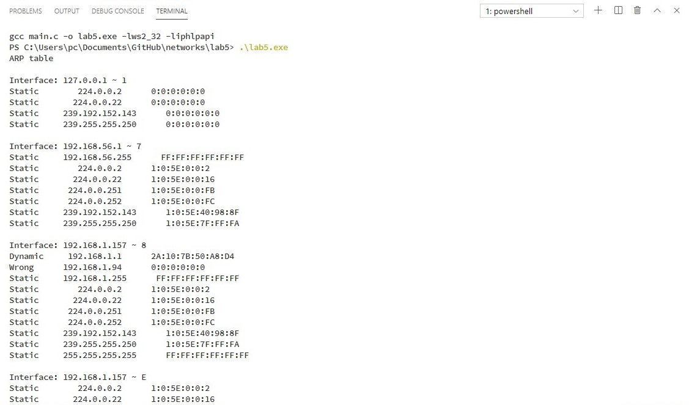

1. **Краткие теоретические сведения.**

**ARP** (*Address Resolution Protocol - протокол определения адреса*) - протокол канального уровня, предназначенный для определения MAC - адреса (адреса канального уровня) по известному IP-адресу (адресу сетевого уровня). Наибольшее распространение этот протокол получил благодаря распространению сетей IP,построенных поверх Ethernet, поскольку практически в 100 % случаев при таком сочетании используется протокол ARP.

Протокол ARP работает различным образом в зависимости от того, какой протокол канального уровня работает в данной сети - протокол локальной сети (*Ethernet, Token Ring, FDDI*) с возможностью широковещательного доступа одновременно ко всем узлам сети, или же протокол глобальной сети (*X.25, frame relay*), как правило не поддерживающий широковещательный доступ. Функциональность протокола ARP сводится к решению двух задач. Одна часть протокола определяет физические адреса при посылке дейтаграммы, другая отвечает на запросы устройств в сети. Протокол ARP предполагает, что каждое устройство «знает» как свой IP - адрес, так и свой физический адрес.

**Протокол RARP** - это протокол, решающий обратную задачу - нахождение IP-адреса по известному локальному адресу. Он называется реверсивный ARP - RARP (*Reverse Address Resolution Protocol*) и используется при старте бездисковых станций, не знающих в начальный момент своего IP-адреса, но знающих адрес своего сетевого адаптера. Reverse ARP (или обратное разрешение) работает аналогично протоколу ARP за исключением того, что в его задачи входит определение физического адреса по известному адресу сетевого уровня. Этот протокол требует наличия в сети сервера RARP ,подключенного к тому же сегменту сети, что и интерфейс маршрутизатора. Наиболее часто протокол reverse ARP используется для запуска бездисковых рабочих станций. В данной лабораторной работе совместно с библиотекой Windows Sockets необходимо использовать библиотеку функций IP Helper.

1. **Основные функции API, использованные в данной работе.**
   
* `DWORD CreateIpNetEntry(PMIB_IPNETROW)`
* `DWORD CreateProxyArpEntry(DWORD,DWORD,DWORD)`
* `DWORD DeleteIpNetEntry(PMIB_IPNETROW)`
* `DWORD DeleteProxyArpEntry(DWORD,DWORD,DWORD)`
* `DWORD FlushIpNetTable(DWORD)`
* `DWORD SetIpNetEntry(PMIB_IPNETROW pArpEntry)`
* `DWORD SendARP(IPAddr,IPAddr,PVOID,PULONG)`
* `ULONG GetIpNetTable(PMIB_IPNETTABLE,PULONG,BOOL)`

2. **Разработка программы.**

    В было разработано консольное приложение на языке Си которое может выполнять следующие действия:
    
    * вывод ARP-таблицы
    * добавление записи в ARP-таблицу
    * удаление записи из ARP-таблицы
    * получение MAC-адреса по IP-адресу

3. **Анализ функционирования разработанных программ.**

    

4. **Выводы.**

В данной лабораторной работе была реализована программа для взаимодействия с ARP таблицей при помощи библиотек Winsock и IP Helper.

5. **Тексты программ. Скриншоты программ.**

>Тексты программ см. в приложении.

7. **Контрольные вопросы**

   1. Какие задачи решает протокол ARP?

        >Протокол ARP решает проблему преобразования IP-адреса в МАС-адрес.

   2. Что такое ARP-таблица? Почему она является необходимым
   элементом?

        >ARP таблица - таблица хранящаяя соответствия IP->MAC адресов. Необходима для уменьшения кол-ва запросов, если в таблице отсутствует запись только тогда будет выполнен запрос.
   
   1. Типы записей ARP-таблицы.

        >Статические и динамические. Статические создаются вручную администратором сети. Динамические создаются автоматически и имеют время жизни, которое продлевается если запись используется системой.

   2. Опишите процесс преобразования ip-адреса в локальный.

        > 1. Просматривается ARP таблица на предмет нужного ip адреса.
        > 2. Если адрес отсутствует то формируется шировещательный  ARP запрос.
        > 3. Каждый узел проверяет на соответствие свой ip адрес и адрес в пакете.
        > 4. Если адреса совпадают формируется ответный запрос на адрес отправителя широковещательного запроса.  

   3. Как может работать протокол ARP в глобальных сетях?

        >В глобальных сетях администратору сети  приходится вручную формировать ARP-таблицы, в которых он задает, соответствие IP-адреса адресу узла сети Х.25, который имеет для протокола IP смысл локального адреса.

   4. Что представляет собой протокол RARP?

        > RARP - протокол обратный ARP. Выполняет задачу нахождения IP адреса по MAC адресу.

   5. В каких целях может быть использован протокол RARP?

        >В бездисковые машины не могут сохранить свой сконфигурированный IP адрес. RARP позволяет использовать уникальный для каждого устройства MAC адрес как идентификатор по которому можно будет определить IP адрес.