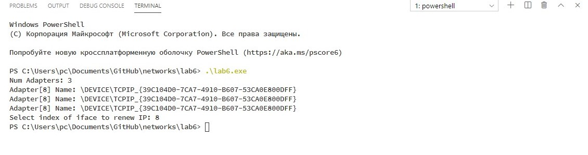

1. **Краткие теоретические сведения.**

**DHCP** (*англ. Dynamic Host Configuration Protocol — протокол динамической конфигурации узла*) - это сетевой протокол, позволяющий компьютерам автоматически получать IP-адрес и другие параметры, необходимые для работы в сети TCP/IP. Данный протокол работает по модели «клиент-сервер». Для автоматической конфигурации компьютер-клиент на этапе конфигурации сетевого устройства обращается к так называемому серверу DHCP, и получает от него нужные параметры. Сетевой администратор может задать диапазон адресов, распределяемых сервером среди компьютеров. Это позволяет избежать ручной настройки компьютеров сети и уменьшает количество ошибок. Протокол DHCP используется в большинстве сетей TCP/IP.

Протокол DHCP предоставляет три способа распределения IP-адресов:

* **Ручное распределение.**

     При этом способе сетевой администратор сопоставляет аппаратному адресу (для Ethernet сетей это MAC-адрес) каждого клиентского компьютера определённый IP-адрес. Фактически, данный способ распределения адресов отличается от ручной настройки каждого компьютера лишь тем, что сведения об адресах хранятся централизованно (на сервере DHCP), и потому их проще изменять при необходимости.

* **Автоматическое распределение.**
  
  При данном способе каждому компьютеру на постоянное использование выделяется произвольный свободный IP-адрес из определённого администратором диапазона.

* **Динамическое распределение.**

     Этот способ аналогичен автоматическому распределению, за исключением того, что адрес выдаётся компьютеру не на постоянное пользование, а на определённый срок. Это называется арендой адреса. По истечении срока аренды IP-адрес вновь считается свободным, и клиент обязан запросить новый. Кроме того, клиент сам может отказаться от полученного адреса.

В стеке TCP/IP применяется доменная система имен, которая имеет иерархическую древовидную структуру. Иерархия доменных имен аналогична иерархии имен файлов, принятой в файловых системах. В отличие от имен файлов запись доменного имени начинается с самой младшей составляющей, и заканчивается самой старшей. Составные части доменного имени отделяются друг от друга точкой. Разделение имени на части позволяет разделить ответственность за назначение уникальных имен между различными людьми или организациями в пределах своего уровня иерархии. Разделение административной ответственности позволяет решить проблему образования имен без взаимных консультаций между организациями, отвечающими за имена одного уровня иерархии. Поэтому должна существовать одна организация, отвечающая за назначение имен верхнего уровня иерархии.Совокупность имен, у которых несколько старших составных частей совпадают, образуют домен (domain) имен. Если один домен входит в другой домен как его составная часть, то такой домен могут называть поддоменом (subdomain). Обычно
поддомен называют по имени той его старшей составляющей, которая отличает его от других поддоменов. Имя поддомену назначает администратор вышестоящего домена. Хорошей аналогией домена является каталог файловой системы.

1. **Основные функции API, использованные в данной работе.**
   
* `DWORD CreateIpNetEntry(PMIB_IPNETROW)`
* `DWORD CreateProxyArpEntry(DWORD,DWORD,DWORD)`
* `DWORD DeleteIpNetEntry(PMIB_IPNETROW)`
* `DWORD DeleteProxyArpEntry(DWORD,DWORD,DWORD)`
* `DWORD FlushIpNetTable(DWORD)`
* `DWORD SetIpNetEntry(PMIB_IPNETROW pArpEntry)`
* `DWORD SendARP(IPAddr,IPAddr,PVOID,PULONG)`
* `ULONG GetIpNetTable(PMIB_IPNETTABLE,PULONG,BOOL)`

2. **Разработка программы.**

    В было разработано консольное приложение на языке Си которое может выполнять следующие действия:
    
    * определение доменного имени по IP адресу.
    * определение IP адрес по доменному имени.
    * получение/сброс IP адреса с помощью DHCP сервера

3. **Анализ функционирования разработанных программ.**

    

4. **Выводы.**

В данной лабораторной работе была реализована программа для взаимодействия с DHCP и DHS серверами при помощи библиотек Winsock и IP Helper.

5. **Тексты программ. Скриншоты программ.**

>Тексты программ см. в приложении.

7. **Контрольные вопросы**

   * Что представляет собой протокол DHCP?

    DHCP — сетевой протокол, позволяющий сетевым устройствам автоматически получать IP-адрес и другие параметры, необходимые для работы в сети TCP/IP. Данный протокол работает по модели «клиент-сервер». Для автоматической конфигурации компьютер-клиент на этапе конфигурации сетевого устройства обращается к так называемому серверу DHCP и получает от него нужные параметры. Сетевой администратор может задать диапазон адресов, распределяемых сервером среди компьютеров. Это позволяет избежать ручной настройки компьютеров сети и уменьшает количество ошибок. Протокол DHCP используется в большинстве сетей TCP/IP.

   * Способы распределения IP-адресов.

     * Ручное распределение.
     * Автоматическое распределение.
     * Динамическое распределение.

   * Опишите процесс получения клиентом IP-адреса от DHCP-сервера.

      Discover (Обнаружение)
      Offer (Предложение)
      Request (Запрос)
      Acknowledge (Подтверждение)

   * В чём состоит суть доменной системы имён?

      Доменное имя — символьное имя, служащее для идентификации областей, которые являются единицами административной автономии в сети Интернет, в составе вышестоящей по иерархии такой области. Каждая из таких областей называется доменом. Общее пространство имён Интернета функционирует благодаря DNS — системе доменных имён. Доменные имена дают возможность адресации интернет-узлов и расположенным на них сетевым ресурсам (веб-сайтам, серверам электронной почты, другим службам) быть представленными в удобной для человека форме.

   * Типы доменных имён.

      Тематические домены (gTLD)
      Общие домены верхнего уровня (gTLD) управляются организацией ICANN.

      Интернационализованные домены (IDN)
      Доменные имена, которые содержат символы национальных алфавитов. IDN верхнего уровня управляются и находятся под контролем ICANN.

      Национальные домены (ccTLD)
      Национальные домены верхнего уровня (ccTLD) делегированы соответствующим национальным регистраторам, которые устанавливают правила регистрации в них либо сами, либо согласно указаниям правительства. Управляющей организацией является IANA.

      Зарезервированные доменные имена
      Документ RFC 2606 (Reserved Top Level DNS Names — Зарезервированные имена доменов верхнего уровня) определяет названия доменов, которые следует использовать в качестве примеров (например, в документации), а также для тестирования. Кроме example.com, example.org и example.net, в эту группу также входят .test, .invalid и др.

      Длинные доменные имена

   * Как происходит управление доменами?

      Корневой домен управляется центральными органами Интернета: IANA и InterNIC. Домены
      верхнего уровня назначаются для каждой страны, а также на организационной основе. Каждый
      домен администрируется отдельной организацией, которая обычно разбивает свой домен на
      поддомены и передает функции администрирования этих поддоменов другим организациям.

   * Состав службы DNS.

      Каждый DNS-сервер кроме таблицы отображений имен содержит ссылки на DNS-серверы своих поддоменов. Эти ссылки связывают отдельные DNS-серверы в единую службу DNS. Ссылки представляют собой IP-адреса соответствующих серверов. Для обслуживания корневого домена выделено несколько дублирующих друг друга DNS-серверов, IP-адреса которых являются широко известными

   * Опишите процесс разрешения доменного имени по двум существующим схемам.

      * Прикладная программа через resolver запрашивает IP-адрес по доменному имени у местного сервера (запрос resolver рекурсивный, т.е. resolver просит server найти ему адрес).
      
      * Местный сервер сообщает прикладной программе IP-адрес запрошенного имени, выполняя при этом нерекурсивный опрос серверов доменных имен. При этом:
        * если адрес находится в зоне его (местного сервера) ответственности, сразу сообщает его resolver-у,
        * если адрес находится в зоне ответственности другого сервера доменных имен, то обращается к корневому серверу системы доменных имен за адресом TLD-сервера (top-level domain server),
        * обращается к TLD-серверу за адресом,
        * получает от него адрес удаленного сервера,
        * обращается к удаленному серверу за адресом,
        * получает от удаленного сервера адрес,