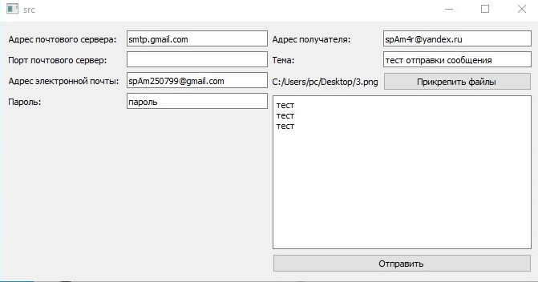

1. **Краткие теоретические сведения.**

**POP3** (*Post Office Protocol Version 3*) - стандартный Интернет-протокол прикладного уровня, используемый клиентами электронной почты для извлечения электронного сообщения с удаленного сервера по TCP/IP-соединению. В некоторых небольших узлах Интернет бывает непрактично поддерживать систему передачи  (*MTS - Message Transport System*). Рабочая станция может не иметь достаточных ресурсов для обеспечения непрерывной работы SMTP-сервера. Для “*домашних ЭВМ*” слишком дорого поддерживать связь с Интернет круглые сутки. Но доступ к электронной почте необходим как для таких малых узлов, так и индивидуальных ЭВМ. Для решения этой проблемы разработан протокол POP3 (Post Office Protocol - Version 3, STD- 53 M. Rose, RFC-1939). Этот протокол обеспечивает доступ узла к базовому почтовому серверу. POP3 не ставит целью предоставление широкого списка манипуляций с почтой. Почтовые сообщения принимаются почтовым сервером и сохраняются там, пока на рабочей станции клиента не будет запущено приложение POP3. Это приложение устанавливает соединение с сервером и   сообщения оттуда. Почтовые сообщения на сервере стираются.

SMTP (Simple Mail Transfer Protocol) - широко используемый сетевой протокол, предназначенный для передачи электронной почты в сетях TCP/IP. SMTP впервые был описан в RFC 821 (1982 год) последнее обновление в RFC 5321 (2008) включает масштабируемое расширение - ESMTP (Extended SMTP). В настоящее время под
«протоколом SMTP», как правило, подразумевают и его расширения. Протокол SMTP предназначен для передачи исходящей почты, используя для этого порт TCP 25.

2. **Разработка программы.**

    В ходе работы было разработано консольное приложение на языке С++ которое может выполнять следующие действия:
    
    * подключение к почтовому серверу.
    * авторизация и аутентификация.
    * проверка входящих сообщений.
    * отправка сообщений с вложением.

3. **Анализ функционирования разработанных программ.**

    

4. **Выводы.**

В данной лабораторной работе была реализована программа для взаимодействия с ARP таблицей при помощи библиотек Winsock и IP Helper.

5. **Тексты программ. Скриншоты программ.**

>Тексты программ см. в приложении.

7. **Контрольные вопросы**

   * Что представляет собой протокол POP3? С какой целью он был
   разработан?
   
     Стандартный интернет-протокол прикладного уровня, используемый клиентами электронной почты для получения почты с удалённого сервера по TCP-соединению.

   * Опишите процесс работы протокола POP3.
   
     Перед работой через протокол POP3 сервер прослушивает порт 110. У POP3 сервера может быть INACTIVITY AUTOLOGOUT таймер. Этот таймер должен быт, по крайней мере, с интервалом 10 минут. Это значит, что если клиент и сервер не взаимодействуют друг с другом, сервер автоматически прерывает соединение и при этом не переходит в режим UPDATE.

   * Формат команд протокола POP3.
          
     Команды POP3 состоят из ключевых слов, за некоторыми следует один или более аргументов. Ключевые слова и аргументы состоят из печатаемых ASCII символов. Ключевое слово и аргументы разделены одиночным пробелом. Ключевое слово состоит от 3-х до 4-х символов, а аргумент может быть длиной до 40-ка символов.

     Ответы в POP3 состоят из индикатора состояния и ключевого слова, за которым может следовать дополнительная информация. Существует только два индикатора состояния: "+OK" - положительный и "-ERR" - отрицательный. Ответы на некоторые команды могут состоять из нескольких строк. 

   * Из каких частей состоит POP3-сессия?

     OP3 сессия состоит из нескольких режимов. Как только соединение с сервером было установлено и сервер отправил приглашение, то сессия переходит в режим AUTHORIZATION (Авторизация). В этом режиме клиент должен идентифицировать себя на сервере. После успешной идентификации сессия переходит в режим TRANSACTION (Передача). В этом режиме клиент запрашивает сервер выполнить определённые команды. Когда клиент отправляет команду QUIT, сессия переходит в режим UPDATE. В этом режиме POP3 сервер освобождает все занятые ресурсы и завершает работу. После этого TCP соединение закрывается.

   3. Как осуществляется взаимодействие SMTP и POP3?
     
     Конструкция протокола РОР3 обеспечивает возможность пользователю обратиться к своему почтовому серверу и изъять накопившуюся для него почту. Пользователь может получить доступ к РОР3-серверу из любой точки доступа к Internet. При этом он должен запустить специальный почтовый агент, работающий по протоколу РОР3, и настроить его для работы со своим почтовым сервером. Сообщения доставляются клиенту по протоколу POP3, а посылаются при помощи SMTP. То есть на компьютере пользователя существуют два отдельных агента-интерфейса к почтовой системе – доставки (POP3) и отправки (SMTP).

   4. Минимальный набор команд и порядок их применения для отправки
   почты по протоколу SMTP.

```
S: (ожидает соединения)
C: (Подключается к порту 25 сервера)
S:220 mail.company.tld ESMTP is glad to see you!
C:HELO
S:250 domain name should be qualified
C:MAIL FROM: <someusername@somecompany.ru>
S:250 someusername@somecompany.ru sender accepted
C:RCPT TO: <user1@company.tld>
S:250 user1@company.tld ok
C:DATA
S:354 Enter mail, end with "." on a line by itself
C:From: Some User <someusername@somecompany.ru>
C:To: User1 <user1@company.tld>
C:Subject: tema
C:Content-Type: text/plain
C:
C:Hi!
C:.
S:250 769947 message accepted for delivery
C:QUIT
S:221 mail.company.tld CommuniGate Pro SMTP closing connection
S: (закрывает соединение)
``` 