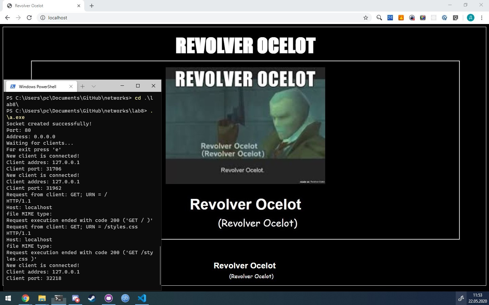

1. **Краткие теоретические сведения.**

HTTP (Hyper Text Transfer Protocol – протокол передачи гипертекста) – протокол прикладного уровня стека протоколов TCP/IP, предназначенный для передачи данных по сети с использованием транспортного протокола TCP. Текущая версия протокола HTTP v1.1, его спецификация приводится в документе RFC 2616 Протокол HTTP может использоваться также в качестве «транспорта» для других протоколов прикладного уровня, таких как SOAP или XML-RPC. Основой HTTP является технология «клиент-сервер». HTTP-клиенты отсылают HTTP-запросы, которые содержат метод, обозначающий потребность клиента. Также такие запросы содержат универсальный идентификатор ресурса, указывающий на желаемый ресурс. Обычно такими ресурсами являются хранящиеся на сервере файлы. По умолчанию HTTP-запросы передаются на порт 80 HTTP-сервер отсылает коды состояния, сообщая, успешно ли выполнен HTTP-запрос или же нет.

Унифицированный идентификатор ресурса представляет собой сочетание унифицированного указателя ресурса (Uniform Resource Locator, URL) и унифицированного имени ресурса (Uniform Resource Name, URN).

1. **Разработка программы.**

    В ходе работы было разработано консольное приложение HTTP сервер на языке С.

    Реализованы методы со стороны сервера:

    * GET (только текстовые файлы).
    * HEAD.

2. **Анализ функционирования разработанных программ.**

    

3. **Выводы.**

В данной лабораторной работе была реализован простейший HTTP сервер, написанный с использованием библиотека Winsock. Библиотека Winsock позволяет быстро и удобно писать сетевые приложения для ОС Windows. 

1. **Тексты программ. Скриншоты программ.**

>Тексты программ см. в приложении.

7. **Контрольные вопросы**

   1. Как расшифровывается аббревиатура HTTP?

      HTTP - HyperText Transfer Protocol — «протокол передачи гипертекста»

   2. Какой уровень занимает протокол в стеке TCP/IP?

      прикладной

   3. На какой технологии построен протокол HTTP?

      клиент-сервер

   4. Какие преимущества протокола HTTP?

      Низкая сложность расширения протокола путем добавления новых заголовков, несовместимые серверы и клиенты будут их просто игнорировать.

   5. Какие недостатки протокола HTTP?

      Отсутствие возможности получить весь список файлов на сервере как в FTP, избыточность.

   6. Какие методы существуют в протоколе HTTP?

    * GET
    * POST
    * PUT
    * DELETE
    * HEAD
    * TRACE
    * OPTIONS

   7. Какие нововведения содержит версия HTTP 1.1?

    * TCP соединение остается открытым после ответа на клиентский запрос, позволяя отправлять несколько запросов за 1 соединение
    * Клиент обязан посылать информацию о имени хоста к которому он обращается.

   8. Какова структура протокола HTTP? Охарактеризуйте каждый элемент

      * Стартовая строка - тип сообщения
      * Заголовки - фрагмент описывающий тело сообщения и прочие сведения
      * <пустая строка>
      * Тело - данные сообщения

   9.  Какие существуют классы кодов состояния?

      * 1хх - информационные состояния
      * 2хх - состояние успеха
      * 3хх - состояние перенаправления
      * 4хх - состояние ошибок клиента
      * 5хх - состояние ошибок сервера

   10. Какие существуют группы заголовков HTTP?

      * Основные заголовки
      * Заголовки запроса
      * Заголовки ответа
      * Заголовки сущности

   11. Что такое cookie-файлы? Для чего они используются?

      Используются для поддержки неанонимного доступа в HTTP.

   12. Что такое HTTP referrer? Для чего он используется?

      Поле используется для возобновления прерванной сессии.
