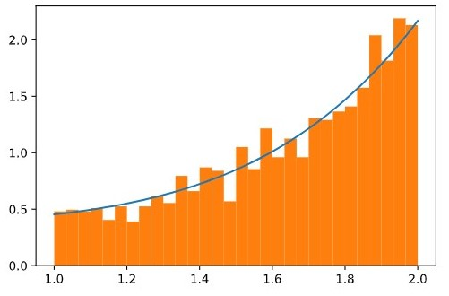

Для получение функции распределения из f_0(x) нормируем ее.
$$f(x)=k^{-1}*f_0(x)$$
$$k = \int^b_a f_0(x) dx = (x^5+x^2+7)\bigg|_1^2 \approx 19.83$$

Случайная величина $\xi$ распределенная по закону распределения $f$, находится по уравнению:

$$\int^{\xi}_a f(x)dx = v$$

,где v - равномерно распределенная случайная величина. 

Для удобства применения численного метода представим уравнение в виде: 

$$\int^{\xi}_a f(x)dx - v = 0$$

