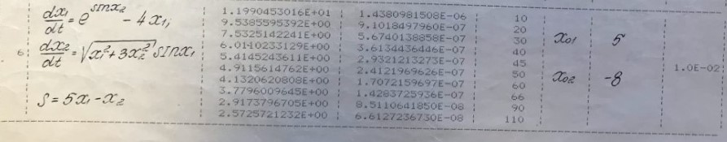

Задание: Исследуемый процесс определяется системой дифференциальных уравнений.

В процессе исследования с помощью аппаратных средств в моменты времени, (где N-число измерений) произведены замеры вектора измерений R (таблица 3), зависящего от переменных x1, x2 этой системы, а так же от оцениваемых параметров - вектор.

Измерения производятся со случайной ошибкой V, распределенной по нормальному закону. Параметры закона распределения известны. Задана диагональная корреляционная матрица ошибок измерений, шаг интегрирования системы дифференциальных уравнений методом Рунге – Кутта четвертого порядка, задана математическая модель вектора измерений. По имеющимся измерениям необходимо оценить неизвестные параметры процесса. Неизвестными параметрами, в зависимости от варианта могут быть начальные условия для системы дифференциальных уравнений, описывающих процесс, коэффициенты системы уравнений. В задании даны примерные начальные значения оцениваемых параметров для обеспечения сходимости вычислительного процесса. Для оценки неизвестных параметров необходимо использовать метод максимального правдоподобия.

