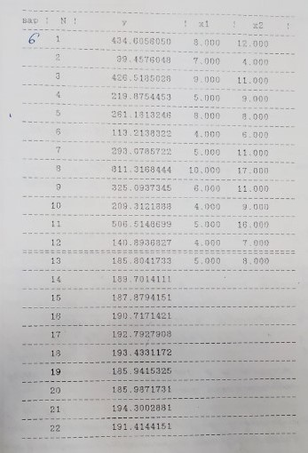

Задание: Исследуемый процесс определяется системой дифференциальных уравнений.

В таблице находятся результаты эксперимента для определения функции, зависящей от двух аргументов. Эксперименты 1 – 12 использовать для оценки коэффициентов математической модели $a$, эксперименты 13 – 22 использовать для оценки дисперсии погрешности измерений $\sigma_\epsilon$.
