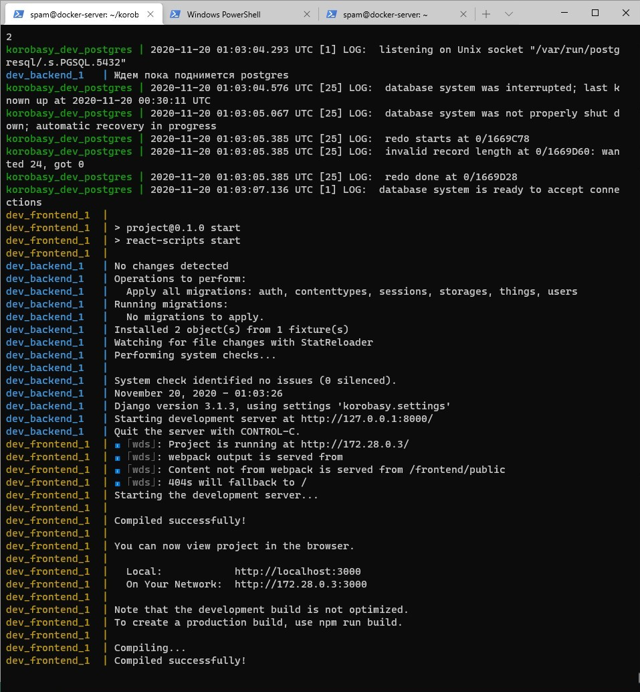
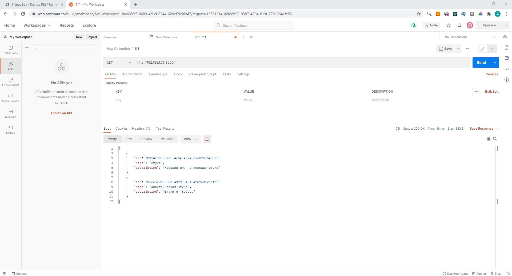

Для разработки серверной части приложения был использован Python и фреймворк Django.

Было развернуто базовое приложение, и настроены переменные окружения для работы с docker-compose.

Так же в приложение было добавлено тестовое API.

Данные в тестовом API
```json
[
  {
    "model": "things.thing",
    "fields": {
      "id": "89f4e9d3-d225-4eba-ac7a-6568f636ad8e",
      "name": "Штука",
      "description": "Хорошая или не хорошая штука"
    }
  },
  {
    "model": "things.thing",
    "fields": {
      "id": "05ee523d-950e-49f9-9a9f-410fe852eefb",
      "name": "Электрическая штука",
      "description": "Штука от Зевса."
    }
  }
]
```



