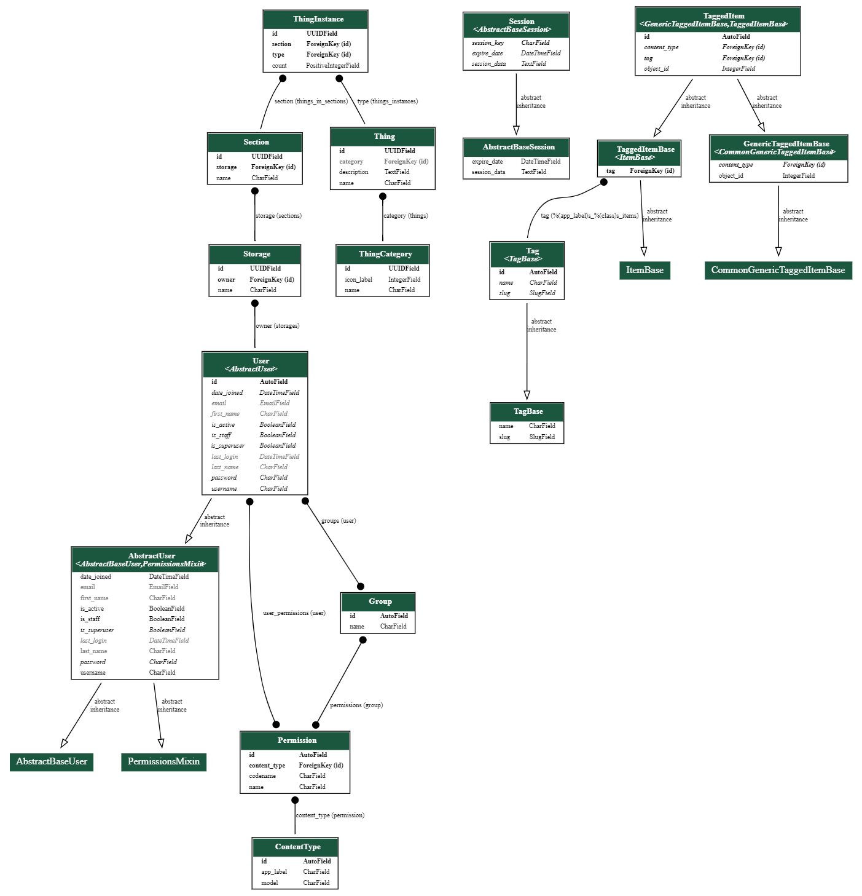

В качестве СУБД был использовал PostgreSQL развернутый в Docker контейнере.

Была разработана следующая структура базы данных.

Таблицы *User*, *AbstractUser*, *Group*, *Permission*, *Session* были предоставлены ORM в составе фреймворка Django.

Все таблицы связанные с тэгами предоставлены библиотекой *django-taggit*.

Таблицы Section, Storage, Thing, ThingInstance, ThingCategory был описаны в моделях (см. в приложении).