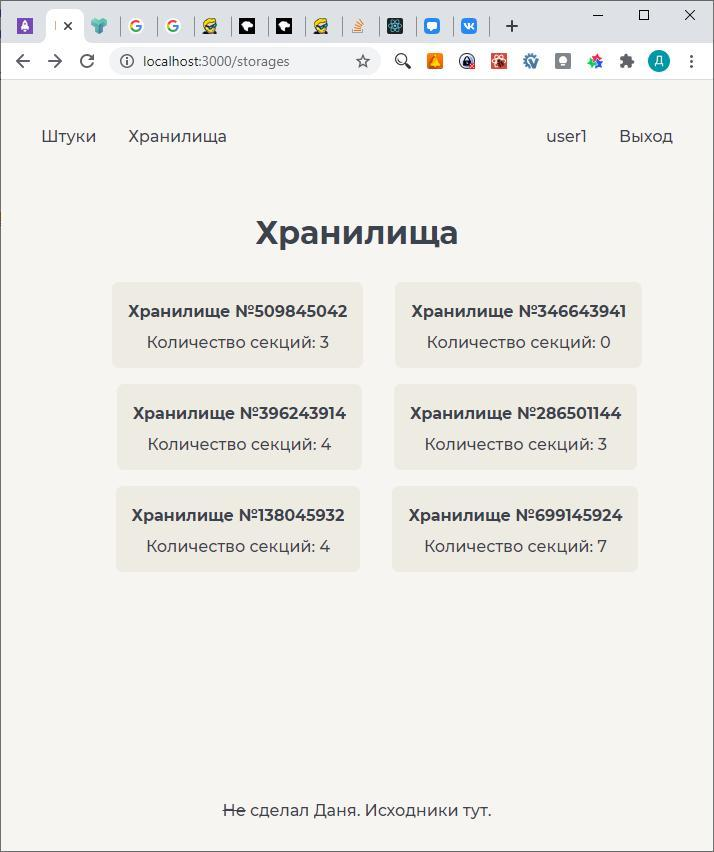

Для работы с HTTP запросами была выбрана библиотека axios. 

Для авторизации приложения используется JWT, полученные с сервера токены хранятся в localStorage, сброс авторизации происходит по истечении refresh токена.

Получение access токена обернуто в функцию, хранящуюся в контексте всего приложения, для автоматического обновления токена по его истечению.

Каждый HTTP запрос, кроме запроса на получение токенов содержит заголовок Bearer, содержащий access токен.

