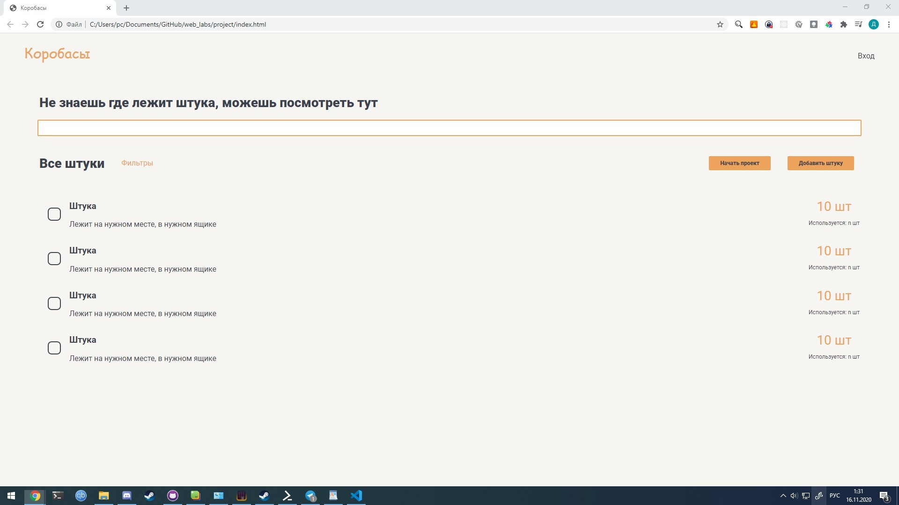
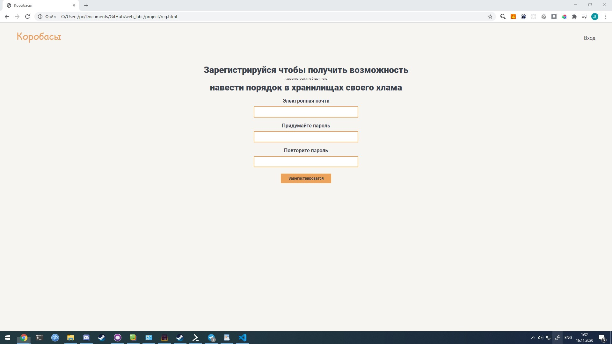
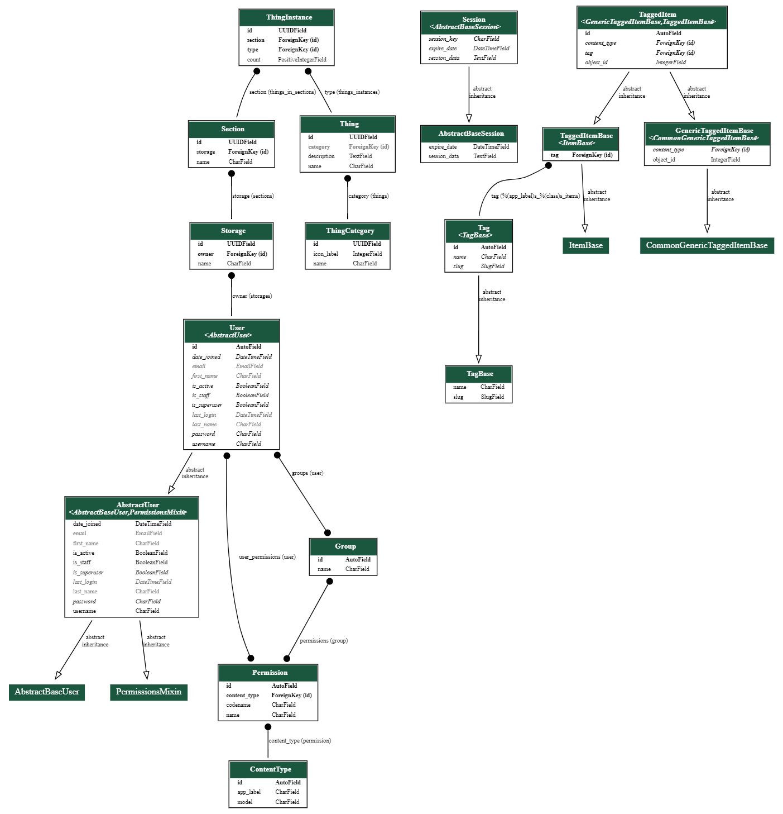
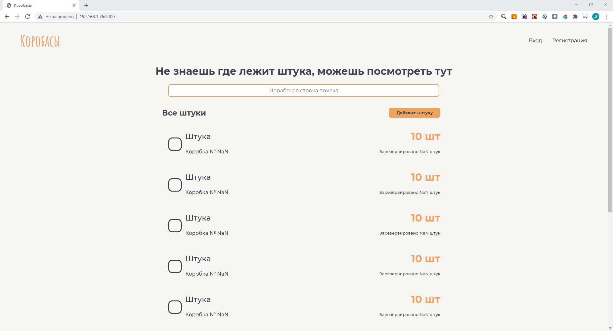
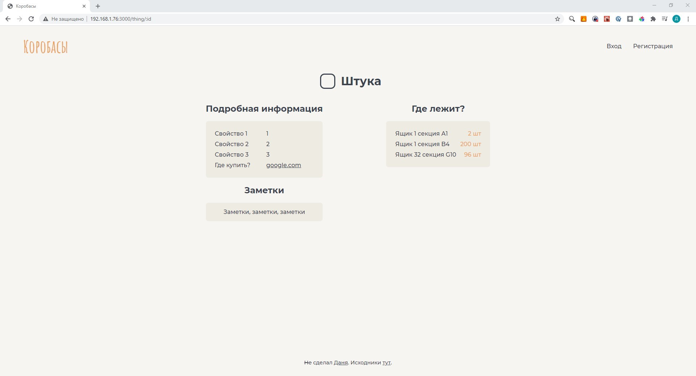
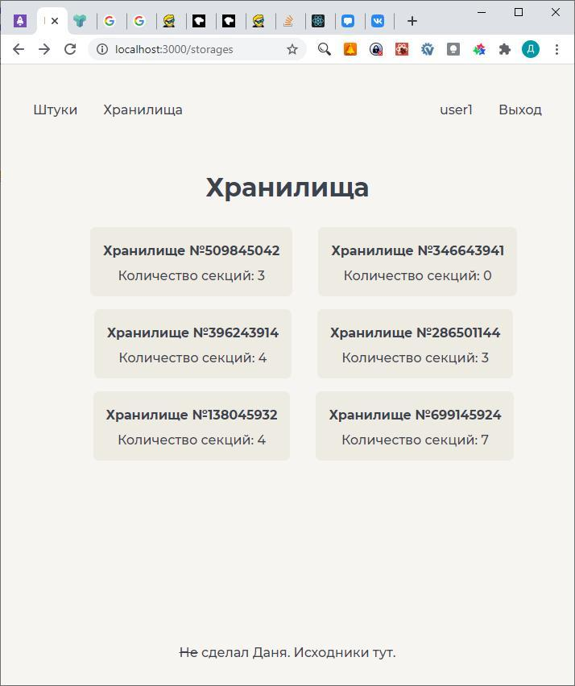

# Ход работы

## Прототип

Перед созданием веб приложения был сверстан макет страниц в [Figma](https://www.figma.com/proto/ipqRz76UgcFNCOm7gWEh9m/). Далее на основе макета были сверстаны все html страницы будущего приложения. CSS фреймворки с готовыми компонентами не использовались.

## Проектирование базы данных

В качестве СУБД использовался PostgreSQL, с ORM входящим в состав Python фреймворка Django. 

Таблицы Section, Storage, Thing, ThingInstance, ThingCategory был описаны в соответствующих моделях (см. в приложении).

Все модели связанные с пользователями и их разрешениями, предоставлены фреймворком.

Таблицы связанные с тегами реализованы в сторонней библиотеке, которая реализует систему тегов для Django - django-taggit.

## Разработка клиентского приложения

В качестве библиотеки для UI использовался - ReactJS, и так как эта библиотека предоставляет лишь функционал по отрисовке в DOM. Были использованы следующие дополнительные библиотеки:

* react-router: библиотека для работы с History API.
* react-router-dom: библиотека для декларативного роутинга в приложении.
* react-form-hook: библиотека реализующая формы ввода информации.
* react-js: библиотека предоставляющая UI компонент "всплывающее окно"
* axios: http клиент для взаимодействия с API.

Для переноса html прототипа на язык JSX, требовалось разделить пользовательский интерфейс на базовые компоненты. После разбиения было описано базовое содержимое страниц и получен макет приложения реализованный на JS.

## Разработка серверной части приложения

Серверная часть проекта была реализована на языке Python с использованием фреймворка Django, а так же библиотеки django-rest-framework для реализации REST API.

Для каждой модели, был описан сериализатор и набор представлений для каждого необходимого метода HTTP запроса, который был связан с URL.

Все наборы представлений были ограничены в доступе только для владельцев сущностей (хранилище может просматривать только владелец хранилища).

Для реализации авторизации с серверной части была использована библиотека django-simple-jwt, которая предоставляет уже настроенное API для JWT авторизации при помощи REST API и встроенных в Django моделей User.

Так же для упрощения разработки и документирования API был использован стандарт OpenAPI, сгенерировав схему API встроенными в DRF функциями и используя генератор документации Redoc, была получена документация на [API](https://spam25.github.io/web_labs/docs/).

## Контейнеризация

Для упрощения процесса разворачивания проекта, был использован Docker и утилита docker-compose.

Была описана сеть содержащая 3 контейнера:

* postgresql: контейнер с СУБД
* backend: контейнер с серверной частью приложения
* frontend: контейнер для сборки и отладки клиентской части приложения

## Связывание клиентской и серверной части

С клиентской части для обращения к серверному API использовался HTTP клиент axios, для сохранения refresh и access токенов использовался localStorage, так же была реализована обертка для получения access токена и его обновлении при истечении для непрерывной сессии пока refresh токен валиден.

Все функции для работы с API и авторизацией находятся в контексте всего приложения, что позволяет использовать текущее состояние авторизации во всех компонентах без проброса состояний через все дерево компонентов.

Тестирование API производилось при помощи утилиты Postman.
 

# Вывод

В результате данной работы была реализована система по управлению хранилищами. В ходе выполнения работы были изучены библиотеки для создания веб приложений на языке JS, язык CSS, фреймворк Django и библиотека DRF для создания REST API, для взаимодействия с БД по средствам HTTP запросов. Также получены навыки работы с контейнерами Docker и утилитой docker-compose для одновременного развертывания сети контейнеров. 